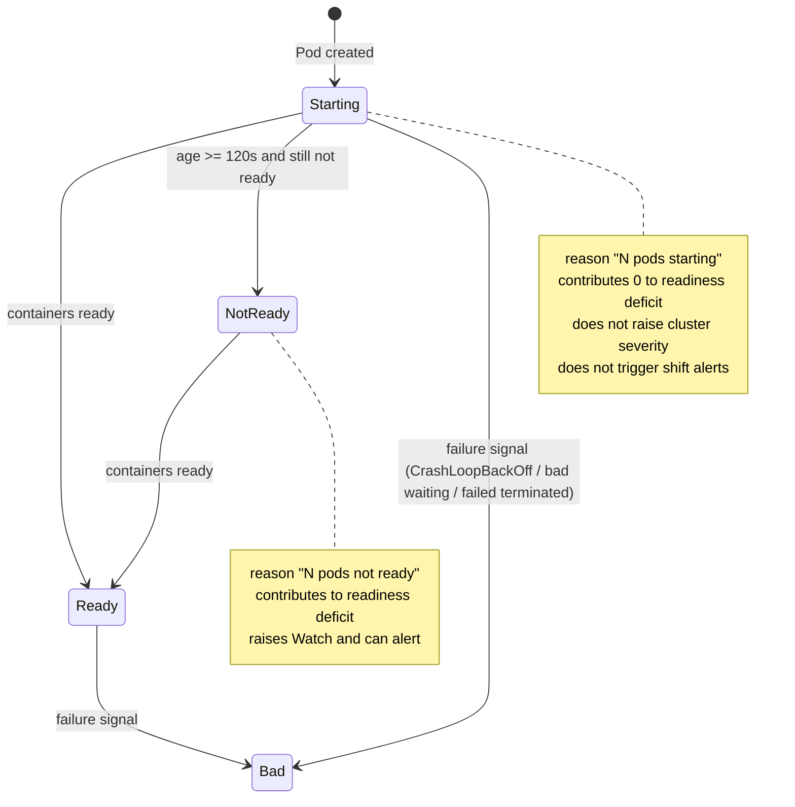

# Pod Startup Grace: Stop Startup Churn From Looking Like Deterioration

## Summary

Kubebar currently treats every not-ready Pod as a cluster warning, including Pods
that were created seconds ago and are still initializing. On the `dev` context the
`arc-runners` watchlist receives a new ARC runner Pod on every workflow dispatch;
that Pod stays `Ready=False` for roughly 30 seconds while its image pulls and
`dind` initializes. Each such start flips the app from `OK` to `Watch`, pulses the
menu bar icon, and — because Health State Shift Alerts fire on any severity
increase — delivers a `Kubebar: dev is Watch` notification. The Pod then becomes
ready and the state returns to `OK`, so the user receives repeated false alarms.

This change introduces a **Pod startup grace**: a young Pod with no failure signal
is classified as *starting* rather than *not ready*. Starting Pods stay visible
and honest in the UI, but they no longer move the cluster out of `OK`, no longer
reduce the effective readiness deficit, and therefore no longer produce Health
State Shift Alerts.

## Output Language

Spec prose is written in English. Code identifiers, file paths, enum cases,
`CONTEXT.md` canonical terms, and Immune-Brain field names remain literal.

## Requirements

- R1: A Pod whose startup age is below the startup grace, and which carries no
  failure signal, is classified as *starting* rather than as a readiness failure.
- R2: The startup grace is a fixed code constant of 120 seconds. It is not
  user-configurable and adds no Settings surface.
- R3: Startup age is `status.startTime`, falling back to `metadata.creationTimestamp`.
  When both are absent or unparsable, the Pod is not starting (fail loud: unknown
  age is treated as not-ready, never as starting).
- R4: Failure signals override the grace. A starting-age Pod is never classified as
  starting when it is restarting (`CrashLoopBackOff`), has a failed terminated
  container, or has a bad waiting reason (`CrashLoopBackOff`, `ImagePullBackOff`,
  `ErrImagePull`, `InvalidImageName`, `CreateContainer*`, `RunContainer*`).
  Failure signals are evaluated across every container — regular and init — so
  container order, count, and kind never decide health; a failing Pod row names
  the container state that explains the failure rather than the first listed
  container. Readiness counts stay on the regular containers only, and the
  completed-Job eligibility predicate stays regular-container-only because
  native sidecars legitimately end with `Error` during shutdown.
- R5: A watched target whose only not-ready Pods are starting reports `OK` with a
  `N pods starting` reason instead of `Watch` with `N pods not ready`.
- R6: A watched target that also has a genuinely not-ready Pod past the grace still
  reports `Watch`, and its reason counts only the genuinely not-ready Pods.
- R7: The cluster-level Pod readiness deficit excludes starting Pods. The cluster
  state stays `OK` when the only deficit is starting Pods, and becomes `Watch` when
  a genuine deficit remains.
- R8: `PodSummary` gains a `starting` count so the evaluator can apply R7 without
  re-deriving Pod ages. Existing `PodSummary(ready:running:total:)` construction
  keeps its current meaning with `starting == 0`.
- R9: Starting Pod rows remain visible with their accurate non-ready state and show
  a `starting` issue text instead of `Pod is not ready`, so the yellow row reads as
  initialization rather than as a fault.
- R10: Because starting Pods no longer raise severity, they no longer produce Health
  State Shift Alerts. A genuinely not-ready Pod past the grace still raises the
  severity and still alerts.
- R11: Pod age never changes the `OK`/`Watch`/`Bad`/`Stale` vocabulary, the
  completed-Job-Pod treatment, or any non-Pod health rule.
- R12: The bad-reason classification used by R4 and the bad-reason classification
  used by `HealthEvaluator.podItemState` are one shared source of truth, so the two
  cannot drift.

## Non-goals

- No change to how the cluster-level Pod counters aggregate namespaces. Every Pod in
  every namespace still contributes to the Pods card and the deficit (see Deferred).
- No user-facing grace setting, no per-target grace, and no grace for Deployments,
  StatefulSets, DaemonSets, or Jobs.
- No change to Warning Event handling. A starting Pod that also has a related
  Warning Event still raises `Watch` through the existing warning rule.
- No alert-layer debounce or persistence requirement. The root cause is the
  misclassification, not the alert comparison.
- No suppression of `ImagePullBackOff`, `CrashLoopBackOff`, or any other genuine
  failure. Slow or broken starts past the grace window still surface as before.
- No historical trend storage, no "recently started" badge, and no new tab or view.

## Data and Security Boundaries

The change is read-only. It adds two Kubernetes metadata fields to the Pod decode
path (`status.startTime`, `metadata.creationTimestamp`) and derives a boolean and a
count from them. No new command is issued, no Kubernetes resource is mutated, no
Secret is read, no kubeconfig content is touched, and nothing is persisted. The
startup age is computed from the refresh timestamp already passed into
`ClusterReading.readSnapshot`, so no new clock dependency is introduced.

## Design risk

**Design risk**: High — the change alters a shared data flow (Pod records →
`PodSummary`/`TrackedItemStatus` → `MenuDisplayModel` → alert comparison) across two
modules and extends two public value types.

**Design views**: state transitions (Pod startup lifecycle and the resulting health
classification), data flow (age and failure signals from decode to display model),
and service/component interfaces (`PodSummary` and `PodDetail` field additions, the
shared bad-reason helper). Temporal sequence is omitted because the change is
stateless per refresh and has no cross-refresh coordination. Architecture layers are
omitted because ownership does not move: `KubectlClusterReader` still owns decode
and `HealthEvaluator` still owns severity.

**Diagram decision**: required

**Diagram reason**: The change is a state classification with an explicit override
precedence (failure signals beat the grace window) and a second consumer
(cluster-level deficit). A diagram makes the precedence and the two consumers
unambiguous.

## Brainstorm Trace

| ID | Status | Mapping |
| --- | --- | --- |
| `BR-REQ-001` | covered_by_step | R1–R4 define the startup classification and its grace. |
| `BR-REQ-002` | covered_by_step | R7 excludes starting Pods from the cluster readiness deficit. |
| `BR-REQ-003` | covered_by_step | R5 reports `OK` with a `starting` reason for a starting-only target. |
| `BR-REQ-004` | covered_by_step | R4 and R6 keep genuine failures and genuine not-ready Pods at `Bad`/`Watch`. |
| `BR-REQ-005` | covered_by_step | R9 keeps starting Pods visible with accurate state and `starting` issue text. |
| `BR-REQ-006` | covered_by_step | R10 records the alert-layer consequence; no alert-layer code changes. |
| `BR-DEC-001` | captured_as_decision | R2 fixes the grace at 120 s as a code constant with no Settings surface. |
| `BR-DEC-002` | captured_as_decision | R3 fixes the age source and the fail-loud behavior for unknown age. |
| `BR-DEC-003` | captured_as_decision | R12 unifies the bad-reason predicate into one shared source of truth. |
| `BR-DEC-004` | captured_as_decision | R11 keeps the health vocabulary and all non-Pod rules unchanged. |
| `BR-OUT-001` | out_of_scope | Non-goals: no alert-layer debounce or persistence gate. |
| `BR-OUT-002` | out_of_scope | Non-goals: no change to the all-namespace Pod aggregation scope. |
| `BR-DEFER-001` | deferred | Cluster-level Pod counters still aggregate all namespaces; recorded below. |

## Deferred

- `BR-DEFER-001`: The Pods card and the cluster readiness deficit are computed from
  `kubectl get pods --all-namespaces`, so Pod churn in unwatched namespaces such as
  `kube-system` or `observability` can still move the cluster state. Restricting that
  aggregation to watched namespaces changes the meaning of the Pods card and is a
  separate product decision. Revisit when an unwatched-namespace start is observed to
  cause a false alert.

## Success Criteria

- A watched target whose only not-ready Pod is inside the grace window reports `OK`
  with a `starting` reason.
- The cluster state stays `OK`, and no Health State Shift Alert is produced, when a
  new Pod starts inside the grace window on an otherwise healthy cluster.
- A Pod past the grace window that is still not ready reports `Watch` with a
  `not ready` reason and produces a Health State Shift Alert.
- A Pod with `CrashLoopBackOff`, `ImagePullBackOff`, or a failed terminated
  container reports `Bad` regardless of age.
- A Pod with no `status.startTime` and no `metadata.creationTimestamp` is treated as
  not-ready, not as starting.
- Existing completed-Job-Pod behavior and all non-Pod health rules are unchanged.
- The full Swift quality gate passes.

## Planning Quality Gate

- **Contract surface**: `PodSummary` (`starting` field), `PodDetail` (`isStarting`
  field), `PodRecord` decode (`status.startTime`, `metadata.creationTimestamp`), the
  shared bad-reason predicate, `KubectlClusterReader.makePodSummary` /
  `trackedStatus` / `makePodDetailsSection`, `HealthEvaluator.evaluateState` /
  `podDeficit` / `podIssueText`, `docs/architecture/runtime-invariants.md`,
  `CONTEXT.md`, and `changelog.d/`.
- **Compatibility**: `PodSummary.init` and `PodDetail.init` keep their current
  parameter lists and add the new field as a defaulted parameter, so every existing
  call site keeps compiling with unchanged meaning. `AppConfig` and persisted state
  are untouched.
- **Interruption recovery**: the change is one coherent slice; a partial
  implementation leaves the reader and evaluator disagreeing about the deficit, which
  the focused reader and evaluator tests detect.
- **Rollback path**: revert the reader, evaluator, model, docs, and test edits
  together. No migration, no persisted state, no config key.
- **Verification strength**: the focused tests assert the classification and the
  resulting severity for each state boundary (inside grace, past grace, failure
  signal inside grace, unknown age), which is exactly where the regression lives. A
  build-only or smoke-only check would not catch a wrong deficit computation.

## Devil's Advocate Audit

- **Rollback resilience**: the change is confined to derived classification. Nothing
  is persisted, so a revert restores the previous behavior on the next refresh. The
  only cross-module coupling is the `PodSummary.starting` field, whose default keeps
  old semantics for every existing construction site.
- **Verification vanity**: the tests must assert the resulting cluster state and the
  tracked-item reason, not merely that a new field exists. A test that only checks
  `starting == 1` would pass while `evaluateState` still returned `Watch`, so the
  evaluator boundary tests are mandatory and are the ones that fail on the intended
  regression.
- **Spec dilution detection**: the two exclusions the user confirmed (no alert-layer
  debounce, no aggregation-scope change) are recorded as explicit non-goals and as
  `BR-DEFER-001`, so neither can be silently dropped nor silently expanded.

## Verification

- `KubebarTests/Services/KubectlClusterReaderTests.swift`: starting Pod inside the grace produces an `OK` tracked
  item with a `starting` reason and `podSummary.starting == 1`; a not-ready Pod past
  the grace produces a `Watch` tracked item with a `not ready` reason and
  `starting == 0`; a `CrashLoopBackOff` Pod inside the grace produces `Bad`; a
  multi-container Pod with a bad waiting reason on a later container is not starting
  and its row names the failing container's reason; a Pod with a crash-looping init
  container is `Bad` and not starting; a successfully completed Job Pod with a native
  sidecar whose init container ended `Error` stays excluded from the active summary
  while another Pod is starting; a Pod with a failed terminated container inside the
  grace is not starting; a Pod with no age fields and a Pod with an unparsable age are
  not starting; the 120 s boundary is exclusive.
- `KubebarTests/Models/MenuDisplayModelTests.swift`: `HealthEvaluator` returns `OK`
  for a starting-only Pod deficit and `Watch` when a genuine deficit remains; the
  health-shift tracker produces no alert for the starting-only case and produces an
  alert for the genuine case; a starting Pod row reads `starting` instead of `Pod is
  not ready`.
- Both evaluator cases live in the existing
  `KubebarTests/Models/MenuDisplayModelTests.swift` rather than a new file, because
  `Kubebar.xcodeproj` is XcodeGen-generated and XcodeGen is not installed in this
  environment, so a new file could not be added to the Xcode test target. That is
  why `scope_hint` names this path instead of a dedicated evaluator test file.
- `./scripts/swift-quality-gate.sh local` passes.
