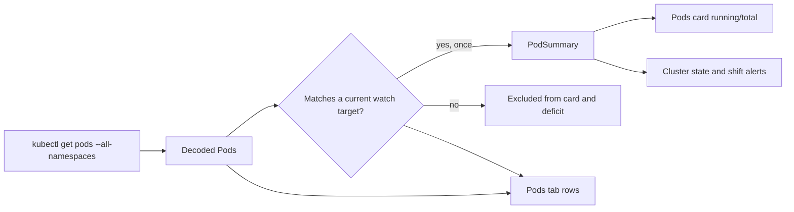

# Watchlist Pod Scope

## Summary

The Pods tab and watchlist rows already count only Pods that match the active
watchlist. The Pods card and the cluster readiness deficit do not: both read
`PodSummary`, which `KubectlClusterReader` builds from every active Pod returned
by `kubectl get pods --all-namespaces`. A not-ready Pod in an unwatched
namespace, or a Pod that misses a workload-only target, still moves the cluster
to `Watch` and can send a Health State Shift Alert.

This change builds `PodSummary` from the same Pod set the Pods tab already
shows: active Pods that match at least one current watch target, counted once.
The Pods card, the readiness deficit, and therefore Health State Shift Alerts
all follow that summary. Nodes, Warning Events, workload availability, and the
empty-watchlist setup gate stay as they are.

## Output Language

Spec prose is written in English. Code identifiers, file paths, and
Immune-Brain field names stay literal.

## Requirements

- R1: `PodSummary` counts only active Pods that match at least one watch target
  in the refresh, using the same match predicate as the Pods tab.
- R2: A Pod that matches more than one watch target is counted once.
- R3: A not-ready Pod that matches no watch target does not increase
  `PodSummary.total`, `running`, `ready`, `starting`, or `notReady`.
- R4: A not-ready Pod that matches a watch target still increases the deficit
  and still makes its tracked target `Watch`, including after the startup grace.
- R5: Because the card and `evaluateState` both read `PodSummary`, an unwatched
  not-ready Pod no longer changes the Pods card and no longer raises cluster
  severity or a Health State Shift Alert by itself.
- R6: An empty watchlist still produces the existing configuration-required
  display (`Choose a cluster context and watchlist to begin`) and no snapshot.
  Zero matching Pods are not a new healthy state.
- R7: Node summaries, Warning Event aggregation, completed-Job exclusion, and
  the startup-grace rules are unchanged. Warning Events remain cluster-wide.

## Non-goals

- No second number on the Pods card.
- No watchlist filter for Nodes or Warning Events.
- No change to which Pods `kubectl` fetches. Filtering happens after decode.
- No new Settings surface.

## Design risk

**Design risk**: High — `PodSummary` feeds the Pods card, the cluster state, and
the alert comparison.

**Design views**: data flow (which decoded Pods enter `PodSummary`).

**Diagram decision**: required

**Diagram reason**: The card and the icon must consume one filtered set, and
that set must be the same one the Pods tab already uses.

## Deferred

- Warning Events still come from the whole cluster. One warning outside the
  watchlist can still raise `Watch`. Revisit only if that noise shows up.

## Success Criteria

- A not-ready Pod outside the watchlist leaves `PodSummary.notReady` at 0 and
  leaves a healthy watched target at `OK`.
- The same Pod inside the watchlist still counts as not ready.
- A Pod selected by two targets contributes 1 to `total`.
- An empty watchlist refresh still asks for a context and watchlist and returns
  no snapshot.
- Existing startup-grace and completed-Job behavior still holds for Pods that
  are in scope.

## Verification

- Reader tests for the unwatched Pod, the watched Pod, and the double-match Pod.
- `RefreshCoordinator` test for the empty watchlist gate.
- An evaluator test that an unwatched not-ready Pod does not move state to
  `Watch` and does not produce a shift alert.
- `./scripts/swift-quality-gate.sh local` passes.
