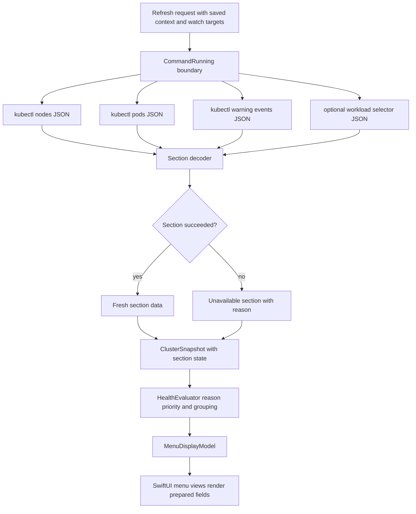

# Phase 05: Expand kubectl data into actionable warning and workload reasons - Research

**Researched:** 2026-04-21 [VERIFIED: current_date]
**Domain:** Swift/macOS menu-bar Kubernetes status parsing and display modeling [VERIFIED: AGENTS.md; docs/architecture/system-overview.md]
**Confidence:** HIGH [VERIFIED: repo docs and source scan; CITED: Kubernetes v1.35 API docs]

<user_constraints>

## User Constraints (from CONTEXT.md)

Source for this section: [VERIFIED: .planning/phases/05-expand-kubectl-data-into-actionable-warning-and-workload-reasons/05-CONTEXT.md]

### Locked Decisions

## Implementation Decisions

### Warning Event Display

- **D-01:** Keep compact warning event count in the counters, then show at most
  3 warning event summaries in the warning event section.
- **D-02:** Each warning event summary should show `Reason + namespace/object +
  age` when those fields are available.
- **D-03:** Repeated warning events should be grouped by `reason + involved
  object`, with the UI showing the occurrence count and most recent time.
- **D-04:** Warning event details should only confirm the problem: reason,
  object, namespace, age, and a short message.
- **D-05:** Do not show raw or full `kubectl` event output in the menu. Long
  messages should be shortened so the menu stays glanceable.

### Source Requirements From GitHub Issue #4

- Workload rows must explain the most important unhealthy reason in one short
  phrase, including pending pods, restarting pods, failed pods, and missing
  pods.
- Tracked item details must include enough context to decide whether to open a
  deeper tool.
- Empty, malformed, and partial `kubectl` JSON cases must remain safe and
  covered by tests.
- Stale state must keep showing failure reason when known.

### Workload Reason Priority

- **D-06:** When multiple workload problems exist, row reasons should prioritize
  `missing/failed > restarting > pending/unready > warning`.
- **D-07:** Restarting pods should be described by affected pod count, such as
  `2 pods restarting`, rather than leading with a single pod name.
- **D-08:** Pending and unready pods should be merged into one short reason,
  such as `3 pods not ready`.
- **D-09:** Workload row reasons should stay as one short phrase. Detailed pod
  examples belong in the tracked item detail view.

### Tracked Item Details

- **D-10:** A tracked item detail should show `state + reason + affected pod
  count + 1-3 example pod names + latest related warning` when those fields are
  available.
- **D-11:** The detail view should provide enough context to decide whether to
  open a deeper tool, but should not show full raw pod or event output.

### Partial and Malformed kubectl Data

- **D-12:** If one `kubectl` section fails while other sections succeed, keep
  the available fresh sections and mark the failed section as unavailable or
  stale with its reason.
- **D-13:** Do not silently hide section failures. The menu must make partial
  failure visible without making unavailable data look healthy.
- **D-14:** Empty JSON lists are valid empty states.
- **D-15:** Malformed JSON is a failure for that section and must be tested as a
  failure path.

### Carried Forward From Prior Phases

- Keep the menu watchlist-first.
- Keep first-screen watchlist rows capped at 3-5 items.
- Keep the menu bar icon categorical: `OK`, `Watch`, `Bad`, or `Stale`.
- Keep stale data visibly marked as `Stale`; old data must never look current.
- Keep all external reads behind injectable boundaries.
- Keep UI rendering behind `MenuDisplayModel`; SwiftUI views must not decide
  cluster health directly.

### Claude's Discretion

- Exact warning message truncation length.
- Exact fallback wording when an event is missing namespace, object, reason, or
  timestamp.
- Exact ordering tie-breakers when multiple warning groups have the same latest
  timestamp.
- Concrete model names for richer warning event and workload reason data.
- Exact wording for section-unavailable states, as long as the failed section is
  visible and not mistaken for healthy data.

### Deferred Ideas (OUT OF SCOPE)

- Deep debugging handoff such as `Open in k9s`.
- Full event timeline or unlimited warning event list.
- Team-facing alert workflow or shared operational notes.
- AppKit `NSStatusItem` migration.
- Distribution packaging and notarization.

</user_constraints>

<phase_requirements>

## Phase Requirements

| ID | Description | Research Support |
|----|-------------|------------------|
| R3 | The first screen must include compact top-level counts for nodes, pods, and warning events. [VERIFIED: docs/brainstorms/2026-04-19-kubebar-watchlist-first-requirements.md] | Keep `MenuCounters.warningEvents` as the compact count while adding a separate capped `warningEventSummaries` display list. [VERIFIED: KubebarCore/Models/MenuDisplayModel.swift; .planning/phases/05.../05-CONTEXT.md] |
| R8 | Each tracked row must show a short reason when unhealthy, such as restarting pods, pending pods, or recent warnings. [VERIFIED: docs/brainstorms/2026-04-19-kubebar-watchlist-first-requirements.md] | Decode pod phase, pod conditions, container readiness, restart counts, container waiting/terminated reasons, and latest related warning before constructing `TrackedItemStatus.reason`. [CITED: https://kubernetes.io/docs/reference/kubernetes-api/workload-resources/pod-v1/] |
| R9 | Selecting a tracked item must open a short detail view that confirms the problem without turning into a full troubleshooting console. [VERIFIED: docs/brainstorms/2026-04-19-kubebar-watchlist-first-requirements.md] | Extend `WatchItemDisplay` with capped detail fields; keep SwiftUI as a renderer of `MenuDisplayModel`. [VERIFIED: docs/architecture/system-overview.md; Kubebar/Views/TrackedItemDetailView.swift] |
| R12 | A stale state must show when the last successful update happened, why refresh failed when known, and a direct `Retry now` action. [VERIFIED: docs/brainstorms/2026-04-19-kubebar-watchlist-first-requirements.md] | Preserve known reasons in stale display and add per-section unavailable state so partial failures do not erase fresh successful sections. [VERIFIED: KubebarCore/Services/HealthEvaluator.swift; KubebarCore/Services/RefreshCoordinator.swift; .planning/phases/05.../05-CONTEXT.md] |

</phase_requirements>

## Summary

Phase 05 should be planned as a core data-modeling and parsing change, followed by a small SwiftUI rendering change. [VERIFIED: docs/architecture/system-overview.md; KubebarCore/Services/KubectlClusterReader.swift; Kubebar/Views/WarningEventsView.swift] `KubectlClusterReader` currently reads nodes, pods, and warning events, but it reduces events to a count and pod health to `status.phase == "Running"`. [VERIFIED: KubebarCore/Services/KubectlClusterReader.swift] The planner should add richer app-owned models before changing views. [VERIFIED: docs/architecture/runtime-invariants.md; .planning/codebase/ARCHITECTURE.md]

The Kubernetes fields needed for this phase are stable enough to plan against: core/v1 Event exposes `reason`, `message`, `involvedObject`, `lastTimestamp`, `eventTime`, and `count`, while events.k8s.io/v1 exposes `reason`, `note`, `regarding`, `eventTime`, `series.lastObservedTime`, and `series.count`. [VERIFIED: kubectl explain events --api-version=v1; VERIFIED: kubectl explain events --api-version=events.k8s.io/v1; CITED: https://kubernetes.io/docs/reference/kubernetes-api/cluster-resources/event-v1/] Pod health should use `status.phase`, `status.reason`, `status.message`, `status.conditions`, and `status.containerStatuses` instead of phase alone. [VERIFIED: kubectl explain pods.status --api-version=v1; CITED: https://kubernetes.io/docs/reference/kubernetes-api/workload-resources/pod-v1/]

**Primary recommendation:** Add section-aware snapshot data, grouped warning summaries, pod reason classification, and capped tracked-item detail fields in `KubebarCore`, then make the SwiftUI views render only those prepared display fields. [VERIFIED: AGENTS.md; docs/architecture/system-overview.md; .planning/phases/05.../05-CONTEXT.md]

## Architectural Responsibility Map

| Capability | Primary Tier | Secondary Tier | Rationale |
|------------|--------------|----------------|-----------|
| Run `kubectl` and decode JSON | `KubebarCore/Services/KubectlClusterReader.swift` | `CommandRunning` | External reads must go through injectable boundaries and current reader already owns `kubectl` JSON conversion. [VERIFIED: AGENTS.md; KubebarCore/Services/KubectlClusterReader.swift; KubebarCore/Services/CommandRunner.swift] |
| Represent partial section success/failure | `KubebarCore/Models/ClusterSnapshot.swift` | `RefreshCoordinator` | Partial freshness is domain state, not UI state; current all-or-nothing failure is a known concern. [VERIFIED: .planning/codebase/CONCERNS.md; KubebarCore/Models/ClusterSnapshot.swift; KubebarCore/Services/RefreshCoordinator.swift] |
| Select row severity and reason priority | `KubebarCore/Services/HealthEvaluator.swift` | `KubectlClusterReader` | `HealthEvaluator` owns severity, watchlist ordering, and display construction; the reader can provide classified raw reasons. [VERIFIED: AGENTS.md; KubebarCore/Services/HealthEvaluator.swift] |
| Group and cap warning event summaries | `KubebarCore/Services/HealthEvaluator.swift` | `ClusterSnapshot` | The UI needs display-ready summaries; locked decisions cap warnings at 3 and group repeated events by reason plus involved object. [VERIFIED: .planning/phases/05.../05-CONTEXT.md; Kubebar/Views/WarningEventsView.swift] |
| Render short warning and item details | SwiftUI views under `Kubebar/Views/` | `MenuDisplayModel` | Views are allowed to show state and actions but must not infer cluster health or parse raw `kubectl` output. [VERIFIED: docs/architecture/system-overview.md; Kubebar/Views/TrackedItemDetailView.swift] |
| Preserve stale and unavailable signals | `HealthEvaluator` | `RefreshCoordinator` | Current stale display already lives in `HealthEvaluator`; section failures must not look healthy. [VERIFIED: KubebarCore/Services/HealthEvaluator.swift; .planning/phases/05.../05-CONTEXT.md] |

## Project Constraints

- Kubebar is a native macOS menu bar app for quick Kubernetes health checks, not a `k9s` replacement. [VERIFIED: AGENTS.md]
- The menu bar icon remains categorical: `OK`, `Watch`, `Bad`, or `Stale`. [VERIFIED: AGENTS.md; docs/architecture/runtime-invariants.md]
- The dropdown stays watchlist-first and the first-screen watchlist stays capped at 3-5 items. [VERIFIED: AGENTS.md; docs/architecture/runtime-invariants.md]
- Stale or unavailable data must not appear healthy or current. [VERIFIED: AGENTS.md; docs/architecture/runtime-invariants.md]
- UI renders `MenuDisplayModel`; SwiftUI views must not decide cluster health. [VERIFIED: AGENTS.md; docs/architecture/system-overview.md]
- `HealthEvaluator` is the single source of truth for severity. [VERIFIED: AGENTS.md; KubebarCore/Services/HealthEvaluator.swift]
- External reads go through injectable boundaries. [VERIFIED: AGENTS.md; KubebarCore/Services/CommandRunner.swift]
- App-owned context is authoritative; `kubectl` calls must pass the saved context. [VERIFIED: AGENTS.md; KubebarCore/Services/KubectlClusterReader.swift]
- Do not read Kubernetes Secrets in this phase. [VERIFIED: docs/architecture/runtime-invariants.md; .planning/phases/05.../05-CONTEXT.md]
- Run `./scripts/swift-quality-gate.sh local` before finishing implementation work. [VERIFIED: AGENTS.md; scripts/swift-quality-gate.sh]
- `CLAUDE.md`, `rules/`, `.claude/skills/`, and `.agents/skills/` were not present in this worktree. [VERIFIED: find . -maxdepth 3]

## Standard Stack

### Core

| Library / Tool | Version | Purpose | Why Standard |
|----------------|---------|---------|--------------|
| Swift Package / Swift language | `swift-tools-version: 6.0`; local compiler Apple Swift 6.3 | App/core implementation | Existing package and Xcode project are Swift/macOS. [VERIFIED: Package.swift; swift --version] |
| Swift Testing | Swift 6 toolchain bundled | Unit tests | Existing tests use `import Testing`, `@Suite`, `@Test`, and `#expect`. [VERIFIED: KubebarTests/Services/KubectlClusterReaderTests.swift; .planning/codebase/TESTING.md] |
| `kubectl` CLI | local client v1.35.3 | Read Kubernetes nodes, pods, events, and workload data | Existing architecture delegates Kubernetes access to local `kubectl` through `CommandRunning`. [VERIFIED: kubectl version --client=true; KubebarCore/Services/KubectlClusterReader.swift] |
| Kubernetes core/v1 Pod API | v1.35 reference | Pod phase, conditions, container status, owner references | Required to classify pending, unready, restarting, failed, and missing pods. [CITED: https://kubernetes.io/docs/reference/kubernetes-api/workload-resources/pod-v1/; CITED: https://kubernetes.io/docs/reference/kubernetes-api/common-definitions/object-meta/] |
| Kubernetes Event APIs | core/v1 and events.k8s.io/v1 | Warning event summaries | Current reader uses `kubectl get events`; event shape differences must be decoded safely. [VERIFIED: KubebarCore/Services/KubectlClusterReader.swift; VERIFIED: kubectl explain events --api-version=v1; VERIFIED: kubectl explain events --api-version=events.k8s.io/v1] |
| `Foundation.JSONDecoder` | Swift standard library / Foundation | JSON decoding | Existing parser uses `JSONDecoder` and should keep structured decoding instead of string parsing. [VERIFIED: KubebarCore/Services/KubectlClusterReader.swift] |

### Supporting

| Library / Tool | Version | Purpose | When to Use |
|----------------|---------|---------|-------------|
| Xcode / `xcodebuild` | Xcode 26.4 local | macOS build and test gate | Required by `scripts/swift-quality-gate.sh` when the Xcode project exists. [VERIFIED: xcodebuild -version; scripts/swift-quality-gate.sh] |
| Ruby | 2.6.10 local | Parse `xcodebuild -list -json` inside quality gate | Required by the existing shell script, not by production code. [VERIFIED: ruby --version; scripts/swift-quality-gate.sh] |
| Context7 Kubernetes docs | `/kubernetes/website` | Current Kubernetes API docs | Used to verify Event and Pod field names. [VERIFIED: Context7 resolve/query] |

### Alternatives Considered

| Instead of | Could Use | Tradeoff |
|------------|-----------|----------|
| Existing `kubectl get events --all-namespaces --field-selector type=Warning -o json` | `kubectl events --all-namespaces --types=Warning -o json` | `kubectl events` has a dedicated event command and `--types`, but changing commands can change JSON shape; preserve the current command unless a fixture proves the new output shape is handled. [VERIFIED: KubebarCore/Services/KubectlClusterReader.swift; CITED: https://kubernetes.io/docs/reference/kubectl/generated/kubectl_events/] |
| Direct Kubernetes API client | Kubernetes Swift/client-go equivalent | This would add a new dependency and bypass the existing `kubectl` boundary; it is not needed for issue #4. [VERIFIED: AGENTS.md; .planning/phases/05.../05-CONTEXT.md] |
| Raw table output parsing | `kubectl get ...` default table output | Table parsing is brittle; current code already uses `-o json` and should keep structured decoding. [VERIFIED: KubebarCore/Services/KubectlClusterReader.swift] |

**Installation:**

```bash
# No new package install is recommended for Phase 05. [VERIFIED: Package.swift; .planning/phases/05.../05-CONTEXT.md]
```

**Version verification:**

```bash
kubectl version --client=true   # Client Version: v1.35.3 [VERIFIED: local command]
swift --version                 # Apple Swift version 6.3 [VERIFIED: local command]
xcodebuild -version             # Xcode 26.4 [VERIFIED: local command]
```

## Kubernetes Data Fields

### Event Fields

| Shape | Fields to decode | Planning guidance |
|-------|------------------|------------------|
| core/v1 `Event` | `metadata.namespace`, `reason`, `message`, `involvedObject.kind`, `involvedObject.namespace`, `involvedObject.name`, `lastTimestamp`, `eventTime`, `count`, `type` | Keep current `kubectl get events` compatibility; group by `reason + involvedObject` and prefer `lastTimestamp`, then `eventTime`, then metadata time if present. [VERIFIED: kubectl explain events --api-version=v1] |
| events.k8s.io/v1 `Event` | `metadata.namespace`, `reason`, `note`, `regarding.kind`, `regarding.namespace`, `regarding.name`, `eventTime`, `series.lastObservedTime`, `series.count`, `deprecatedCount`, `deprecatedLastTimestamp`, `type` | Decode this shape too if planner switches to `kubectl events` or clusters return events.k8s.io JSON; prefer `series.lastObservedTime` for repeated events and `series.count` for occurrence count. [VERIFIED: kubectl explain events --api-version=events.k8s.io/v1; CITED: https://kubernetes.io/docs/reference/kubernetes-api/cluster-resources/event-v1/] |
| Event API migration | `involvedObject` became `regarding`; `count` became `series.count`; `lastTimestamp` became `series.lastObservedTime`; `message` became `note` | Implement a normalized app model so display code does not care which event API produced the row. [CITED: https://kubernetes.io/docs/reference/using-api/deprecation-guide/] |

### Pod Fields

| Problem | Fields to decode | Planning guidance |
|---------|------------------|------------------|
| Pending pods | `status.phase`, `status.reason`, `status.message`, `status.conditions[]`, `containerStatuses[].state.waiting.reason` | Treat Pending as not ready; prefer short waiting/condition reasons like `ImagePullBackOff`, `ErrImagePull`, `Unschedulable`, or fallback to `pods not ready`. [CITED: https://kubernetes.io/docs/reference/kubernetes-api/workload-resources/pod-v1/] |
| Unready pods | `status.conditions` where `type == "Ready"` or `type == "ContainersReady"` is not `True`; `containerStatuses[].ready` | Running phase is not enough; a Running pod with unready containers must produce a watch/bad reason. [VERIFIED: kubectl explain pods.status.conditions --api-version=v1; VERIFIED: kubectl explain pods.status.containerStatuses --api-version=v1] |
| Restarting pods | `containerStatuses[].restartCount`, `containerStatuses[].lastState.terminated.reason`, `containerStatuses[].state.waiting.reason` | Use affected pod count in row reason; use 1-3 pod examples and the most useful container reason in detail. [VERIFIED: kubectl explain pods.status.containerStatuses --api-version=v1; VERIFIED: .planning/phases/05.../05-CONTEXT.md] |
| Failed pods | `status.phase == "Failed"`, `status.reason`, `status.message`, `containerStatuses[].state.terminated.reason`, `containerStatuses[].lastState.terminated.reason` | Failed outranks restarting and not-ready per locked priority. [CITED: https://kubernetes.io/docs/reference/kubernetes-api/workload-resources/pod-v1/; VERIFIED: .planning/phases/05.../05-CONTEXT.md] |
| Missing pods | No matching pods after workload/namespace matching | Missing outranks failed/restarting/pending only when the target should have pods; keep wording short such as `no matching pods`. [VERIFIED: .planning/phases/05.../05-CONTEXT.md; KubebarCore/Services/KubectlClusterReader.swift] |
| Workload matching | `metadata.namespace`, `metadata.name`, `metadata.labels`, `metadata.ownerReferences`, workload `spec.selector.matchLabels` where queried | Prefer selector-backed matching for Deployment, StatefulSet, and DaemonSet targets; use owner references as supplemental context, not as the only Deployment matcher. [VERIFIED: kubectl explain deployments.spec.selector --api-version=apps/v1; VERIFIED: kubectl explain statefulsets.spec.selector --api-version=apps/v1; VERIFIED: kubectl explain daemonsets.spec.selector --api-version=apps/v1; CITED: https://kubernetes.io/docs/concepts/workloads/controllers/deployment/] |

## Architecture Patterns

### System Architecture Diagram

Source: [VERIFIED: docs/architecture/system-overview.md; KubebarCore/Services/KubectlClusterReader.swift; KubebarCore/Services/HealthEvaluator.swift]



### Recommended Project Structure

```text
KubebarCore/
+-- Models/
|   +-- ClusterSnapshot.swift       # Add section state, warning summaries, tracked detail values. [VERIFIED: existing file]
|   +-- MenuDisplayModel.swift      # Add display-ready warning and detail fields. [VERIFIED: existing file]
|   +-- WatchTarget.swift           # Preserve target/state/reason; extend detail if needed. [VERIFIED: existing file]
+-- Services/
|   +-- KubectlClusterReader.swift  # Decode pods/events/workload matching and section failures. [VERIFIED: existing file]
|   +-- HealthEvaluator.swift       # Apply row priority, cap summaries, build display. [VERIFIED: existing file]
Kubebar/
+-- Views/
    +-- WarningEventsView.swift     # Render capped display summaries only. [VERIFIED: existing file]
    +-- TrackedItemDetailView.swift # Render capped confirmatory detail only. [VERIFIED: existing file]
KubebarTests/
+-- Services/
|   +-- KubectlClusterReaderTests.swift # Add JSON fixture coverage. [VERIFIED: existing file]
+-- Models/
    +-- MenuDisplayModelTests.swift     # Add display mapping and cap coverage. [VERIFIED: existing file]
```

### Pattern 1: Normalize Event Shapes Before Display

**What:** Decode core/v1 and events.k8s.io/v1 event JSON into one app-owned warning event model. [VERIFIED: kubectl explain events --api-version=v1; VERIFIED: kubectl explain events --api-version=events.k8s.io/v1]

**When to use:** Use for all event rows before grouping, sorting, truncation, or display. [VERIFIED: .planning/phases/05.../05-CONTEXT.md]

**Example:**

```swift
// Source: Kubernetes Event docs and local kubectl explain. [CITED: https://kubernetes.io/docs/reference/kubernetes-api/cluster-resources/event-v1/]
struct WarningEventRecord: Equatable, Sendable {
    let reason: String
    let namespace: String?
    let objectKind: String?
    let objectName: String?
    let message: String?
    let observedAt: Date?
    let count: Int
}
```

### Pattern 2: Section Result Instead of All-or-Nothing Snapshot

**What:** Represent each `kubectl` resource read as either fresh data or unavailable data with a reason. [VERIFIED: .planning/codebase/CONCERNS.md; .planning/phases/05.../05-CONTEXT.md]

**When to use:** Use when nodes, pods, events, or workload selector reads can fail independently. [VERIFIED: KubebarCore/Services/KubectlClusterReader.swift]

**Example:**

```swift
// Source: Phase D-12/D-13 partial-data decision. [VERIFIED: .planning/phases/05.../05-CONTEXT.md]
enum SnapshotSection<Value: Equatable & Sendable>: Equatable, Sendable {
    case available(Value)
    case unavailable(reason: String)
}
```

### Pattern 3: Reason Priority as a Pure Domain Rule

**What:** Classify pod facts into a small enum ordered by `missing/failed > restarting > pending/unready > warning > ok`. [VERIFIED: .planning/phases/05.../05-CONTEXT.md]

**When to use:** Use before constructing `TrackedItemStatus.reason` so row wording and detail examples share one decision. [VERIFIED: KubebarCore/Services/HealthEvaluator.swift; KubebarCore/Models/WatchTarget.swift]

**Example:**

```swift
// Source: locked workload priority. [VERIFIED: .planning/phases/05.../05-CONTEXT.md]
enum WorkloadAttention: Int, Comparable, Sendable {
    case ok = 0
    case warning = 1
    case notReady = 2
    case restarting = 3
    case failed = 4
    case missing = 5

    static func < (left: Self, right: Self) -> Bool {
        left.rawValue < right.rawValue
    }
}
```

### Pattern 4: Display-Ready Detail Objects

**What:** Add capped detail fields to display models rather than letting `TrackedItemDetailView` assemble facts from raw pod/event data. [VERIFIED: docs/architecture/system-overview.md; Kubebar/Views/TrackedItemDetailView.swift]

**When to use:** Use for affected pod count, 1-3 example pod names, and latest related warning. [VERIFIED: .planning/phases/05.../05-CONTEXT.md]

**Example:**

```swift
// Source: MenuDisplayModel render contract. [VERIFIED: docs/architecture/system-overview.md]
struct WatchItemDetailDisplay: Equatable, Sendable {
    let stateLabel: String
    let reason: String
    let affectedPodCount: Int?
    let examplePodNames: [String]
    let latestWarning: WarningEventDisplay?
}
```

### Anti-Patterns to Avoid

- **Parsing table output:** Use JSON and `Decodable`; current reader already uses `-o json`. [VERIFIED: KubebarCore/Services/KubectlClusterReader.swift]
- **Letting views compute health:** Keep health and detail shaping behind `MenuDisplayModel`. [VERIFIED: AGENTS.md; docs/architecture/system-overview.md]
- **Making partial failures invisible:** A failed events section with healthy pods must still be visible as unavailable/stale. [VERIFIED: .planning/phases/05.../05-CONTEXT.md]
- **Showing raw event output:** The menu must show shortened summaries, not raw `kubectl` event bodies. [VERIFIED: .planning/phases/05.../05-CONTEXT.md]
- **Treating events as durable truth:** Kubernetes events are best-effort supplemental data with limited retention. [CITED: https://kubernetes.io/docs/reference/kubernetes-api/cluster-resources/event-v1/]
- **Matching Deployments only by pod ownerReference:** Deployment-created Pods are commonly owned by ReplicaSets, so selector-backed matching is safer for Deployment targets. [CITED: https://kubernetes.io/docs/concepts/workloads/controllers/deployment/; CITED: https://kubernetes.io/docs/concepts/workloads/controllers/replicaset/]

## Don't Hand-Roll

| Problem | Don't Build | Use Instead | Why |
|---------|-------------|-------------|-----|
| JSON parsing | String slicing or regex over JSON | `Decodable` structs with optional fields | Kubernetes JSON has API-version variants and missing-field cases; structured decoding keeps malformed JSON as a section failure. [VERIFIED: KubebarCore/Services/KubectlClusterReader.swift; CITED: https://kubernetes.io/docs/reference/kubernetes-api/cluster-resources/event-v1/] |
| Event API compatibility | Separate UI branches for core/v1 and events.k8s.io/v1 | One normalized event model | Field names changed across Event APIs; display should not know about `involvedObject` vs `regarding`. [CITED: https://kubernetes.io/docs/reference/using-api/deprecation-guide/] |
| Pod readiness logic in SwiftUI | View-side checks for `phase` or `restartCount` | Core pod classifier | UI is not allowed to decide cluster health. [VERIFIED: AGENTS.md; docs/architecture/system-overview.md] |
| Full troubleshooting | Detail console, raw event stream, `Open in k9s` | Capped confirmatory detail | Deep troubleshooting and handoff are out of scope for this phase. [VERIFIED: .planning/phases/05.../05-CONTEXT.md] |
| Secrets inspection | Reading Secret objects for richer reasons | Events, pod status, conditions, and container statuses | Kubebar does not query Kubernetes Secrets. [VERIFIED: docs/architecture/runtime-invariants.md] |
| Controller graph reconstruction | Guessing every controller relationship from name suffixes | Selector-backed matching plus owner references where directly available | Kubernetes workload selectors and owner references are structured API fields. [VERIFIED: kubectl explain deployments.spec.selector --api-version=apps/v1; VERIFIED: kubectl explain pods.metadata.ownerReferences --api-version=v1] |

**Key insight:** This phase should add app-owned facts and short display summaries, not a Kubernetes diagnostic engine. [VERIFIED: docs/brainstorms/2026-04-19-kubebar-watchlist-first-requirements.md; .planning/phases/05.../05-CONTEXT.md]

## Common Pitfalls

### Pitfall 1: Running Phase Looks Healthy But Containers Are Not Ready

**What goes wrong:** A pod with `status.phase == "Running"` can still have unready containers or false `Ready` conditions. [CITED: https://kubernetes.io/docs/reference/kubernetes-api/workload-resources/pod-v1/]

**Why it happens:** Phase is a high-level summary and the detailed readiness data is in conditions and container statuses. [CITED: https://kubernetes.io/docs/reference/kubernetes-api/workload-resources/pod-v1/]

**How to avoid:** Decode `status.conditions`, `status.containerStatuses[].ready`, and container waiting/terminated reasons before deciding row state. [VERIFIED: kubectl explain pods.status.conditions --api-version=v1; VERIFIED: kubectl explain pods.status.containerStatuses --api-version=v1]

**Warning signs:** Tests only assert `running/total` pod counts and do not include Running-but-unready fixtures. [VERIFIED: KubebarTests/Services/KubectlClusterReaderTests.swift]

### Pitfall 2: Repeated Events Flood the Menu

**What goes wrong:** Repeated warning events can consume the whole warning section. [VERIFIED: .planning/phases/05.../05-CONTEXT.md]

**Why it happens:** Kubernetes Event objects can represent repeated occurrences through `count` or `series.count`. [VERIFIED: kubectl explain events --api-version=v1; VERIFIED: kubectl explain events --api-version=events.k8s.io/v1]

**How to avoid:** Group by `reason + involved object`, show occurrence count, sort by most recent observed time, and cap display at 3 rows. [VERIFIED: .planning/phases/05.../05-CONTEXT.md]

**Warning signs:** `WarningEventsView` receives only a count string today, so it has no way to cap or group detail rows. [VERIFIED: Kubebar/Views/WarningEventsView.swift]

### Pitfall 3: Partial Read Failure Becomes Global Stale Or Fake Healthy

**What goes wrong:** One malformed events payload can stale the entire display, or one unavailable section can disappear from the menu. [VERIFIED: .planning/codebase/CONCERNS.md; .planning/phases/05.../05-CONTEXT.md]

**Why it happens:** `KubectlClusterReader` currently throws if any node, pod, or event read fails. [VERIFIED: KubebarCore/Services/KubectlClusterReader.swift]

**How to avoid:** Return section-aware results and render section-unavailable states in counters/warning area. [VERIFIED: .planning/phases/05.../05-CONTEXT.md]

**Warning signs:** Tests expect a single thrown `KubectlCommandError.failed(...)` from reader failures and do not cover mixed success/failure. [VERIFIED: KubebarTests/Services/KubectlClusterReaderTests.swift]

### Pitfall 4: Workload Matching Misses Real Pods

**What goes wrong:** A Deployment target can show `no matching pods` even when its Pods exist. [VERIFIED: KubebarCore/Services/KubectlClusterReader.swift; CITED: https://kubernetes.io/docs/concepts/workloads/controllers/deployment/]

**Why it happens:** Current matching checks pod name plus two labels; Deployment Pods are managed through ReplicaSets and workloads define selectors. [VERIFIED: KubebarCore/Services/KubectlClusterReader.swift; CITED: https://kubernetes.io/docs/concepts/workloads/controllers/replicaset/]

**How to avoid:** Prefer workload selector data for Deployment, StatefulSet, and DaemonSet targets; use owner references only as supplemental context. [VERIFIED: kubectl explain deployments.spec.selector --api-version=apps/v1; VERIFIED: kubectl explain statefulsets.spec.selector --api-version=apps/v1; VERIFIED: kubectl explain daemonsets.spec.selector --api-version=apps/v1]

**Warning signs:** A test target matched only by `app.kubernetes.io/name` passes while owner/selector fixtures are absent. [VERIFIED: KubebarTests/Services/KubectlClusterReaderTests.swift]

### Pitfall 5: Detail View Turns Into a Debugging Console

**What goes wrong:** Detail rows become long, raw, and hard to scan. [VERIFIED: .planning/phases/05.../05-CONTEXT.md]

**Why it happens:** Event `note`/`message` can be long, and Kubernetes docs warn event messages can evolve over time. [CITED: https://kubernetes.io/docs/reference/kubernetes-api/cluster-resources/event-v1/]

**How to avoid:** Cap examples to 1-3 pod names, shorten messages before they reach SwiftUI, and keep full output out of the menu. [VERIFIED: .planning/phases/05.../05-CONTEXT.md]

**Warning signs:** New view code receives raw pod records, raw event records, or unbounded message arrays. [VERIFIED: docs/architecture/system-overview.md]

## Code Examples

Verified patterns from official sources and existing code:

### Normalized Event Decoding

```swift
// Sources:
// - core/v1 Event: [VERIFIED: kubectl explain events --api-version=v1]
// - events.k8s.io/v1 Event: [CITED: https://kubernetes.io/docs/reference/kubernetes-api/cluster-resources/event-v1/]
private struct EventListRecord: Decodable {
    let apiVersion: String?
    let items: [EventRecord]
}

private struct EventRecord: Decodable {
    struct Metadata: Decodable {
        let namespace: String?
        let creationTimestamp: String?
    }

    struct ObjectReference: Decodable {
        let kind: String?
        let namespace: String?
        let name: String?
    }

    struct Series: Decodable {
        let count: Int?
        let lastObservedTime: String?
    }

    let metadata: Metadata
    let reason: String?
    let message: String?
    let note: String?
    let involvedObject: ObjectReference?
    let regarding: ObjectReference?
    let lastTimestamp: String?
    let eventTime: String?
    let count: Int?
    let deprecatedCount: Int?
    let deprecatedLastTimestamp: String?
    let series: Series?
}
```

### Pod Classifier Inputs

```swift
// Source: PodStatus and ContainerStatus docs. [CITED: https://kubernetes.io/docs/reference/kubernetes-api/workload-resources/pod-v1/]
private struct PodRecord: Decodable {
    struct Metadata: Decodable {
        let namespace: String
        let name: String
        let labels: [String: String]?
        let ownerReferences: [OwnerReference]?
    }

    struct Status: Decodable {
        let phase: String?
        let reason: String?
        let message: String?
        let conditions: [PodCondition]?
        let containerStatuses: [ContainerStatus]?
    }

    let metadata: Metadata
    let status: Status
}
```

### Section Result for Partial Reads

```swift
// Source: D-12 and D-13. [VERIFIED: .planning/phases/05.../05-CONTEXT.md]
struct ClusterSnapshot: Equatable, Sendable {
    let nodes: SnapshotSection<NodeSummary>
    let pods: SnapshotSection<PodSummary>
    let warningEvents: SnapshotSection<[WarningEventRecord]>
    let trackedItems: [TrackedItemStatus]
    let capturedAt: Date
}
```

## State of the Art

| Old Approach | Current Approach | When Changed | Impact |
|--------------|------------------|--------------|--------|
| Event payload fields such as `involvedObject`, `message`, `lastTimestamp`, and `count` | events.k8s.io/v1 fields such as `regarding`, `note`, `series.lastObservedTime`, and `series.count` | events.k8s.io/v1 is available since v1.19 and v1beta1 is no longer served as of v1.25. [CITED: https://kubernetes.io/docs/reference/using-api/deprecation-guide/] | Decode both shapes into one app model before display. [VERIFIED: kubectl explain events --api-version=v1; VERIFIED: kubectl explain events --api-version=events.k8s.io/v1] |
| Pod health as `phase == Running` | Pod health from phase plus reason/message, conditions, container readiness, restart count, and container state | Current API docs expose these fields in v1.35. [CITED: https://kubernetes.io/docs/reference/kubernetes-api/workload-resources/pod-v1/] | The planner should update tests to cover Running-but-unready and restart scenarios. [VERIFIED: KubebarTests/Services/KubectlClusterReaderTests.swift] |
| Deployment matching by pod names or app labels only | Selector-backed workload matching plus owner references where directly available | Workload selectors and ownerReferences are Kubernetes API fields. [VERIFIED: kubectl explain deployments.spec.selector --api-version=apps/v1; VERIFIED: kubectl explain pods.metadata.ownerReferences --api-version=v1] | Avoid false `missing` rows for real workloads. [VERIFIED: KubebarCore/Services/KubectlClusterReader.swift] |

**Deprecated/outdated:**

- Treating `count`, `lastTimestamp`, and `involvedObject` as the only Event fields is outdated for events.k8s.io/v1 compatibility. [CITED: https://kubernetes.io/docs/reference/using-api/deprecation-guide/]
- Treating warning events as a raw count is insufficient for issue #4 because the phase goal requires actionable warning summaries. [VERIFIED: docs/plans/2026-04-19-002-kubebar-product-roadmap.md; .planning/phases/05.../05-CONTEXT.md]
- Treating a partial read failure as a whole-refresh failure conflicts with D-12 and D-13. [VERIFIED: KubebarCore/Services/KubectlClusterReader.swift; .planning/phases/05.../05-CONTEXT.md]

## Test Fixture Strategy

| Fixture Case | File | Expected Coverage |
|--------------|------|-------------------|
| Empty events list | `KubebarTests/Services/KubectlClusterReaderTests.swift` | Empty JSON list is valid and shows count `0`, no warning summaries, no failure. [VERIFIED: .planning/phases/05.../05-CONTEXT.md; existing test file] |
| Malformed event JSON | `KubebarTests/Services/KubectlClusterReaderTests.swift` | Events section becomes unavailable with `invalid event JSON`; nodes/pods remain fresh when those sections decode. [VERIFIED: .planning/phases/05.../05-CONTEXT.md; .planning/codebase/CONCERNS.md] |
| Duplicate warning events | `KubebarTests/Models/MenuDisplayModelTests.swift` | Same `reason + object` groups into one row with count and latest time. [VERIFIED: .planning/phases/05.../05-CONTEXT.md] |
| core/v1 event shape | `KubebarTests/Services/KubectlClusterReaderTests.swift` | Decode `message`, `involvedObject`, `lastTimestamp`, and `count`. [VERIFIED: kubectl explain events --api-version=v1] |
| events.k8s.io/v1 event shape | `KubebarTests/Services/KubectlClusterReaderTests.swift` | Decode `note`, `regarding`, `eventTime`, and `series`. [VERIFIED: kubectl explain events --api-version=events.k8s.io/v1] |
| Pending pod | `KubebarTests/Services/KubectlClusterReaderTests.swift` | Row says `pods not ready` or specific short waiting reason; detail includes example names. [CITED: https://kubernetes.io/docs/reference/kubernetes-api/workload-resources/pod-v1/; VERIFIED: .planning/phases/05.../05-CONTEXT.md] |
| Running but unready pod | `KubebarTests/Services/KubectlClusterReaderTests.swift` | Running phase does not become healthy when `Ready` is false or a container is not ready. [VERIFIED: kubectl explain pods.status.conditions --api-version=v1; VERIFIED: kubectl explain pods.status.containerStatuses --api-version=v1] |
| Restarting pods | `KubebarTests/Services/KubectlClusterReaderTests.swift` | Row reason uses affected count, such as `2 pods restarting`. [VERIFIED: .planning/phases/05.../05-CONTEXT.md] |
| Failed pods | `KubebarTests/Services/KubectlClusterReaderTests.swift` | Failed outranks restarting/pending and shows short failure reason when available. [VERIFIED: .planning/phases/05.../05-CONTEXT.md; CITED: https://kubernetes.io/docs/reference/kubernetes-api/workload-resources/pod-v1/] |
| Missing workload pods | `KubebarTests/Services/KubectlClusterReaderTests.swift` | Workload target with no matched pods shows missing reason and bad state. [VERIFIED: KubebarCore/Services/KubectlClusterReader.swift; .planning/phases/05.../05-CONTEXT.md] |
| Partial section failure | `KubebarTests/Services/KubectlClusterReaderTests.swift` and `KubebarTests/Models/MenuDisplayModelTests.swift` | Failed events/pods/nodes section is visible and not counted as healthy. [VERIFIED: .planning/phases/05.../05-CONTEXT.md] |
| Stale keeps known reason | `KubebarTests/Models/MenuDisplayModelTests.swift` | Stale display keeps last known row reason while showing refresh failure reason. [VERIFIED: KubebarTests/Models/MenuDisplayModelTests.swift; .planning/phases/05.../05-CONTEXT.md] |

## Risks and Sequencing

| Sequence | Work | Risk Controlled |
|----------|------|-----------------|
| 1 | Add model-only types for warning summaries, tracked detail, and section availability. [VERIFIED: KubebarCore/Models/ClusterSnapshot.swift; KubebarCore/Models/MenuDisplayModel.swift] | Prevents UI changes from driving parser shape. [VERIFIED: docs/architecture/system-overview.md] |
| 2 | Add `KubectlClusterReader` fixtures for event shapes and pod status fields. [VERIFIED: KubebarTests/Services/KubectlClusterReaderTests.swift] | Locks malformed/empty/partial behavior before display polish. [VERIFIED: .planning/codebase/TESTING.md] |
| 3 | Implement pod reason classifier and workload matching. [VERIFIED: KubebarCore/Services/KubectlClusterReader.swift; KubebarCore/Models/WorkloadKind.swift] | Controls row reason priority and avoids false missing workloads. [VERIFIED: .planning/phases/05.../05-CONTEXT.md] |
| 4 | Implement warning grouping and `MenuDisplayModel` mapping. [VERIFIED: KubebarCore/Services/HealthEvaluator.swift] | Enforces cap of 3 warning summaries and first-screen watchlist cap. [VERIFIED: .planning/phases/05.../05-CONTEXT.md] |
| 5 | Update `WarningEventsView` and `TrackedItemDetailView` to render prepared fields only. [VERIFIED: Kubebar/Views/WarningEventsView.swift; Kubebar/Views/TrackedItemDetailView.swift] | Keeps UI short and confirmatory. [VERIFIED: .planning/phases/05.../05-CONTEXT.md] |
| 6 | Run full Swift quality gate. [VERIFIED: AGENTS.md; scripts/swift-quality-gate.sh] | Confirms Xcode and SwiftPM paths remain green. [VERIFIED: .planning/codebase/TESTING.md] |

**Plan split recommendation:** Split by model/parser, display mapping, and UI rendering; do not split by "events" and "workloads" if both need the same section-failure model. [VERIFIED: .planning/phases/05.../05-CONTEXT.md; .planning/codebase/CONCERNS.md]

## Assumptions Log

| # | Claim | Section | Risk if Wrong |
|---|-------|---------|---------------|
| A1 | No assumption-backed implementation claim is required; all implementation recommendations above are tied to repo files, local command output, or official Kubernetes docs. [VERIFIED: source tags throughout this file] | All | None for planning; re-check external docs if changing Kubernetes command strategy. [CITED: https://kubernetes.io/docs/reference/kubectl/generated/kubectl_events/] |

## Open Questions (RESOLVED)

1. **RESOLVED: Keep `kubectl get events --all-namespaces --field-selector type=Warning -o json`; do not switch to `kubectl events` in Phase 05.** [VERIFIED: KubebarCore/Services/KubectlClusterReader.swift; CITED: https://kubernetes.io/docs/reference/kubectl/generated/kubectl_events/]
   - What we know: Current code uses `kubectl get events --all-namespaces --field-selector type=Warning -o json`. [VERIFIED: KubebarCore/Services/KubectlClusterReader.swift]
   - What's unclear: The phase does not require a command change, and changing the command can change fixtures. [VERIFIED: .planning/phases/05.../05-CONTEXT.md]
   - RESOLVED decision: Keep the current command for the plan and normalize richer event fields behind the existing reader boundary. [VERIFIED: current code and kubectl docs]

2. **RESOLVED: Keep CronJob support to active pod owner-reference or existing-label matching only in Phase 05.** [VERIFIED: KubebarCore/Models/WorkloadKind.swift]
   - What we know: `WorkloadKind` includes `cronJob`, and CronJobs create Jobs from a job template. [VERIFIED: KubebarCore/Models/WorkloadKind.swift; VERIFIED: kubectl explain cronjobs.spec.jobTemplate --api-version=batch/v1]
   - What's unclear: Issue #4 does not require historical Job analysis or CronJob schedule diagnostics. [VERIFIED: .planning/phases/05.../05-CONTEXT.md]
   - RESOLVED decision: Match only active pods through owner references or existing labels; do not add CronJob history, schedule diagnostics, or troubleshooting in this phase. [VERIFIED: .planning/phases/05.../05-CONTEXT.md]

## Environment Availability

| Dependency | Required By | Available | Version | Fallback |
|------------|-------------|-----------|---------|----------|
| `kubectl` | Kubernetes reader fixtures and local smoke tests | yes | v1.35.3 | Unit tests use fake `CommandRunning`; no cluster required for parser tests. [VERIFIED: command -v kubectl; kubectl version --client=true; .planning/codebase/TESTING.md] |
| Swift | Build/test | yes | Apple Swift 6.3 | None for implementation validation. [VERIFIED: swift --version; Package.swift] |
| Xcode / `xcodebuild` | Quality gate | yes | Xcode 26.4 | SwiftPM-only `swift test` can be focused, but final gate expects Xcode when present. [VERIFIED: xcodebuild -version; scripts/swift-quality-gate.sh] |
| Ruby | Quality gate scheme detection | yes | 2.6.10 | Set `XCODE_SCHEME` manually if Ruby parsing fails. [VERIFIED: ruby --version; scripts/swift-quality-gate.sh] |
| `gsd-sdk` | Optional GSD init/commit helper | no | unavailable on PATH | Direct filesystem research and manual file write. [VERIFIED: gsd-sdk query init.phase-op 05 failed with command not found] |

**Missing dependencies with no fallback:**

- None for research or planning. [VERIFIED: local command probes]

**Missing dependencies with fallback:**

- `gsd-sdk` is missing; explicit phase context and checked-in files were sufficient for this research. [VERIFIED: local command failure; prompt phase_context]

## Validation Architecture

`.planning/config.json` is absent, so validation is treated as enabled by default for planning. [VERIFIED: ls .planning/config.json]

### Test Framework

| Property | Value |
|----------|-------|
| Framework | Swift Testing via Swift 6 toolchain. [VERIFIED: Package.swift; KubebarTests/Services/KubectlClusterReaderTests.swift] |
| Config file | `Package.swift` and `project.yml`. [VERIFIED: Package.swift; project.yml] |
| Quick run command | `swift test --filter KubectlClusterReaderTests` for parser-focused work, then `swift test --filter MenuDisplayModelTests` for display mapping work. [VERIFIED: Package.swift; .planning/codebase/TESTING.md] |
| Full suite command | `./scripts/swift-quality-gate.sh local`. [VERIFIED: AGENTS.md; scripts/swift-quality-gate.sh] |

### Phase Requirements -> Test Map

| Req ID | Behavior | Test Type | Automated Command | File Exists? |
|--------|----------|-----------|-------------------|--------------|
| R3 | Compact counters keep node/pod/warning counts while warning summaries are capped separately. [VERIFIED: docs/brainstorms/2026-04-19-kubebar-watchlist-first-requirements.md] | unit | `swift test --filter MenuDisplayModelTests` | yes: `KubebarTests/Models/MenuDisplayModelTests.swift` [VERIFIED: file scan] |
| R8 | Tracked rows show short unhealthy reasons for failed, restarting, pending/unready, missing, and warning cases. [VERIFIED: docs/brainstorms/2026-04-19-kubebar-watchlist-first-requirements.md] | unit | `swift test --filter KubectlClusterReaderTests` | yes: `KubebarTests/Services/KubectlClusterReaderTests.swift` [VERIFIED: file scan] |
| R9 | Tracked item details remain short and include state, reason, count, examples, and latest warning when available. [VERIFIED: .planning/phases/05.../05-CONTEXT.md] | unit/manual UI smoke | `swift test --filter MenuDisplayModelTests`; optional `./scripts/compile-and-run.sh` for visible app smoke | yes for model tests; no dedicated UI test target. [VERIFIED: .planning/codebase/TESTING.md; AGENTS.md] |
| R12 | Stale display includes last successful update and refresh failure reason; partial section failures stay visible. [VERIFIED: docs/brainstorms/2026-04-19-kubebar-watchlist-first-requirements.md; .planning/phases/05.../05-CONTEXT.md] | unit | `swift test --filter MenuDisplayModelTests` and `swift test --filter RefreshCoordinatorTests` | yes: existing tests need extension. [VERIFIED: KubebarTests/Models/MenuDisplayModelTests.swift; KubebarTests/Services/RefreshCoordinatorTests.swift] |

### Sampling Rate

- **Per task commit:** Run the focused Swift test matching the touched area. [VERIFIED: .planning/codebase/TESTING.md]
- **Per wave merge:** Run `swift test`. [VERIFIED: Package.swift]
- **Phase gate:** Run `./scripts/swift-quality-gate.sh local` before verification. [VERIFIED: AGENTS.md; scripts/swift-quality-gate.sh]

### Wave 0 Gaps

- Add new fixture cases inside `KubebarTests/Services/KubectlClusterReaderTests.swift` for empty, malformed, duplicate, partial, pod reason, and event-shape cases. [VERIFIED: current test file; .planning/phases/05.../05-CONTEXT.md]
- Add new mapping cases inside `KubebarTests/Models/MenuDisplayModelTests.swift` for warning cap, detail cap, unavailable section display, and reason priority. [VERIFIED: current test file; .planning/phases/05.../05-CONTEXT.md]
- No new test framework installation is needed. [VERIFIED: Package.swift; .planning/codebase/TESTING.md]

## Security Domain

`.planning/config.json` is absent, so security review is treated as enabled by default for planning. [VERIFIED: ls .planning/config.json]

### Applicable ASVS Categories

| ASVS Category | Applies | Standard Control |
|---------------|---------|------------------|
| V2 Authentication | no | Kubebar delegates cluster access to the user's local `kubectl` configuration and does not implement login. [VERIFIED: .planning/codebase/ARCHITECTURE.md] |
| V3 Session Management | no | The app has no web session or token lifecycle. [VERIFIED: .planning/codebase/ARCHITECTURE.md] |
| V4 Access Control | yes | Do not expand reads beyond needed nodes/pods/events/workload metadata; do not read Secrets. [VERIFIED: docs/architecture/runtime-invariants.md; .planning/phases/05.../05-CONTEXT.md] |
| V5 Input Validation | yes | Treat malformed JSON as section failure and decode with typed `Decodable` models. [VERIFIED: .planning/phases/05.../05-CONTEXT.md; KubebarCore/Services/KubectlClusterReader.swift] |
| V6 Cryptography | no | Phase does not add encryption, signing, or secret storage. [VERIFIED: .planning/phases/05.../05-CONTEXT.md] |

### Known Threat Patterns for Kubebar

| Pattern | STRIDE | Standard Mitigation |
|---------|--------|---------------------|
| Raw `kubectl` stderr leaking sensitive paths or kubeconfig details | Information Disclosure | Sanitize and shorten section failure reasons before display. [VERIFIED: .planning/codebase/CONCERNS.md] |
| PATH-selected `kubectl` binary differs from expected binary | Spoofing / Tampering | Keep using argument arrays; future setup can validate absolute path, but Phase 05 should not add shell interpolation. [VERIFIED: .planning/codebase/CONCERNS.md; KubebarCore/Services/CommandRunner.swift] |
| Malformed external JSON creates fake healthy UI | Tampering | Mark malformed section unavailable and test it. [VERIFIED: .planning/phases/05.../05-CONTEXT.md] |
| Over-broad Kubernetes reads | Information Disclosure | Stay within nodes, pods, warning events, and workload metadata; do not query Secrets. [VERIFIED: docs/architecture/runtime-invariants.md] |

## Sources

### Primary (HIGH confidence)

- `.planning/phases/05-expand-kubectl-data-into-actionable-warning-and-workload-reasons/05-CONTEXT.md` - locked decisions, scope, source requirements. [VERIFIED: file read]
- `AGENTS.md` - product, architecture, coding, and verification constraints. [VERIFIED: file read]
- `docs/architecture/system-overview.md` and `docs/architecture/runtime-invariants.md` - runtime ownership and invariants. [VERIFIED: file read]
- `.planning/codebase/ARCHITECTURE.md`, `.planning/codebase/CONVENTIONS.md`, `.planning/codebase/TESTING.md`, `.planning/codebase/CONCERNS.md` - current architecture/test/risk map. [VERIFIED: file read]
- `KubebarCore/Services/KubectlClusterReader.swift`, `KubebarCore/Services/HealthEvaluator.swift`, `KubebarCore/Models/*.swift`, and listed view/test files - current implementation shape. [VERIFIED: file read]
- Context7 `/kubernetes/website` - Event and Pod API field queries. [VERIFIED: Context7 query]
- Local `kubectl explain` with client v1.35.3 - Event, Pod, ownerReference, and selector fields. [VERIFIED: local command]

### Secondary (MEDIUM confidence)

- Kubernetes Event API reference: https://kubernetes.io/docs/reference/kubernetes-api/cluster-resources/event-v1/ - events.k8s.io/v1 fields and retention warning. [CITED: official docs]
- Kubernetes Pod API reference: https://kubernetes.io/docs/reference/kubernetes-api/workload-resources/pod-v1/ - PodStatus, conditions, container status fields. [CITED: official docs]
- Kubernetes ObjectMeta API reference: https://kubernetes.io/docs/reference/kubernetes-api/common-definitions/object-meta/ - ownerReferences fields. [CITED: official docs]
- Kubernetes Deprecated API Migration Guide: https://kubernetes.io/docs/reference/using-api/deprecation-guide/ - Event API field migration. [CITED: official docs]
- Kubernetes `kubectl events` reference: https://kubernetes.io/docs/reference/kubectl/generated/kubectl_events/ - command flags and warning type filter. [CITED: official docs]
- Kubernetes Deployment and ReplicaSet docs: https://kubernetes.io/docs/concepts/workloads/controllers/deployment/ and https://kubernetes.io/docs/concepts/workloads/controllers/replicaset/ - Deployment/ReplicaSet pod ownership context. [CITED: official docs]

### Tertiary (LOW confidence)

- None. [VERIFIED: source review]

## Metadata

**Confidence breakdown:**

- Standard stack: HIGH - repo files and local tool versions were verified. [VERIFIED: Package.swift; kubectl version --client=true; swift --version; xcodebuild -version]
- Architecture: HIGH - ownership rules are documented and source files match the documented flow. [VERIFIED: docs/architecture/system-overview.md; .planning/codebase/ARCHITECTURE.md]
- Kubernetes fields: HIGH - field names were verified through official docs and local `kubectl explain`. [CITED: Kubernetes docs; VERIFIED: kubectl explain commands]
- Pitfalls: HIGH - pitfalls are grounded in existing known concerns, current tests, and Kubernetes docs. [VERIFIED: .planning/codebase/CONCERNS.md; KubebarTests/Services/KubectlClusterReaderTests.swift; CITED: Kubernetes docs]

**Research date:** 2026-04-21 [VERIFIED: current_date]
**Valid until:** Re-check Kubernetes command/output assumptions if the implementation changes from `kubectl get events` to `kubectl events`; otherwise repo-local conclusions remain valid until the surrounding architecture changes. [CITED: https://kubernetes.io/docs/reference/kubectl/generated/kubectl_events/; VERIFIED: KubebarCore/Services/KubectlClusterReader.swift]
