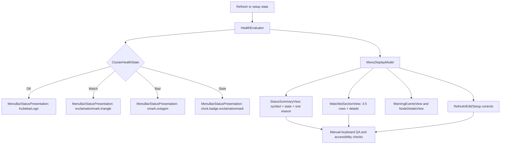

# Phase 06: Polish Menu Bar Icon States and Keyboard Navigation - Research

**Researched:** 2026-04-21
**Domain:** macOS SwiftUI MenuBarExtra polish, accessibility, truncation, and keyboard QA
**Confidence:** HIGH overall, MEDIUM for real menu keyboard verification because menu-bar extras are not covered by existing automated UI infrastructure

<user_constraints>
## User Constraints (from CONTEXT.md)

Source: [VERIFIED: .planning/phases/06-polish-menu-bar-icon-states-and-keyboard-navigation/06-CONTEXT.md]

### Locked Decisions

#### Menu Bar Icon States

- **D-01:** Keep the healthy menu bar state as the brand logo. `OK` should use
  the existing custom `KubebarLogo` in the menu bar.
- **D-02:** Keep `Watch`, `Bad`, and `Stale` as explicit status symbols.
- **D-03:** Reuse the current symbol set:
  `Watch = exclamationmark.triangle`, `Bad = xmark.octagon`, and
  `Stale = clock.badge.exclamationmark`.
- **D-04:** When the menu opens, the top status area must explicitly show
  `OK` for a healthy cluster so the logo is not the only health signal.
- **D-05:** Preserve distinct accessibility labels for all four states, such as
  `Kubebar OK`, `Kubebar Watch`, `Kubebar Bad`, and `Kubebar Stale`.

#### Non-Color Status Expression

- **D-06:** Warning and failure states must use symbol, status text, and a short
  reason. They must not rely on color alone.
- **D-07:** The top status area should show only the single most important
  reason, such as `2 pods restarting` or `kubectl timed out`.
- **D-08:** Detailed reasons stay in the watchlist row, tracked item detail,
  stale banner, or warning event sections. Do not turn the top status area into
  a multi-line incident summary.

#### Menu Reading Experience

- **D-09:** Use CodexBar as a design reference for the menu's product logic:
  the menu bar icon is the first signal, the opened menu explains it, and the
  menu behaves like a reliable small instrument.
- **D-10:** Do not copy CodexBar's provider registry, widgets, update plumbing,
  keychain/cookie usage providers, CLI subproduct, or AppKit status-item
  architecture.
- **D-11:** Keep the menu order focused on status summary plus watchlist first.
  Warning events and node details remain lower-priority sections.
- **D-12:** Tighten spacing and typography, but do not compress the menu. The
  result should feel like native menu grouping, not cards or dashboard panels.

#### Long-Name Truncation

- **D-13:** Long context, namespace, and workload names should use middle
  truncation that preserves the beginning and end of the name.
- **D-14:** Truncation should prioritize preserving tail differences for
  workload and resource names, because Kubernetes names often differ at the
  end.
- **D-15:** Full untruncated names should remain available through hover
  tooltip and accessibility text.
- **D-16:** Avoid multi-line list rows for long names on the primary menu
  surface. Multi-line names make menu height unstable and weaken quick reading.

#### Keyboard Navigation and Verification

- **D-17:** Keyboard navigation must reach setup, refresh, edit watchlist,
  watchlist detail, warning events, and secondary sections.
- **D-18:** Verification should combine automatic tests with a manual QA
  checklist. Existing tests can cover model and state behavior; real menu
  keyboard behavior needs documented manual QA.
- **D-19:** QA must cover all four menu states: `OK`, `Watch`, `Bad`, and
  `Stale`.
- **D-20:** QA must also cover setup, edit watchlist, and refresh enabled or
  disabled paths.

### Claude's Discretion

- The planner may choose exact truncation length and helper type names.
- The planner may choose whether tooltip support lives directly in SwiftUI
  views or behind a small presentation helper, as long as full names are
  available without cluttering the menu.
- The planner may decide which keyboard-navigation behaviors are testable in
  unit tests versus documented in UAT.
- The planner may adjust exact copy if it keeps the same status meaning,
  remains short, and does not weaken watchlist-first reading.

### Deferred Ideas (OUT OF SCOPE)

- Full daily-loop operator QA belongs to GitHub issue #7.
- AppKit `NSStatusItem` migration remains deferred.
- Local distribution, notarization, and packaging remain deferred.
- Deep troubleshooting handoff such as `Open in k9s` remains deferred.
</user_constraints>

<phase_requirements>
## Phase Requirements

| ID | Description | Research Support |
|----|-------------|------------------|
| R1 | The menu bar icon must communicate one of four states: `OK`, `Watch`, `Bad`, or `Stale`. [VERIFIED: docs/brainstorms/2026-04-19-kubebar-watchlist-first-requirements.md; GitHub issue #6] | Use `ClusterHealthState` plus `MenuBarStatusPresentation`; current code already maps `OK` to `KubebarLogo` and `Watch`/`Bad`/`Stale` to the locked SF Symbols. [VERIFIED: KubebarCore/Models/MenuBarStatusPresentation.swift; Kubebar/KubebarApp.swift] |
| R13 | Warning and failure states must not rely on color alone. [VERIFIED: docs/brainstorms/2026-04-19-kubebar-watchlist-first-requirements.md; 06-CONTEXT.md] | Add explicit opened-menu symbol, state text, and one top reason from `MenuDisplayModel`; preserve accessibility labels. [VERIFIED: 06-CONTEXT.md; CITED: https://developer.apple.com/documentation/SwiftUI/View-Accessibility via WebSearch] |
| R18 | The dropdown must feel like a disciplined menu bar utility, not a small dashboard made of cards or widgets. [VERIFIED: docs/brainstorms/2026-04-19-kubebar-watchlist-first-requirements.md] | Keep `StatusSummaryView`, `WatchlistSectionView`, warning events, and node details ordered as the existing menu root does; tighten spacing without adding dashboard panels. [VERIFIED: Kubebar/Views/MenuBarRootView.swift; 06-CONTEXT.md] |
| R19 | The first screen must prioritize typography, ordering, and spacing over decorative UI. [VERIFIED: docs/brainstorms/2026-04-19-kubebar-watchlist-first-requirements.md] | Apple HIG says menu labels should be clear and succinct and icons should clarify meaning, not decorate. [CITED: https://developer.apple.com/design/human-interface-guidelines/menus via WebSearch] |
| R20 | Long object names must truncate consistently so the menu remains scannable during daily use. [VERIFIED: docs/brainstorms/2026-04-19-kubebar-watchlist-first-requirements.md] | Replace current tail pre-truncation with full-value display fields plus SwiftUI one-line middle truncation and tooltip/accessibility full names. [VERIFIED: KubebarCore/Services/HealthEvaluator.swift; CITED: https://developer.apple.com/documentation/swiftui/environmentvalues/truncationmode via WebSearch] |
| R21 | Keyboard navigation must work across top-level rows and submenus. [VERIFIED: docs/brainstorms/2026-04-19-kubebar-watchlist-first-requirements.md; GitHub issue #6] | Use native `Button`, `Picker`, `Toggle`, and `DisclosureGroup` controls; document Full Keyboard Access manual QA because existing tests do not cover menu-bar interaction. [VERIFIED: Kubebar/Views/*.swift; .planning/codebase/TESTING.md; CITED: https://developer.apple.com/design/human-interface-guidelines/keyboards/ via WebSearch] |
</phase_requirements>

## Project Constraints (from AGENTS.md)

- Kubebar is a native macOS menu bar app for quickly checking Kubernetes health, not a replacement for `k9s`. [VERIFIED: AGENTS.md]
- Keep the menu bar icon categorical: `OK`, `Watch`, `Bad`, or `Stale`. [VERIFIED: AGENTS.md]
- Keep the dropdown watchlist-first and cap first-screen watchlist rows at `3-5` items. [VERIFIED: AGENTS.md]
- Never let stale data look healthy or current. [VERIFIED: AGENTS.md]
- Keep deep troubleshooting out of version 1. [VERIFIED: AGENTS.md]
- UI renders `MenuDisplayModel`; views must not decide cluster health directly. [VERIFIED: AGENTS.md; docs/architecture/runtime-invariants.md]
- `HealthEvaluator` is the single source of truth for severity. [VERIFIED: AGENTS.md; .planning/codebase/ARCHITECTURE.md]
- External reads must go through injectable boundaries, and the app-owned context is the source of truth. [VERIFIED: AGENTS.md; docs/architecture/system-overview.md]
- New asynchronous work should prefer `async` / `await`; UI-bound state and side effects should use `@MainActor` where required. [VERIFIED: AGENTS.md]
- The standard local gate is `./scripts/swift-quality-gate.sh local`; visible-app smoke validation uses `./scripts/compile-and-run.sh`. [VERIFIED: AGENTS.md; scripts/swift-quality-gate.sh; scripts/compile-and-run.sh]
- No `CLAUDE.md` file was present in this checkout. [VERIFIED: rg --files -g CLAUDE.md]
- No `.claude/skills` or `.agents/skills` directory was present in this checkout. [VERIFIED: ls .claude/skills; ls .agents/skills]

## Summary

Phase 06 should be planned as a presentation and verification polish phase over the existing SwiftUI `MenuBarExtra.window` app, not as a shell rewrite. [VERIFIED: 06-CONTEXT.md; Kubebar/KubebarApp.swift; CITED: https://developer.apple.com/documentation/SwiftUI/MenuBarExtra via Context7] The locked path is to keep `OK` as the custom `KubebarLogo`, keep `Watch`/`Bad`/`Stale` as explicit SF Symbol states, and make the opened menu explain the compressed menu-bar signal with symbol, state text, and one concise reason. [VERIFIED: 06-CONTEXT.md; KubebarCore/Models/MenuBarStatusPresentation.swift]

The highest-risk planning detail is that current display data is not yet shaped for the phase decisions. [VERIFIED: KubebarCore/Models/MenuDisplayModel.swift; KubebarCore/Services/HealthEvaluator.swift] `HealthEvaluator.shortened(_:)` currently pre-truncates watch item titles at the tail, which conflicts with the locked middle-truncation and full-name fallback decisions. [VERIFIED: KubebarCore/Services/HealthEvaluator.swift; 06-CONTEXT.md] `MenuDisplayModel` also has `healthSentence` but no explicit top-status reason field, so the planner should add a core-owned `primaryStatusReason` or equivalent instead of making `StatusSummaryView` infer the reason. [VERIFIED: KubebarCore/Models/MenuDisplayModel.swift; Kubebar/Views/StatusSummaryView.swift; 06-CONTEXT.md]

**Primary recommendation:** Keep the phase in `MenuBarStatusPresentation`, `MenuDisplayModel`, `HealthEvaluator`, and the existing SwiftUI views; add focused model tests plus a Phase 06 UAT checklist for real keyboard/menu behavior instead of introducing AppKit `NSStatusItem`, dashboard UI, or a new UI automation stack. [VERIFIED: 06-CONTEXT.md; .planning/codebase/TESTING.md; .planning/phases/05-expand-kubectl-data-into-actionable-warning-and-workload-reasons/05-UAT.md]

## Architectural Responsibility Map

| Capability | Primary Tier | Secondary Tier | Rationale |
|------------|--------------|----------------|-----------|
| Menu bar icon state | Core Models | macOS App Shell | `ClusterHealthState` and `MenuBarStatusPresentation` own categorical state and accessibility labels; `KubebarApp` only renders the selected icon. [VERIFIED: KubebarCore/Models/ClusterHealthState.swift; KubebarCore/Models/MenuBarStatusPresentation.swift; Kubebar/KubebarApp.swift] |
| Opened-menu state explanation | Core Models / Services | SwiftUI Views | `HealthEvaluator` should compute the state label and one reason in `MenuDisplayModel`; `StatusSummaryView` should render it without recalculating health. [VERIFIED: AGENTS.md; KubebarCore/Services/HealthEvaluator.swift; Kubebar/Views/StatusSummaryView.swift] |
| Non-color status expression | SwiftUI Views | Core Models | Views render symbol, text, and reason; core supplies the values and accessibility labels. [VERIFIED: 06-CONTEXT.md; KubebarCore/Models/MenuBarStatusPresentation.swift; CITED: https://developer.apple.com/documentation/SwiftUI/View-Accessibility via Context7] |
| Native menu reading polish | SwiftUI Views | Core Models | Spacing, ordering, typography, and grouping belong in `MenuBarRootView` and section views; the data contract stays in `MenuDisplayModel`. [VERIFIED: Kubebar/Views/MenuBarRootView.swift; KubebarCore/Models/MenuDisplayModel.swift] |
| Long-name truncation and full-name fallback | SwiftUI Views | Core Models | Visual truncation belongs in SwiftUI `Text`; full untruncated values should be carried by model fields for tooltip and accessibility text. [VERIFIED: KubebarCore/Services/HealthEvaluator.swift; CITED: https://developer.apple.com/documentation/swiftui/environmentvalues/truncationmode via WebSearch; CITED: https://developer.apple.com/documentation/swiftui/view/help%28_%3A%29 via Context7] |
| Keyboard reachability | SwiftUI Views | Manual QA | `Button`, `Picker`, `Toggle`, and `DisclosureGroup` are the reachable controls; real menu-bar keyboard traversal is not covered by current unit tests. [VERIFIED: Kubebar/Views/*.swift; .planning/codebase/TESTING.md; CITED: https://developer.apple.com/design/human-interface-guidelines/keyboards/ via WebSearch] |
| Verification | Tests / UAT Docs | Local scripts | Core behavior belongs in Swift Testing; real menu and keyboard behavior belongs in UAT plus `compile-and-run`. [VERIFIED: .planning/codebase/TESTING.md; scripts/compile-and-run.sh; .planning/phases/05-expand-kubectl-data-into-actionable-warning-and-workload-reasons/05-UAT.md] |

## Standard Stack

### Core

| Library / Tool | Version | Purpose | Why Standard |
|----------------|---------|---------|--------------|
| SwiftUI `MenuBarExtra` | Apple SDK; app target macOS 14.0; local toolchain Swift 6.3.1 / Xcode 26.4.1 | Native macOS menu bar extra with window-style content. [VERIFIED: Package.swift; project.yml; swift --version; xcodebuild -version] | Official SwiftUI scene for persistent menu-bar utilities; `.window` supports data-rich content and standard controls. [CITED: https://developer.apple.com/documentation/SwiftUI/MenuBarExtra via Context7] |
| SwiftUI text/accessibility modifiers | Apple SDK | `.lineLimit(1)`, `.truncationMode(.middle)`, `.help(Text(...))`, `.accessibilityLabel(...)`, and `.keyboardShortcut(...)`. [CITED: Context7 SwiftUI docs; WebSearch Apple docs] | Uses system text layout, help tags/tooltips, accessibility labels, and keyboard shortcut resolution instead of custom behavior. [CITED: https://developer.apple.com/documentation/swiftui/environmentvalues/truncationmode via WebSearch; CITED: https://developer.apple.com/documentation/swiftui/view/help%28_%3A%29 via Context7] |
| SF Symbols through SwiftUI `Label` / `Image(systemName:)` | Apple SDK | Locked symbols for `Watch`, `Bad`, and `Stale`. [VERIFIED: 06-CONTEXT.md; KubebarCore/Models/MenuBarStatusPresentation.swift] | Keeps status icons native, scalable, and accessible through SwiftUI labels. [VERIFIED: Kubebar/KubebarApp.swift; CITED: https://developer.apple.com/design/human-interface-guidelines/menus via WebSearch] |
| Swift Testing | Swift 6 project; tests import `Testing` | Model and service regression tests. [VERIFIED: Package.swift; KubebarTests/**/*.swift] | Existing test framework; no XCTest UI target is configured. [VERIFIED: .planning/codebase/TESTING.md; rg --files KubebarTests] |

### Supporting

| Library / Tool | Version | Purpose | When to Use |
|----------------|---------|---------|-------------|
| Xcode / `xcodebuild` | Xcode 26.4.1, build 17E202 | Build and test the macOS app target. [VERIFIED: xcodebuild -version; scripts/swift-quality-gate.sh] | Required for the full local gate and any Xcode scheme tests. [VERIFIED: scripts/swift-quality-gate.sh] |
| Swift Package Manager | Swift driver 1.148.6 / Swift 6.3.1 local | SwiftPM build and test path. [VERIFIED: swift --version; Package.swift] | Used by the full gate after Xcode checks. [VERIFIED: scripts/swift-quality-gate.sh] |
| XcodeGen | 2.44.1 local | Regenerate `Kubebar.xcodeproj` if `project.yml` or target membership changes. [VERIFIED: xcodegen --version; project.yml] | Only needed if the plan changes targets, sources, or build settings. [VERIFIED: .planning/codebase/STACK.md] |
| `kubectl` | Client v1.35.3 local | Live app setup/refresh data during manual QA. [VERIFIED: kubectl version --client] | Needed for real cluster UAT; unit tests use fakes and should not shell out to real `kubectl`. [VERIFIED: .planning/codebase/TESTING.md; KubebarTests/Services/*.swift] |
| `osascript` / `open` | macOS system tools | Visible app smoke launch. [VERIFIED: osascript -e "return 1"; scripts/compile-and-run.sh] | Required by `./scripts/compile-and-run.sh`. [VERIFIED: scripts/compile-and-run.sh] |

### Alternatives Considered

| Instead of | Could Use | Tradeoff |
|------------|-----------|----------|
| SwiftUI `MenuBarExtra.window` | AppKit `NSStatusItem` / `NSMenu` | Rejected by locked phase scope; AppKit migration is deferred and would expand architecture risk. [VERIFIED: 06-CONTEXT.md; .planning/phases/04-codexbar-inspired-menu-reliability-and-freshness/04-RESEARCH.md] |
| SwiftUI `Text.truncationMode(.middle)` with full-value fields | Custom text-measurement truncation | Custom text measurement is unnecessary for this phase; Apple provides middle truncation and tooltip/accessibility APIs. [CITED: https://developer.apple.com/documentation/swiftui/environmentvalues/truncationmode via WebSearch; CITED: Context7 SwiftUI help docs] |
| Swift Testing plus UAT | New UI automation target | Current repo has no UI test target, and prior menu-bar inspection through Computer Use could not access the menu extra reliably. [VERIFIED: .planning/codebase/TESTING.md; .planning/phases/05-expand-kubectl-data-into-actionable-warning-and-workload-reasons/05-UAT.md] |
| Existing SF Symbols | Redesign all status icons | User locked the current `Watch`, `Bad`, and `Stale` symbols, and `OK` remains the brand logo. [VERIFIED: 06-CONTEXT.md] |

**Installation:**

```bash
# No Swift package installation is required for this phase because Package.swift declares no external dependencies.
# Regenerate the Xcode project only if project.yml changes:
xcodegen generate
```

**Version verification:**

```bash
swift --version
xcodebuild -version
xcodegen --version
kubectl version --client
```

Version results in this environment: Swift 6.3.1, Xcode 26.4.1, XcodeGen 2.44.1, and kubectl client v1.35.3. [VERIFIED: local command outputs on 2026-04-21]

## Architecture Patterns

### System Architecture Diagram



The diagram shows the desired Phase 06 flow: core services shape the state and reasons, while SwiftUI renders the menu and controls. [VERIFIED: docs/architecture/system-overview.md; KubebarCore/Services/HealthEvaluator.swift; Kubebar/Views/MenuBarRootView.swift]

### Recommended Project Structure

```text
KubebarCore/Models/
├── MenuBarStatusPresentation.swift   # Four-state menu bar icon and accessibility labels
├── MenuDisplayModel.swift            # Add full names and top status reason fields here
└── ClusterHealthState.swift          # Keep OK / Watch / Bad / Stale labels

KubebarCore/Services/
└── HealthEvaluator.swift             # Compute primary reason, watchlist order, truncation-safe display contracts

Kubebar/Views/
├── StatusSummaryView.swift           # Render opened-menu symbol, state text, and one reason
├── WatchlistSectionView.swift        # One-line middle truncation, tooltip, accessibility text, details
├── WarningEventsView.swift           # Secondary section, not promoted above watchlist
└── SetupView.swift / WatchlistPickerView.swift # Keyboard-reachable setup and edit flow

KubebarTests/Models/
├── MenuBarStatusPresentationTests.swift
└── MenuDisplayModelTests.swift

.planning/phases/06-polish-menu-bar-icon-states-and-keyboard-navigation/
└── 06-UAT.md                         # Manual QA for four states and keyboard paths
```

This structure follows the current target layout and test layout. [VERIFIED: .planning/codebase/STRUCTURE.md; rg --files Kubebar KubebarCore KubebarTests]

### Pattern 1: Core-Owned Four-State Presentation

**What:** Keep state-to-icon and state-to-accessibility mapping in `MenuBarStatusPresentation`; do not duplicate state switches in views. [VERIFIED: KubebarCore/Models/MenuBarStatusPresentation.swift; AGENTS.md]

**When to use:** Any menu bar icon, opened-menu status symbol, or accessibility label change. [VERIFIED: 06-CONTEXT.md]

**Example:**

```swift
// Source: KubebarCore/Models/MenuBarStatusPresentation.swift
let presentation = MenuBarStatusPresentation(state: display.state)

switch presentation.icon {
case let .system(name):
    Label(presentation.accessibilityLabel, systemImage: name)
case let .custom(name):
    Image(name)
        .accessibilityLabel(presentation.accessibilityLabel)
}
```

Planning note: update `MenuBarStatusPresentationTests` to assert `OK` uses `.custom("KubebarLogo")`; the current test only asserts `symbolName == "checkmark.circle"` for `OK`, which does not prove the locked menu-bar logo behavior. [VERIFIED: KubebarTests/Models/MenuBarStatusPresentationTests.swift; KubebarCore/Models/MenuBarStatusPresentation.swift; 06-CONTEXT.md]

### Pattern 2: Status Summary Is a Display Contract, Not View Logic

**What:** Add a display-model field such as `primaryStatusReason` so the opened menu can show symbol, state label, and one reason without recalculating severity in `StatusSummaryView`. [VERIFIED: AGENTS.md; KubebarCore/Models/MenuDisplayModel.swift; 06-CONTEXT.md]

**When to use:** Top status area rendering for `OK`, `Watch`, `Bad`, and `Stale`. [VERIFIED: 06-CONTEXT.md]

**Example:**

```swift
// Source: recommended pattern based on AGENTS.md and HealthEvaluator ownership
public struct MenuDisplayModel: Equatable, Sendable {
    public let state: ClusterHealthState
    public let contextName: String
    public let healthSentence: String
    public let primaryStatusReason: String
}
```

Planning note: derive `primaryStatusReason` in `HealthEvaluator` from the highest-priority visible watch item reason, stale banner reason, section failure reason, or warning count. [VERIFIED: KubebarCore/Services/HealthEvaluator.swift; 06-CONTEXT.md]

### Pattern 3: Full Names Stay in the Model, Middle Truncation Stays in SwiftUI

**What:** Preserve the full context, namespace, and workload names in display data, then render with `.lineLimit(1)` and `.truncationMode(.middle)` plus `.help(Text(fullName))` and `.accessibilityLabel(fullName)`. [VERIFIED: 06-CONTEXT.md; CITED: https://developer.apple.com/documentation/swiftui/environmentvalues/truncationmode via WebSearch; CITED: https://developer.apple.com/documentation/swiftui/view/help%28_%3A%29 via Context7]

**When to use:** Status context names, watchlist row titles, tracked item detail names, setup picker labels, and warning-event locations. [VERIFIED: 06-CONTEXT.md; Kubebar/Views/*.swift]

**Example:**

```swift
// Source: Apple SwiftUI truncation/help/accessibility docs via Context7 and WebSearch
Text(item.fullTitle)
    .lineLimit(1)
    .truncationMode(.middle)
    .help(Text(item.fullTitle))
    .accessibilityLabel(item.fullTitle)
```

Planning note: current `HealthEvaluator.shortened(_:)` performs tail truncation and stores only the shortened title in `WatchItemDisplay.title`; change the contract so tests can prove the full value remains available. [VERIFIED: KubebarCore/Services/HealthEvaluator.swift; KubebarCore/Models/MenuDisplayModel.swift]

### Pattern 4: Keyboard Navigation Through Native Controls

**What:** Keep interactive paths as native SwiftUI controls and add explicit shortcuts only for clear primary actions. [VERIFIED: Kubebar/Views/MenuBarRootView.swift; Kubebar/Views/SetupView.swift; CITED: https://developer.apple.com/documentation/SwiftUI/KeyboardShortcut via Context7]

**When to use:** `Retry now`, `Edit watchlist`, `Finish setup`, setup pickers, watchlist toggles, and disclosure groups. [VERIFIED: 06-CONTEXT.md; Kubebar/Views/*.swift]

**Example:**

```swift
// Source: Apple SwiftUI KeyboardShortcut docs via Context7
Button("Finish setup", action: onComplete)
    .keyboardShortcut(.defaultAction)
    .disabled(!state.isConfigured)
```

Planning note: Full Keyboard Access manual QA should be part of `06-UAT.md` because Apple HIG identifies it as the system keyboard-navigation path, and this repo has no UI automation target. [CITED: https://developer.apple.com/design/human-interface-guidelines/keyboards/ via WebSearch; VERIFIED: .planning/codebase/TESTING.md]

### Anti-Patterns to Avoid

- **View-level health decisions:** Do not make `StatusSummaryView` decide which reason is most important; this violates the `HealthEvaluator` ownership rule. [VERIFIED: AGENTS.md; docs/architecture/system-overview.md]
- **Pre-truncating away full values:** Do not store only an ellipsized title in `MenuDisplayModel`; D-15 requires full names for tooltip and accessibility text. [VERIFIED: 06-CONTEXT.md; KubebarCore/Services/HealthEvaluator.swift]
- **Color-only or icon-only warning state:** Do not rely on color, the menu bar icon, or the logo alone; warning/failure states require symbol, status text, and short reason. [VERIFIED: 06-CONTEXT.md; docs/architecture/runtime-invariants.md]
- **Card/dashboard expansion:** Do not convert the primary menu into cards, widgets, or a troubleshooting panel. [VERIFIED: 06-CONTEXT.md; AGENTS.md]
- **New AppKit shell:** Do not migrate to `NSStatusItem` in this phase. [VERIFIED: 06-CONTEXT.md]

## Don't Hand-Roll

| Problem | Don't Build | Use Instead | Why |
|---------|-------------|-------------|-----|
| Menu bar shell | Custom `NSStatusItem` / `NSMenu` migration | Existing SwiftUI `MenuBarExtra.window` | Locked out of scope and already implemented. [VERIFIED: 06-CONTEXT.md; Kubebar/KubebarApp.swift] |
| Text truncation | Manual text measurement and custom ellipsis rendering | SwiftUI `.lineLimit(1)` plus `.truncationMode(.middle)` | Apple provides middle truncation and line limits. [CITED: https://developer.apple.com/documentation/swiftui/environmentvalues/truncationmode via WebSearch] |
| Tooltips | Custom hover tracking | SwiftUI `.help(Text(...))` | Apple documents `.help` as accessibility hint plus macOS tooltip/help tag. [CITED: https://developer.apple.com/documentation/swiftui/view/help%28_%3A%29 via Context7] |
| Accessibility labels | Separate accessibility registry | SwiftUI `.accessibilityLabel(...)` and `MenuBarStatusPresentation.accessibilityLabel` | Existing code already centralizes state labels; SwiftUI provides accessibility modifiers. [VERIFIED: KubebarCore/Models/MenuBarStatusPresentation.swift; CITED: https://developer.apple.com/documentation/SwiftUI/View-Accessibility via WebSearch] |
| Keyboard traversal | Raw key handlers for normal controls | Native `Button`, `Picker`, `Toggle`, `DisclosureGroup`, and targeted `keyboardShortcut` | Apple recommends standard keyboard behavior and shortcuts; native controls remain the lowest-risk path. [CITED: https://developer.apple.com/design/human-interface-guidelines/keyboards/ via WebSearch; VERIFIED: Kubebar/Views/*.swift] |
| Four-state QA | Live-cluster-only reproduction | Deterministic model tests plus manual UAT | Live clusters may not naturally produce all four states, and current repo lacks UI automation. [VERIFIED: .planning/codebase/TESTING.md; .planning/phases/05-expand-kubectl-data-into-actionable-warning-and-workload-reasons/05-UAT.md] |

**Key insight:** The phase is about making already-computed product state readable and reachable; custom shells, custom layout engines, and broad automation infrastructure add risk without improving the locked user outcomes. [VERIFIED: 06-CONTEXT.md; docs/architecture/system-overview.md]

## Common Pitfalls

### Pitfall 1: `OK` Logo Without Opened-Menu Meaning

**What goes wrong:** The menu bar shows the brand logo for `OK`, but the opened menu does not explicitly say `OK`. [VERIFIED: 06-CONTEXT.md; Kubebar/Views/StatusSummaryView.swift]

**Why it happens:** `KubebarApp` uses `MenuBarStatusPresentation`, while `StatusSummaryView` only shows `display.state.label` as small text and no opened-menu symbol. [VERIFIED: Kubebar/KubebarApp.swift; Kubebar/Views/StatusSummaryView.swift]

**How to avoid:** Render the same presentation concept in the opened top status area, with state text and one reason. [VERIFIED: 06-CONTEXT.md]

**Warning signs:** Tests assert menu bar symbol names but do not assert the opened summary contains `OK`, `Watch`, `Bad`, or `Stale` with a reason. [VERIFIED: KubebarTests/Models/MenuBarStatusPresentationTests.swift; KubebarTests/Models/MenuDisplayModelTests.swift]

### Pitfall 2: Tail Truncation Hides Kubernetes Suffixes

**What goes wrong:** Similar Kubernetes resource names become indistinguishable because the meaningful suffix disappears. [VERIFIED: 06-CONTEXT.md]

**Why it happens:** Current `HealthEvaluator.shortened(_:)` uses prefix-only truncation. [VERIFIED: KubebarCore/Services/HealthEvaluator.swift]

**How to avoid:** Keep the full value and use middle truncation for visual `Text`, with full tooltip/accessibility fallback. [VERIFIED: 06-CONTEXT.md; CITED: SwiftUI truncation/help docs via Context7/WebSearch]

**Warning signs:** Tests expect values like `production-namespace/checkout-api-with-a-...` instead of preserving the tail. [VERIFIED: KubebarTests/Models/MenuDisplayModelTests.swift]

### Pitfall 3: Manual QA Cannot Force All Four States

**What goes wrong:** UAT only verifies whichever state the current live cluster happens to show. [VERIFIED: .planning/phases/05-expand-kubectl-data-into-actionable-warning-and-workload-reasons/05-UAT.md]

**Why it happens:** The app reads real `kubectl` state, and the repo has no UI test target or built-in fixture mode. [VERIFIED: .planning/codebase/TESTING.md; KubebarCore/Services/KubectlClusterReader.swift]

**How to avoid:** Cover all four states in deterministic model tests and make UAT explicit about which real-menu paths were manually checked; add a debug-only fixture launch path only if visual all-state manual proof is required. [VERIFIED: KubebarTests/Models/MenuDisplayModelTests.swift; 06-CONTEXT.md]

**Warning signs:** `06-UAT.md` says "state covered" without evidence for `OK`, `Watch`, `Bad`, and `Stale`. [VERIFIED: 06-CONTEXT.md]

### Pitfall 4: Keyboard Reachability Assumed From Mouse Usability

**What goes wrong:** Setup, disclosure groups, secondary sections, or refresh controls work with a mouse but are not reachable or usable with keyboard traversal. [VERIFIED: 06-CONTEXT.md; .planning/codebase/CONCERNS.md]

**Why it happens:** Current tests are model/service tests; no UI interaction tests exist. [VERIFIED: .planning/codebase/TESTING.md]

**How to avoid:** Use native controls, add clear default shortcut behavior for primary actions where appropriate, and run a manual Full Keyboard Access checklist. [CITED: https://developer.apple.com/design/human-interface-guidelines/keyboards/ via WebSearch; VERIFIED: Kubebar/Views/*.swift]

**Warning signs:** New content appears as inert `Text`, such as the current `View all tracked` overflow row. [VERIFIED: Kubebar/Views/WatchlistSectionView.swift]

## Code Examples

Verified patterns from official and local sources:

### Opened Status Summary With State, Symbol, and Reason

```swift
// Source: local MenuBarStatusPresentation + 06-CONTEXT non-color decisions
let presentation = MenuBarStatusPresentation(state: display.state)

HStack(alignment: .firstTextBaseline, spacing: 8) {
    presentation.image
    VStack(alignment: .leading, spacing: 2) {
        Text(display.state.label)
            .font(.caption.weight(.semibold))
        Text(display.primaryStatusReason)
            .font(.subheadline)
            .foregroundStyle(.secondary)
            .lineLimit(1)
    }
}
.accessibilityLabel("\(presentation.accessibilityLabel), \(display.primaryStatusReason)")
```

The `presentation.image` helper does not exist today; if added, keep it UI-only or expose only `IconSource` from core so `KubebarCore` remains free of SwiftUI. [VERIFIED: KubebarCore/Models/MenuBarStatusPresentation.swift; .planning/codebase/ARCHITECTURE.md]

### Middle Truncation With Full Tooltip

```swift
// Source: Apple SwiftUI truncationMode, help, and accessibilityLabel docs
Text(fullName)
    .lineLimit(1)
    .truncationMode(.middle)
    .help(Text(fullName))
    .accessibilityLabel(fullName)
```

Use this for `display.contextName`, watchlist row titles, setup context names, workload names, and warning locations. [VERIFIED: 06-CONTEXT.md; Kubebar/Views/*.swift]

### Native Keyboard Default Action

```swift
// Source: Apple SwiftUI KeyboardShortcut docs
Button("Finish setup", action: onComplete)
    .keyboardShortcut(.defaultAction)
    .disabled(!state.isConfigured)
```

Use explicit shortcuts sparingly; Apple HIG says people expect standard keyboard shortcuts to behave consistently. [CITED: https://developer.apple.com/design/human-interface-guidelines/keyboards/ via WebSearch]

### Model Test For Full Name Preservation

```swift
// Source: existing Swift Testing pattern in KubebarTests/Models/MenuDisplayModelTests.swift
@Test("long watch item keeps full title while visual title can be truncated")
func longWatchItemKeepsFullTitle() {
    let display = HealthEvaluator().evaluate(snapshot: snapshot, now: now)

    #expect(display.visibleWatchItems.first?.fullTitle == "production-namespace/checkout-api-with-a-very-long-name")
}
```

Add the actual property name during planning; the required behavior is full value preservation plus middle visual truncation. [VERIFIED: 06-CONTEXT.md; KubebarCore/Models/MenuDisplayModel.swift]

## State of the Art

| Old Approach | Current Approach | When Changed | Impact |
|--------------|------------------|--------------|--------|
| AppKit `NSStatusItem` for menu-bar apps | SwiftUI `MenuBarExtra`, with `.window` style for data-rich content | `MenuBarExtra` is documented as available on macOS 13.0+; Kubebar targets macOS 14.0. [CITED: Context7 SwiftUI MenuBarExtra docs; VERIFIED: Package.swift] | Keep the SwiftUI shell; do not migrate to AppKit for this phase. [VERIFIED: 06-CONTEXT.md] |
| Tail truncation stored in model strings | Full model value plus view-level middle truncation | Locked by Phase 06 decisions on 2026-04-21. [VERIFIED: 06-CONTEXT.md] | Preserves both prefix and suffix, and keeps full values available to help/accessibility. [VERIFIED: 06-CONTEXT.md; CITED: SwiftUI truncation/help docs] |
| Color or icon as primary state cue | Symbol plus state text plus short reason | Locked by Phase 06 decisions and R13. [VERIFIED: 06-CONTEXT.md; docs/brainstorms/2026-04-19-kubebar-watchlist-first-requirements.md] | Makes `Watch`, `Bad`, and `Stale` understandable without color. [VERIFIED: 06-CONTEXT.md] |
| Live-only manual validation | Unit tests for deterministic states plus documented UAT for real menu interaction | Existing repo has Swift Testing but no UI automation target. [VERIFIED: .planning/codebase/TESTING.md] | The planner should avoid promising full automated menu keyboard coverage unless it first creates UI test infrastructure. [VERIFIED: .planning/codebase/TESTING.md] |

**Deprecated/outdated:**

- AppKit status-item migration is out of scope for this phase. [VERIFIED: 06-CONTEXT.md]
- Color-only, logo-only, or icon-only status meaning is insufficient for this phase. [VERIFIED: 06-CONTEXT.md; docs/architecture/runtime-invariants.md]
- Tail-only pre-truncation is inconsistent with the locked middle-truncation decision. [VERIFIED: KubebarCore/Services/HealthEvaluator.swift; 06-CONTEXT.md]

## Assumptions Log

> List all claims tagged `[ASSUMED]` in this research. The planner and discuss-phase use this section to identify decisions that need user confirmation before execution.

| # | Claim | Section | Risk if Wrong |
|---|-------|---------|---------------|

All claims in this research were verified or cited; no user confirmation is needed before planning. [VERIFIED: source review and documentation lookup completed on 2026-04-21]

## Open Questions

1. **Should visual all-four-state manual QA require a debug-only fixture mode?**
   - What we know: All four state meanings can be covered in Swift Testing, and the previous UAT noted Computer Use could not directly inspect the menu bar extra. [VERIFIED: KubebarTests/Models/MenuDisplayModelTests.swift; .planning/phases/05-expand-kubectl-data-into-actionable-warning-and-workload-reasons/05-UAT.md]
   - What's unclear: Whether the user expects manual visual proof for all four states, or accepts deterministic model tests plus live manual checks for the states available in the current cluster. [VERIFIED: 06-CONTEXT.md]
   - Recommendation: Plan unit tests for all four states and UAT rows for all four states; add a debug-only fixture launch path only if implementation discovers that visual inspection cannot otherwise satisfy D-19. [VERIFIED: 06-CONTEXT.md; .planning/codebase/TESTING.md]

2. **Which explicit keyboard shortcuts should be added, if any?**
   - What we know: Apple documents standard keyboard shortcuts and recommends respecting standard behavior. [CITED: https://developer.apple.com/design/human-interface-guidelines/keyboards/ via WebSearch]
   - What's unclear: The exact shortcut set was left to planner discretion. [VERIFIED: 06-CONTEXT.md]
   - Recommendation: Use `.defaultAction` for `Finish setup` and rely on native keyboard traversal for most controls; add a shortcut for `Retry now` only if manual QA shows the action is not comfortably reachable. [VERIFIED: 06-CONTEXT.md; Kubebar/Views/MenuBarRootView.swift]

## Environment Availability

| Dependency | Required By | Available | Version | Fallback |
|------------|-------------|-----------|---------|----------|
| macOS Swift toolchain | `swift build`, `swift test` | yes | Swift 6.3.1 | none needed. [VERIFIED: swift --version] |
| Xcode / `xcodebuild` | Xcode app build/test gate | yes | Xcode 26.4.1 build 17E202 | none needed. [VERIFIED: xcodebuild -version] |
| XcodeGen | Regenerate project if target membership changes | yes | 2.44.1 | Avoid target changes or update committed `.xcodeproj` manually if unavailable. [VERIFIED: xcodegen --version; project.yml] |
| `kubectl` | Real setup/refresh manual QA | yes | Client v1.35.3 | Unit tests use fake command runners; real app UAT needs configured local cluster access. [VERIFIED: kubectl version --client; .planning/codebase/TESTING.md] |
| `osascript` / `open` | `./scripts/compile-and-run.sh` visible app smoke test | yes | macOS system tools | Manual launch from Finder if script cannot run. [VERIFIED: osascript command; scripts/compile-and-run.sh] |
| GitHub CLI `gh` | Issue source lookup only | yes | authenticated enough to read issue #6 | Issue content is also captured in `06-CONTEXT.md`. [VERIFIED: gh issue view 6 output; 06-CONTEXT.md] |

**Missing dependencies with no fallback:**

- None found for planning this phase. [VERIFIED: environment audit commands on 2026-04-21]

**Missing dependencies with fallback:**

- No UI automation target exists; use Swift Testing plus manual UAT unless the plan explicitly creates UI test infrastructure. [VERIFIED: .planning/codebase/TESTING.md]

## Validation Architecture

### Test Framework

| Property | Value |
|----------|-------|
| Framework | Swift Testing with `@Suite`, `@Test`, and `#expect`. [VERIFIED: .planning/codebase/TESTING.md; KubebarTests/**/*.swift] |
| Config file | `Package.swift` test target plus `project.yml` Xcode test target. [VERIFIED: Package.swift; project.yml] |
| Quick run command | `swift test` [VERIFIED: scripts/swift-quality-gate.sh] |
| Full suite command | `./scripts/swift-quality-gate.sh local` [VERIFIED: AGENTS.md; scripts/swift-quality-gate.sh] |
| Visible app smoke command | `./scripts/compile-and-run.sh` [VERIFIED: AGENTS.md; scripts/compile-and-run.sh] |

Validation is enabled because `.planning/config.json` is absent and no `workflow.nyquist_validation: false` setting exists. [VERIFIED: ls .planning]

### Phase Requirements -> Test Map

| Req ID | Behavior | Test Type | Automated Command | File Exists? |
|--------|----------|-----------|-------------------|--------------|
| R1 | `OK` uses `KubebarLogo`; `Watch`, `Bad`, and `Stale` use locked SF Symbols and accessibility labels. | unit | `swift test --filter MenuBarStatusPresentationTests` | yes, update needed. [VERIFIED: KubebarTests/Models/MenuBarStatusPresentationTests.swift] |
| R13 | Opened menu has symbol, status text, and one reason without relying on color. | unit + manual | `swift test --filter MenuDisplayModelTests` plus `06-UAT.md` | partial; add model field/test and UAT file. [VERIFIED: KubebarTests/Models/MenuDisplayModelTests.swift; 06-CONTEXT.md] |
| R18 | Menu remains watchlist-first and not dashboard/card-like. | manual/source review | `./scripts/compile-and-run.sh` plus `06-UAT.md` | no Phase 06 UAT yet. [VERIFIED: find .planning/phases/06...; Kubebar/Views/MenuBarRootView.swift] |
| R19 | Typography, ordering, and spacing remain readable and native. | manual/source review | `./scripts/compile-and-run.sh` plus `06-UAT.md` | no Phase 06 UAT yet. [VERIFIED: 06-CONTEXT.md; Kubebar/Views/MenuBarRootView.swift] |
| R20 | Long context, namespace, workload, and warning names use consistent middle truncation and full-name fallback. | unit + manual | `swift test --filter MenuDisplayModelTests` plus `06-UAT.md` | partial; current test asserts tail truncation. [VERIFIED: KubebarTests/Models/MenuDisplayModelTests.swift; KubebarCore/Services/HealthEvaluator.swift] |
| R21 | Keyboard reaches setup, refresh, edit watchlist, watchlist detail, warning events, and secondary sections. | manual QA, limited source assertions | `./scripts/compile-and-run.sh` plus `06-UAT.md` | no automated UI target; UAT needed. [VERIFIED: .planning/codebase/TESTING.md; 06-CONTEXT.md] |

### Sampling Rate

- **Per task commit:** `swift test` for model/core-only changes; use focused `--filter` runs first when editing a single model or service. [VERIFIED: .planning/codebase/TESTING.md]
- **Per wave merge:** `./scripts/swift-quality-gate.sh local`. [VERIFIED: AGENTS.md]
- **Phase gate:** Full gate green plus `06-UAT.md` updated with menu state and keyboard checks. [VERIFIED: 06-CONTEXT.md; prior UAT pattern in 04-UAT.md and 05-UAT.md]

### Wave 0 Gaps

- [ ] `KubebarTests/Models/MenuBarStatusPresentationTests.swift` - update `OK` test to assert `.custom("KubebarLogo")` and preserve four accessibility labels. [VERIFIED: current test file]
- [ ] `KubebarTests/Models/MenuDisplayModelTests.swift` - add `primaryStatusReason` coverage for `OK`, `Watch`, `Bad`, and `Stale`. [VERIFIED: current model/test shape]
- [ ] `KubebarTests/Models/MenuDisplayModelTests.swift` or new model test - replace tail-truncation expectation with full-name preservation and middle-truncation contract. [VERIFIED: current test file]
- [ ] `.planning/phases/06-polish-menu-bar-icon-states-and-keyboard-navigation/06-UAT.md` - add manual checklist for four states, setup, edit watchlist, refresh enabled/disabled, disclosure groups, warning events, secondary sections, long-name tooltip/accessibility, and Full Keyboard Access. [VERIFIED: 06-CONTEXT.md; 04-UAT.md; 05-UAT.md]
- [ ] Optional UI test target - only if the planner rejects manual UAT as sufficient. No target exists today. [VERIFIED: Package.swift; project.yml; .planning/codebase/TESTING.md]

## Security Domain

Security enforcement is treated as enabled because `.planning/config.json` is absent. [VERIFIED: ls .planning]

### Applicable ASVS Categories

| ASVS Category | Applies | Standard Control |
|---------------|---------|------------------|
| V2 Authentication | no | Kubebar has no app account/session auth; Kubernetes identity is delegated to local `kubectl`. [VERIFIED: .planning/codebase/INTEGRATIONS.md] |
| V3 Session Management | no | No app sessions are present. [VERIFIED: .planning/codebase/INTEGRATIONS.md] |
| V4 Access Control | limited | Do not add deep links or mutation actions; app reads through selected `kubectl` context only. [VERIFIED: AGENTS.md; .planning/codebase/INTEGRATIONS.md] |
| V5 Input Validation | yes | Treat context, namespace, workload, warning, and error strings as display data only; do not shell-interpolate or expose raw kubectl output in UI. [VERIFIED: docs/architecture/runtime-invariants.md; .planning/codebase/CONCERNS.md] |
| V6 Cryptography | no | No cryptographic feature is in this phase; do not add secret handling. [VERIFIED: 06-CONTEXT.md; .planning/codebase/INTEGRATIONS.md] |

### Known Threat Patterns for This Stack

| Pattern | STRIDE | Standard Mitigation |
|---------|--------|---------------------|
| Misleading stale status | Spoofing / Information disclosure by confusion | Keep stale distinct in icon, state text, banner, and top reason. [VERIFIED: docs/architecture/runtime-invariants.md; 06-CONTEXT.md] |
| Raw command output shown in tooltips or accessibility text | Information disclosure | Full-name fallbacks should use app-owned names, not raw stderr or raw JSON. [VERIFIED: docs/architecture/runtime-invariants.md; .planning/codebase/CONCERNS.md] |
| Custom keyboard handlers triggering unintended actions | Tampering | Prefer native controls and standard shortcuts; keep destructive/deep actions out of scope. [CITED: Apple HIG keyboards via WebSearch; VERIFIED: 06-CONTEXT.md] |
| Shell injection through display strings | Tampering | This phase should not add subprocess calls; existing command boundary passes arguments arrays. [VERIFIED: .planning/codebase/ARCHITECTURE.md; KubebarCore/Services/CommandRunner.swift] |

## Sources

### Primary (HIGH confidence)

- `.planning/phases/06-polish-menu-bar-icon-states-and-keyboard-navigation/06-CONTEXT.md` - locked decisions, discretion, deferred ideas, and code context. [VERIFIED]
- GitHub issue #6, `https://github.com/nexttylabs/kubebar/issues/6` - source scope and acceptance criteria via `gh issue view 6`. [VERIFIED]
- `AGENTS.md` - repo product, architecture, coding, and quality rules. [VERIFIED]
- `docs/brainstorms/2026-04-19-kubebar-watchlist-first-requirements.md` - R1, R13, R18-R21. [VERIFIED]
- `docs/plans/2026-04-19-002-kubebar-product-roadmap.md` - issue #6 as polish gate before QA/distribution. [VERIFIED]
- `docs/architecture/runtime-invariants.md` and `docs/architecture/system-overview.md` - runtime and ownership rules. [VERIFIED]
- `.planning/codebase/ARCHITECTURE.md`, `.planning/codebase/STRUCTURE.md`, `.planning/codebase/TESTING.md`, `.planning/codebase/CONCERNS.md` - current mapped architecture, structure, testing, and risks. [VERIFIED]
- Current source files in `Kubebar/`, `KubebarCore/`, and `KubebarTests/`. [VERIFIED]
- Context7 `/websites/developer_apple_swiftui` - `MenuBarExtra`, `.window` style, `help(_:)`, `accessibilityLabel`, `keyboardShortcut`. [CITED]

### Secondary (MEDIUM confidence)

- Apple Developer Documentation search snippets for `MenuBarExtra`, `KeyboardShortcut`, SwiftUI accessibility modifiers, `truncationMode`, and HIG menus/keyboards. Apple pages are official but browser open returned JavaScript placeholders, so Context7 snippets are preferred where available. [CITED: developer.apple.com via WebSearch]
- `.planning/phases/04-codexbar-inspired-menu-reliability-and-freshness/04-RESEARCH.md` - prior CodexBar lessons adapted for Kubebar. [VERIFIED]
- `.planning/phases/04-codexbar-inspired-menu-reliability-and-freshness/04-UAT.md`, `.planning/phases/05-expand-kubectl-data-into-actionable-warning-and-workload-reasons/05-UAT.md`, `.planning/phases/03-complete-first-use-setup-and-watchlist-editing/03-UAT.md` - existing UAT style and menu-bar automation limitations. [VERIFIED]

### Tertiary (LOW confidence)

- None used as authoritative input. [VERIFIED: source selection review]

## Metadata

**Confidence breakdown:**

- Standard stack: HIGH - current repo manifests, local tool versions, and official SwiftUI docs agree. [VERIFIED: Package.swift; project.yml; local commands; Context7]
- Architecture: HIGH - ownership is locked by AGENTS and architecture docs, and source matches the core/view split. [VERIFIED: AGENTS.md; docs/architecture/system-overview.md; current source]
- Pitfalls: HIGH for truncation/status/model gaps because they are visible in source; MEDIUM for menu keyboard QA because no automated UI target exists. [VERIFIED: KubebarCore/Services/HealthEvaluator.swift; .planning/codebase/TESTING.md]
- Security: MEDIUM - phase has low security scope, but tooltip/accessibility changes must avoid raw command output. [VERIFIED: .planning/codebase/CONCERNS.md; docs/architecture/runtime-invariants.md]

**Research date:** 2026-04-21
**Valid until:** 2026-05-21 for repo-local architecture; re-check Apple docs and local tool versions if planning starts after that date. [VERIFIED: current date and local command outputs]

## RESEARCH COMPLETE
