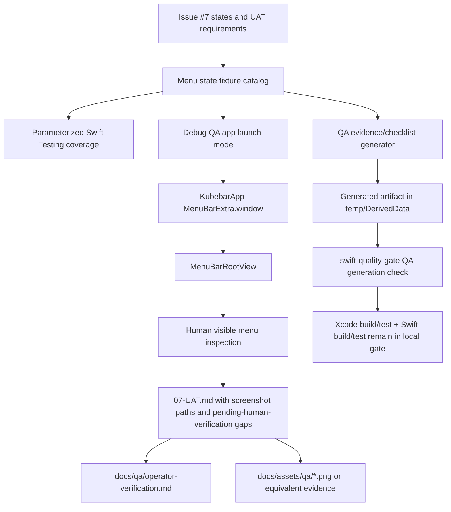

# Phase 07: Add Operator-Facing QA and App Verification - Research

**Researched:** 2026-04-22 [VERIFIED: system date]
**Domain:** SwiftUI macOS menu-bar QA harness, deterministic menu-state fixtures, local quality-gate verification [VERIFIED: 07-CONTEXT.md]
**Confidence:** HIGH for codebase structure and gate integration; MEDIUM for visible menu automation because prior verification found menu-bar inspection requires human evidence. [VERIFIED: .planning/phases/06-polish-menu-bar-icon-states-and-keyboard-navigation/06-UAT.md]

<user_constraints>
## User Constraints (from CONTEXT.md)

The following subsections are copied from `07-CONTEXT.md`; they are the locked planning boundary for Phase 07. [VERIFIED: .planning/phases/07-add-operator-facing-qa-and-app-verification/07-CONTEXT.md]

### Locked Decisions

## Implementation Decisions

### QA Evidence Form

- **D-01:** Use a `UAT table + screenshot paths` evidence format. The table
  should be the primary review surface, and screenshot paths should point to
  the captured visual evidence.
- **D-02:** Cover all issue #7 states: Healthy, Watch, Bad, Stale, first-use,
  empty-watchlist, and kubectl failure.
- **D-03:** Each state record should be detailed. Include reproduction steps,
  expected behavior, observed behavior, evidence path, limitations, and
  follow-up risk.
- **D-04:** kubectl failure does not need to be forced through a real cluster
  as a hard completion gate. Automatic tests should prove the behavior, while
  visible-app QA confirms that the displayed state does not mislead the user.

### State Coverage

- **D-05:** Healthy should be produced from fixed fixtures or a fake runner
  that creates a fully healthy snapshot.
- **D-06:** Watch should be represented by warning events.
- **D-07:** Bad should be represented by a not-ready node or bad workload.
- **D-08:** first-use and empty-watchlist are separate states. first-use means
  setup is incomplete; empty-watchlist means a context exists but no watch
  targets are selected.
- **D-09:** Stale must cover both refresh failure with retained old data and
  old snapshot age-out.

### Automation Boundary

- **D-10:** Keep `./scripts/swift-quality-gate.sh local` as the single local
  check, but extend the gate so it also verifies that QA fixture or checklist
  artifacts can be generated.
- **D-11:** The visible-app smoke test should record the built app path, PID,
  and running state as QA evidence. It does not need to automatically open and
  inspect every menu state.
- **D-12:** If screenshot capture or real menu verification cannot complete,
  the phase may still finish only when the gap is explicit and marked
  `human_needed` or `pending-human-verification`.
- **D-13:** Add a dedicated menu-state fixture or preview harness so QA states
  are stable and do not depend on the operator's current real cluster.

### Documentation Location

- **D-14:** Use both a phase UAT file and long-term docs. The phase UAT records
  this phase's evidence; `docs/qa/operator-verification.md` keeps durable
  operator verification instructions.
- **D-15:** Store committed screenshots under `docs/assets/qa/`.
- **D-16:** Do not expand README for this phase. Update architecture or docs
  entry points instead.
- **D-17:** Manual gaps must be listed as `pending-human-verification`. Do not
  present unverified items as passed.

### Claude's Discretion

- The planner may choose the exact harness shape, file names, and command name
  as long as QA states are stable and repeatable.
- The planner may choose screenshot naming conventions under `docs/assets/qa/`.
- The planner may decide whether generated QA evidence is produced by Swift
  code, a script, or a small app mode if it preserves the product boundaries.
- The planner may tune exact UAT wording as long as every state records
  reproduction steps, observations, limitations, and risk.

### Deferred Ideas (OUT OF SCOPE)

- Local distribution, signing, notarization, and install packaging belong to
  GitHub issue #8.
- Deeper debugging handoff such as `Open in k9s` belongs to GitHub issue #9 or
  future backlog.
- A broad macOS menu automation framework is not required for this phase.
</user_constraints>

## Summary

Phase 07 should add a deterministic QA path around the existing menu display contract, not a new monitoring surface or a real-cluster state factory. [VERIFIED: AGENTS.md; VERIFIED: docs/architecture/system-overview.md; VERIFIED: .planning/phases/07-add-operator-facing-qa-and-app-verification/07-CONTEXT.md]

The safest planning shape is a small menu-state fixture catalog that produces `MenuDisplayModel` plus setup/runtime state for Healthy, Watch, Bad, Stale-by-failure, Stale-by-age, first-use, empty-watchlist, and kubectl failure. [VERIFIED: KubebarCore/Services/HealthEvaluator.swift; VERIFIED: KubebarCore/Models/MenuDisplayModel.swift; VERIFIED: .planning/phases/07-add-operator-facing-qa-and-app-verification/07-CONTEXT.md]

The quality gate should remain `./scripts/swift-quality-gate.sh local` and should add a non-GUI generation check for QA artifacts after the existing Xcode and SwiftPM checks. [VERIFIED: AGENTS.md; VERIFIED: scripts/swift-quality-gate.sh; VERIFIED: .planning/phases/07-add-operator-facing-qa-and-app-verification/07-CONTEXT.md]

**Primary recommendation:** Implement a Debug-only QA state mode backed by a pure fixture catalog, plus a generator/check script that writes a UAT template to a temporary output and proves all required rows are present. [VERIFIED: Kubebar/KubebarApp.swift; VERIFIED: Kubebar/Views/MenuBarRootView.swift; VERIFIED: scripts/swift-quality-gate.sh; CITED: developer.apple.com/documentation/swiftui/menubarextra]

## Project Constraints (from AGENTS.md)

- `CLAUDE.md` is absent in this checkout, so project constraints come from `AGENTS.md` and the listed canonical docs. [VERIFIED: local `ls CLAUDE.md`; VERIFIED: AGENTS.md]
- Kubebar is a native macOS menu bar app for quick Kubernetes health checks, not a `k9s` replacement. [VERIFIED: AGENTS.md]
- The menu bar icon must stay categorical: `OK`, `Watch`, `Bad`, or `Stale`. [VERIFIED: AGENTS.md; VERIFIED: docs/architecture/runtime-invariants.md]
- The dropdown must stay watchlist-first, and first-screen watchlist rows must stay capped at `3-5` items. [VERIFIED: AGENTS.md; VERIFIED: docs/brainstorms/2026-04-19-kubebar-watchlist-first-requirements.md]
- Stale data must never look healthy or current. [VERIFIED: AGENTS.md; VERIFIED: docs/architecture/runtime-invariants.md]
- UI renders `MenuDisplayModel`; UI must not decide cluster health directly. [VERIFIED: AGENTS.md; VERIFIED: docs/architecture/system-overview.md]
- `HealthEvaluator` is the single source of truth for severity. [VERIFIED: AGENTS.md; VERIFIED: KubebarCore/Services/HealthEvaluator.swift]
- External reads must go through injectable boundaries. [VERIFIED: AGENTS.md; VERIFIED: KubebarCore/Services/CommandRunner.swift; VERIFIED: KubebarCore/Services/KubectlClusterReader.swift]
- App-owned context is authoritative; the app must not depend on the terminal's current Kubernetes context. [VERIFIED: AGENTS.md; VERIFIED: docs/architecture/runtime-invariants.md]
- Production code should avoid force unwraps, `try!`, and undocumented `fatalError`, prefer value types, explicit access control, `async`/`await`, dependency injection, and thin views. [VERIFIED: AGENTS.md]
- The local quality gate is `./scripts/swift-quality-gate.sh local`, and behavior changes should include tests and relevant docs updates. [VERIFIED: AGENTS.md; VERIFIED: skills/ship/SKILL.md]

## Phase Requirements

| ID | Description | Research Support |
|----|-------------|------------------|
| D-01 | Use UAT table plus screenshot paths as the primary evidence format. | Plan `07-UAT.md` as the authoritative table and treat screenshots as linked proof. [VERIFIED: 07-CONTEXT.md; VERIFIED: 06-UAT.md] |
| D-02 | Cover Healthy, Watch, Bad, Stale, first-use, empty-watchlist, and kubectl failure. | Use a fixture catalog plus parameterized tests to assert every state exists. [VERIFIED: 07-CONTEXT.md; CITED: developer.apple.com/documentation/testing/parameterizedtesting] |
| D-04 | Prove kubectl failure automatically without requiring a real failed cluster. | Reuse fake `CommandRunning` patterns and existing kubectl failure tests. [VERIFIED: KubebarTests/Services/KubectlClusterReaderTests.swift] |
| D-09 | Cover stale retained-data failure and old snapshot age-out. | Existing `HealthEvaluator` supports failure-driven stale and `staleAfterSeconds`; tests already cover both behaviors. [VERIFIED: KubebarCore/Services/HealthEvaluator.swift; VERIFIED: KubebarTests/Models/MenuDisplayModelTests.swift] |
| D-10 | Keep the local quality gate as the single local check, extended with QA artifact generation. | Add one generator/check step to `scripts/swift-quality-gate.sh` without removing Xcode build/test or SwiftPM build/test. [VERIFIED: scripts/swift-quality-gate.sh] |
| D-11 | Record visible app path, PID, and running state as QA evidence. | `scripts/compile-and-run.sh` already prints built app path and PID after launch. [VERIFIED: scripts/compile-and-run.sh] |
| D-12/D-17 | Mark incomplete visual evidence as `human_needed` or `pending-human-verification`. | Phase 06 already uses this status for menu-bar inspection gaps. [VERIFIED: 06-UAT.md; VERIFIED: 06-VERIFICATION.md] |
| D-14/D-15 | Store phase evidence in UAT and durable docs, with screenshots under `docs/assets/qa/`. | Plan new `07-UAT.md`, `docs/qa/operator-verification.md`, and `docs/assets/qa/`. [VERIFIED: 07-CONTEXT.md] |

## Architectural Responsibility Map

| Capability | Primary Tier | Secondary Tier | Rationale |
|------------|-------------|----------------|-----------|
| Deterministic menu-state fixtures | Core / Test Support | macOS App Shell | `MenuDisplayModel` and `HealthEvaluator` own renderable health state, while the app shell only needs a way to display a selected fixture. [VERIFIED: docs/architecture/system-overview.md; VERIFIED: KubebarCore/Services/HealthEvaluator.swift] |
| QA app launch mode | macOS App Shell | Core / Test Support | The real menu window is created by `KubebarApp` and `MenuBarRootView`, while fixture data should come from core-shaped values. [VERIFIED: Kubebar/KubebarApp.swift; VERIFIED: Kubebar/Views/MenuBarRootView.swift; CITED: developer.apple.com/documentation/swiftui/menubarextra] |
| QA artifact generation | Scripts / Local Tooling | Core / Test Support | The quality gate is a shell script that already coordinates Xcode and SwiftPM checks, so generation belongs beside existing gate commands. [VERIFIED: scripts/swift-quality-gate.sh] |
| Visual screenshot evidence | Human QA / Local macOS | Scripts / Visible app smoke | Prior automation could launch the app but could not reliably inspect menu-bar extras, so screenshots are supporting evidence and human-visible menu inspection remains explicit. [VERIFIED: 06-UAT.md; VERIFIED: scripts/compile-and-run.sh] |
| Daily-use operator documentation | Docs | Phase UAT | The durable doc belongs in `docs/qa/operator-verification.md`, while phase-specific proof belongs in `07-UAT.md`. [VERIFIED: 07-CONTEXT.md] |
| Scope enforcement | Planner / Docs | Tests / Gate | Distribution, signing, deep handoff, dashboard expansion, and broad menu automation are explicitly out of scope. [VERIFIED: 07-CONTEXT.md; VERIFIED: docs/brainstorms/2026-04-19-kubebar-watchlist-first-requirements.md] |

## Standard Stack

### Core

| Library / Tool | Version | Purpose | Why Standard |
|----------------|---------|---------|--------------|
| SwiftUI `MenuBarExtra` | SDK from Xcode 26.4.1 local toolchain | Native macOS menu-bar scene and window-style content. | Apple documents `MenuBarExtra` as the SwiftUI scene for persistent menu-bar access, and `.window` as the style for richer standard controls. [VERIFIED: local `xcodebuild -version`; CITED: developer.apple.com/documentation/swiftui/menubarextra] |
| Swift Testing | Swift 6 toolchain; local Swift 6.3.1 | Unit tests, suites, expectations, and parameterized fixture coverage. | The repo already uses `@Suite`, `@Test`, and `#expect`, and Apple documents parameterized tests through `@Test(arguments:)`. [VERIFIED: local `swift --version`; VERIFIED: KubebarTests/Models/MenuDisplayModelTests.swift; CITED: developer.apple.com/documentation/testing/parameterizedtesting] |
| Xcode `xcodebuild` | Xcode 26.4.1 | macOS app build and Xcode test gate. | The current gate runs `xcodebuild build` and `xcodebuild test`; Apple documents `xcodebuild test -scheme ...` for command-line testing. [VERIFIED: scripts/swift-quality-gate.sh; VERIFIED: local `xcodebuild -version`; CITED: developer.apple.com/documentation/xcode/running-tests-and-interpreting-results] |
| Swift Package Manager | Swift tools version 6.0 declared; local Swift 6.3.1 | Package build/test checks and core test target. | `Package.swift` declares the executable, `KubebarCore`, and test target, and the gate runs `swift build` and `swift test`. [VERIFIED: Package.swift; VERIFIED: scripts/swift-quality-gate.sh; VERIFIED: local `swift --version`] |
| `kubectl` JSON fixtures | local kubectl client v1.35.3 | Stable fake inputs for cluster states and failure paths. | Kubernetes documents `kubectl get -o json`; existing tests already fake `kubectl` output instead of requiring a real cluster. [VERIFIED: local `kubectl version --client=true`; VERIFIED: KubebarTests/Services/KubectlClusterReaderTests.swift; CITED: kubernetes.io/docs/reference/kubectl/generated/kubectl_get/] |

### Supporting

| Library / Tool | Version | Purpose | When to Use |
|----------------|---------|---------|-------------|
| `scripts/swift-quality-gate.sh` | repo script | Single local gate for build/test plus new QA artifact generation check. | Use for every final validation and add the non-GUI QA generation check here. [VERIFIED: AGENTS.md; VERIFIED: scripts/swift-quality-gate.sh; VERIFIED: 07-CONTEXT.md] |
| `scripts/compile-and-run.sh` | repo script | Visible app smoke evidence: app path, PID, running state. | Use for UAT setup and record output in `07-UAT.md`; do not make it inspect every menu state automatically. [VERIFIED: scripts/compile-and-run.sh; VERIFIED: 07-CONTEXT.md] |
| `screencapture` | `/usr/sbin/screencapture` available locally | Manual or semi-manual screenshot capture. | Use for human-visible menu evidence when the menu is on screen; do not make screenshot capture a required CI gate. [VERIFIED: local `command -v screencapture`; VERIFIED: 06-UAT.md] |
| XcodeGen | 2.44.1 local | Regenerate Xcode project only if project structure changes. | Use only if adding Xcode target membership or settings through `project.yml`; `project.yml` is the app-project source of truth. [VERIFIED: local `xcodegen --version`; VERIFIED: project.yml; VERIFIED: Package.swift] |

### Alternatives Considered

| Instead of | Could Use | Tradeoff |
|------------|-----------|----------|
| Debug-only QA app mode plus fixture catalog | Manual-only screenshots from a real cluster | Real-cluster screenshots are closer to daily use but are not stable and cannot reliably cover kubectl failure or stale age-out. [VERIFIED: 07-CONTEXT.md; VERIFIED: KubebarTests/Services/KubectlClusterReaderTests.swift] |
| Non-GUI artifact generation in the quality gate | Full menu UI automation framework | UI automation would be fragile for `MenuBarExtra.window`, and Phase 07 explicitly excludes a broad menu automation framework. [VERIFIED: 07-CONTEXT.md; VERIFIED: 06-UAT.md] |
| Pure Swift Testing fixture assertions | New snapshot-testing dependency | The repo has no UI snapshot framework, and current tests use Swift Testing with manual fakes. [VERIFIED: .planning/codebase/TESTING.md; VERIFIED: Package.swift] |

**Installation:** No new third-party dependency is recommended for Phase 07. [VERIFIED: Package.swift; VERIFIED: 07-CONTEXT.md]

```bash
./scripts/swift-quality-gate.sh local
```

**Version verification:** This repo is not an npm package, so `npm view` version checks are not applicable; versions were verified with local `swift --version`, `xcodebuild -version`, `kubectl version --client=true`, and `xcodegen --version`. [VERIFIED: local commands]

## Architecture Patterns

### System Architecture Diagram



The diagram reflects the existing `MenuBarExtra.window` app shell, model-driven menu rendering, and script-owned quality gate. [VERIFIED: Kubebar/KubebarApp.swift; VERIFIED: Kubebar/Views/MenuBarRootView.swift; VERIFIED: scripts/swift-quality-gate.sh; CITED: developer.apple.com/documentation/swiftui/menubarextra]

### Recommended Project Structure

```text
KubebarCore/QA/
├── MenuStateFixtureCatalog.swift      # Debug/test-safe source of required QA states. [VERIFIED: docs/architecture/system-overview.md]
Kubebar/QA/
├── QALaunchMode.swift                 # Debug-only environment/argument adapter for visible app states. [VERIFIED: Kubebar/KubebarApp.swift]
KubebarTests/QA/
├── MenuStateFixtureCatalogTests.swift # Parameterized state coverage and no-sensitive-text checks. [CITED: developer.apple.com/documentation/testing/parameterizedtesting]
scripts/
├── generate-qa-evidence.sh            # Non-GUI UAT/checklist generation command. [VERIFIED: scripts/swift-quality-gate.sh]
docs/qa/
├── operator-verification.md           # Durable daily-use verification instructions. [VERIFIED: 07-CONTEXT.md]
docs/assets/qa/
├── phase-07-*.png                     # Committed screenshots or equivalent visual evidence. [VERIFIED: 07-CONTEXT.md]
.planning/phases/07-add-operator-facing-qa-and-app-verification/
├── 07-UAT.md                          # Phase evidence table. [VERIFIED: 07-CONTEXT.md]
```

The `KubebarCore/QA` path should be compiled only for Debug/test use or kept free of side effects if compiled into Debug products. [VERIFIED: AGENTS.md; VERIFIED: Package.swift]

### Pattern 1: Fixture Catalog Owns Required States

**What:** Define a small `MenuStateFixtureCatalog` with one stable case per required QA state and explicit metadata for expected behavior, screenshot path, and automation coverage. [VERIFIED: 07-CONTEXT.md; VERIFIED: KubebarCore/Models/MenuDisplayModel.swift]

**When to use:** Use this when the planner needs stable state coverage without depending on the operator's real cluster or current terminal context. [VERIFIED: 07-CONTEXT.md; VERIFIED: docs/architecture/runtime-invariants.md]

**Example:**

```swift
// Source: local pattern from MenuDisplayModelTests + Apple Swift Testing parameterized tests.
enum MenuQAState: String, CaseIterable, Sendable {
    case healthy
    case watch
    case bad
    case staleRefreshFailure
    case staleAgeOut
    case firstUse
    case emptyWatchlist
    case kubectlFailure
}

struct MenuStateFixture: Sendable {
    let id: MenuQAState
    let display: MenuDisplayModel
    let isShowingSetup: Bool
    let expectedBehavior: String
    let evidencePath: String
}
```

This shape follows the existing value-type and `MenuDisplayModel` render contract. [VERIFIED: AGENTS.md; VERIFIED: KubebarCore/Models/MenuDisplayModel.swift; VERIFIED: .planning/codebase/ARCHITECTURE.md]

### Pattern 2: Parameterized Coverage for Required States

**What:** Use Swift Testing parameterized tests to assert that every required fixture exists and maps to the expected high-level state. [CITED: developer.apple.com/documentation/testing/parameterizedtesting; VERIFIED: KubebarTests/Models/MenuDisplayModelTests.swift]

**When to use:** Use this for non-visual proof that fixture coverage cannot silently drop a required state. [VERIFIED: 07-CONTEXT.md; VERIFIED: .planning/codebase/TESTING.md]

**Example:**

```swift
// Source: Apple Swift Testing parameterized test docs + local Swift Testing style.
@Suite("Menu QA fixtures")
struct MenuStateFixtureCatalogTests {
    @Test("required state exists", arguments: MenuQAState.allCases)
    func requiredStateExists(_ state: MenuQAState) throws {
        let fixture = try MenuStateFixtureCatalog.fixture(for: state)

        #expect(fixture.id == state)
        #expect(!fixture.expectedBehavior.isEmpty)
        #expect(!fixture.evidencePath.isEmpty)
    }
}
```

The repo already uses `@Suite`, `@Test`, and `#expect`; adding parameterization matches Apple's documented Swift Testing API and local test style. [VERIFIED: KubebarTests/Models/MenuDisplayModelTests.swift; CITED: developer.apple.com/documentation/testing/parameterizedtesting]

### Pattern 3: Debug QA Launch Mode for Real App Evidence

**What:** Add a Debug-only launch argument or environment variable such as `KUBEBAR_QA_STATE=watch` that bypasses live `kubectl` reads and displays the selected fixture in the real `MenuBarExtra.window` shell. [VERIFIED: 07-CONTEXT.md; VERIFIED: Kubebar/KubebarApp.swift; VERIFIED: Kubebar/MenuBarViewModel.swift]

**When to use:** Use this for screenshots and human-visible verification of stable states without requiring real cluster manipulation. [VERIFIED: 07-CONTEXT.md; VERIFIED: 06-UAT.md]

**Example:**

```swift
// Source: local app shell and fixture recommendation.
#if DEBUG
let qaStateName = ProcessInfo.processInfo.environment["KUBEBAR_QA_STATE"]
if let fixture = qaStateName.flatMap(MenuStateFixtureCatalog.fixtureIfPresent(named:)) {
    MenuBarRootView(
        display: fixture.display,
        setupState: .constant(fixture.setupState),
        isShowingSetup: fixture.isShowingSetup,
        refreshCadence: .oneMinute,
        isRefreshing: false,
        onRefresh: {},
        onEditWatchlist: {},
        onCompleteSetup: {},
        onSelectContext: { _ in },
        onSelectRefreshCadence: { _ in },
        onRetryTargets: {}
    )
}
#endif
```

The QA mode should not mutate app config, shell out to `kubectl`, or change production health evaluation rules. [VERIFIED: AGENTS.md; VERIFIED: docs/architecture/runtime-invariants.md; VERIFIED: KubebarCore/Services/KubectlClusterReader.swift]

### Pattern 4: Quality Gate Adds Generation, Not GUI Inspection

**What:** Add a `run_qa_artifact_check` function to `scripts/swift-quality-gate.sh` after the existing Xcode and SwiftPM checks, and have it generate required QA rows into a temporary directory. [VERIFIED: scripts/swift-quality-gate.sh; VERIFIED: 07-CONTEXT.md]

**When to use:** Use this to prove that fixture/checklist artifacts are reproducible without blocking CI on GUI state, screenshots, or SystemUIServer automation. [VERIFIED: 06-UAT.md; VERIFIED: 07-CONTEXT.md]

**Example:**

```bash
# Source: local quality-gate shape.
run_qa_artifact_check() {
  local output_dir
  output_dir="$(mktemp -d)"
  ./scripts/generate-qa-evidence.sh --output "$output_dir"
  test -s "$output_dir/07-UAT.generated.md"
}
```

The generator should write to a temporary output during the gate so it does not overwrite human-entered UAT observations. [VERIFIED: 06-UAT.md; VERIFIED: 07-CONTEXT.md]

### Anti-Patterns to Avoid

- **Real-cluster-only QA:** It cannot reliably produce stale age-out, first-use, empty-watchlist, and kubectl failure states on demand. [VERIFIED: 07-CONTEXT.md; VERIFIED: KubebarTests/Services/KubectlClusterReaderTests.swift]
- **UI-derived health logic:** It violates the rule that UI renders `MenuDisplayModel` and does not decide cluster health. [VERIFIED: AGENTS.md; VERIFIED: docs/architecture/system-overview.md]
- **Quality gate opens menus or requires screenshots:** Prior phase evidence found `MenuBarExtra` inspection unreliable through automation, so GUI evidence should remain UAT/human evidence. [VERIFIED: 06-UAT.md; VERIFIED: 07-CONTEXT.md]
- **README expansion:** Phase 07 explicitly says to update architecture or docs entry points, not README. [VERIFIED: 07-CONTEXT.md]
- **New dashboard or deep-debug action:** The roadmap and requirements keep Kubebar as a glanceable utility and defer deep handoff. [VERIFIED: docs/brainstorms/2026-04-19-kubebar-watchlist-first-requirements.md; VERIFIED: 07-CONTEXT.md]

## Don't Hand-Roll

| Problem | Don't Build | Use Instead | Why |
|---------|-------------|-------------|-----|
| Forcing Kubernetes into every visible QA state | A local cluster mutation script or real-cluster failure recipe | `MenuDisplayModel` fixtures and fake `CommandRunning` outputs | The phase allows kubectl failure proof through automatic tests and requires stable states independent of the operator's real cluster. [VERIFIED: 07-CONTEXT.md; VERIFIED: KubebarTests/Services/KubectlClusterReaderTests.swift] |
| Full menu-bar automation | A broad SystemUIServer/menu inspection framework | Human UAT rows plus screenshot paths, with non-GUI artifact generation in the gate | Prior UAT found Computer Use could not reliably inspect the menu-bar extra, and the phase excludes broad menu automation. [VERIFIED: 06-UAT.md; VERIFIED: 07-CONTEXT.md] |
| New visual snapshot dependency | A snapshot testing framework | Swift Testing fixture assertions and manual screenshot evidence | Current tests use Swift Testing only, and the phase requires screenshots or equivalent visual evidence rather than automated pixel diffs. [VERIFIED: .planning/codebase/TESTING.md; VERIFIED: 07-CONTEXT.md] |
| Ad hoc shell parsing of app state | Parsing raw command transcripts or full JSON into UAT | App-owned display strings and redacted observations | Runtime rules forbid raw command transcript display, and UAT evidence must avoid sensitive cluster data. [VERIFIED: docs/architecture/runtime-invariants.md; VERIFIED: 06-UAT.md] |
| Replacing the quality gate | A separate QA command as the required local check | Keep `./scripts/swift-quality-gate.sh local` and add a generation step | Phase 07 locks the single local check. [VERIFIED: 07-CONTEXT.md; VERIFIED: AGENTS.md] |

**Key insight:** The phase is about trust evidence for already-shaped menu states, so the hard boundary is "fixture-backed app verification" rather than "more cluster behavior." [VERIFIED: docs/architecture/system-overview.md; VERIFIED: 07-CONTEXT.md]

## Common Pitfalls

### Pitfall 1: Treating Empty Watchlist as Healthy

**What goes wrong:** A configured context with zero watch targets can be confused with a healthy cluster if the evidence only checks counters. [VERIFIED: 07-CONTEXT.md; VERIFIED: docs/architecture/runtime-invariants.md]

**Why it happens:** First-use and empty-watchlist are separate states, and the product rules say an empty watchlist is a real state with a next action. [VERIFIED: 07-CONTEXT.md; VERIFIED: docs/brainstorms/2026-04-19-kubebar-watchlist-first-requirements.md]

**How to avoid:** Give `emptyWatchlist` its own fixture, UAT row, expected behavior, screenshot path, and test assertion. [VERIFIED: 07-CONTEXT.md]

**Warning signs:** A fixture list has `firstUse` but no `emptyWatchlist`, or a UAT table groups both into one row. [VERIFIED: 07-CONTEXT.md]

### Pitfall 2: Calling the Phase Passed Without Visual Evidence

**What goes wrong:** Automated model tests pass while the visible menu state remains unconfirmed. [VERIFIED: 06-VERIFICATION.md]

**Why it happens:** `MenuBarExtra.window` content is real SwiftUI UI, but prior automation could not reliably inspect the menu-bar extra or SystemUIServer. [VERIFIED: 06-UAT.md; CITED: developer.apple.com/documentation/swiftui/menubarextra]

**How to avoid:** Keep automatic evidence and visible-menu evidence in separate UAT columns, and mark missing screenshots or inspection as `pending-human-verification`. [VERIFIED: 07-CONTEXT.md; VERIFIED: 06-UAT.md]

**Warning signs:** A UAT row says `pass` while the evidence path is empty or points only to a unit test. [VERIFIED: 07-CONTEXT.md]

### Pitfall 3: Making the Quality Gate GUI-Dependent

**What goes wrong:** CI or headless local runs fail because the gate tries to open the menu or capture screenshots. [VERIFIED: 06-UAT.md; VERIFIED: scripts/swift-quality-gate.sh]

**Why it happens:** Visible app verification is valuable but not reliably scriptable for menu-bar extras in this repo's prior evidence. [VERIFIED: 06-UAT.md]

**How to avoid:** Gate only deterministic generation and tests; record visible app launch and screenshots in UAT. [VERIFIED: 07-CONTEXT.md; VERIFIED: scripts/compile-and-run.sh]

**Warning signs:** `swift-quality-gate.sh` starts calling `open`, `osascript`, `screencapture`, or `SystemUIServer` inspection. [VERIFIED: scripts/swift-quality-gate.sh; VERIFIED: 06-UAT.md]

### Pitfall 4: Letting QA Mode Become Product Scope

**What goes wrong:** A fixture mode turns into context switching, dashboard navigation, or deep debugging handoff. [VERIFIED: 07-CONTEXT.md; VERIFIED: docs/brainstorms/2026-04-19-kubebar-watchlist-first-requirements.md]

**Why it happens:** App verification touches the visible app shell, which can invite product additions. [VERIFIED: Kubebar/KubebarApp.swift; VERIFIED: docs/plans/2026-04-19-002-kubebar-product-roadmap.md]

**How to avoid:** Keep QA state selection Debug-only and launch-argument/environment-driven, with no visible production menu controls for QA state switching. [VERIFIED: 07-CONTEXT.md; VERIFIED: AGENTS.md]

**Warning signs:** New production buttons like "Demo states", "Open in k9s", or broad dashboard routes appear in the plan. [VERIFIED: 07-CONTEXT.md]

### Pitfall 5: Exposing Sensitive Cluster Details in Evidence

**What goes wrong:** UAT screenshots or observations include raw command output, kubeconfig paths, tokens, or full JSON. [VERIFIED: docs/architecture/runtime-invariants.md; VERIFIED: 06-UAT.md]

**Why it happens:** kubectl failure and warning-event paths are easy to reproduce with raw stderr or transcripts. [VERIFIED: KubebarTests/Services/KubectlClusterReaderTests.swift]

**How to avoid:** Use app-owned labels, sanitized failure reasons, and redacted observations in UAT. [VERIFIED: docs/architecture/runtime-invariants.md; VERIFIED: KubebarTests/Services/KubectlClusterReaderTests.swift]

**Warning signs:** Evidence contains `/Users/.../.kube/config`, token-like strings, command transcripts, or full JSON blocks. [VERIFIED: KubebarTests/Services/KubectlClusterReaderTests.swift; VERIFIED: 06-UAT.md]

## Code Examples

### Required-State Fixture Assertion

```swift
// Source: Apple Swift Testing parameterized tests + local MenuDisplayModelTests style.
@Test("QA fixture maps to expected display state", arguments: [
    (MenuQAState.healthy, ClusterHealthState.ok),
    (.watch, .watch),
    (.bad, .bad),
    (.staleRefreshFailure, .stale),
    (.staleAgeOut, .stale),
    (.kubectlFailure, .stale)
])
func qaFixtureMapsToExpectedDisplayState(_ input: (MenuQAState, ClusterHealthState)) throws {
    let fixture = try MenuStateFixtureCatalog.fixture(for: input.0)

    #expect(fixture.display.state == input.1)
}
```

This example uses the repo's current Swift Testing style and Apple's documented parameterized test pattern. [VERIFIED: KubebarTests/Models/MenuDisplayModelTests.swift; CITED: developer.apple.com/documentation/testing/parameterizedtesting]

### Gate-Safe Artifact Generation

```bash
# Source: local quality gate structure.
output_dir="$(mktemp -d)"
./scripts/generate-qa-evidence.sh --output "$output_dir"
test -s "$output_dir/07-UAT.generated.md"
grep -q "Healthy" "$output_dir/07-UAT.generated.md"
grep -q "pending-human-verification" "$output_dir/07-UAT.generated.md"
```

This keeps generation deterministic and avoids overwriting the manually updated phase UAT. [VERIFIED: 07-CONTEXT.md; VERIFIED: 06-UAT.md]

### Visible App Smoke Evidence Row

```markdown
| Visible app launch | pass | App path: DerivedData/Build/Products/Debug/Kubebar.app; PID: <recorded>; running: yes |
```

This row matches the existing `compile-and-run.sh` output contract. [VERIFIED: scripts/compile-and-run.sh]

## State of the Art

| Old Approach | Current Approach | When Changed | Impact |
|--------------|------------------|--------------|--------|
| Model tests prove menu states but visible menu proof remains manual. | Fixture-backed UAT plus screenshot paths and explicit human-needed status. | Phase 07 context on 2026-04-22. | Planner should add stable evidence artifacts, not only more unit tests. [VERIFIED: 06-UAT.md; VERIFIED: 07-CONTEXT.md] |
| Quality gate runs Xcode and SwiftPM checks only. | Quality gate remains the single check and adds QA artifact generation. | Phase 07 D-10. | Planner should modify `scripts/swift-quality-gate.sh` without replacing existing build/test stages. [VERIFIED: scripts/swift-quality-gate.sh; VERIFIED: 07-CONTEXT.md] |
| Real app launch smoke records path/PID/running state. | Visible app smoke output becomes QA evidence but does not inspect every state. | Phase 07 D-11. | Planner can reuse `compile-and-run.sh` and extend optional QA state launch separately. [VERIFIED: scripts/compile-and-run.sh; VERIFIED: 07-CONTEXT.md] |
| `kubectl` failure could be thought of as a real-cluster-only scenario. | Automatic tests prove failure display, while visible QA checks that the UI is not misleading. | Phase 07 D-04. | Planner should avoid cluster mutation requirements for failure proof. [VERIFIED: 07-CONTEXT.md; VERIFIED: KubebarTests/Services/KubectlClusterReaderTests.swift] |

**Deprecated/outdated:**
- Treating `07-UAT.md` as purely manual is outdated for Phase 07; it should be seeded or checked by deterministic fixture generation while keeping human evidence explicit. [VERIFIED: 07-CONTEXT.md; VERIFIED: 06-UAT.md]
- Treating screenshots as the only evidence is too narrow; the issue allows screenshots or equivalent visual evidence, and the context requires screenshot paths as supporting proof in the UAT table. [VERIFIED: GitHub issue #7 via `gh api`; VERIFIED: 07-CONTEXT.md]

## Assumptions Log

| # | Claim | Section | Risk if Wrong |
|---|-------|---------|---------------|
| A1 | The research remains valid until 2026-05-22 unless Xcode/macOS tooling changes first. [ASSUMED] | Metadata | Planner may rely on stale tool-specific guidance if the local Xcode or macOS version changes before implementation. [ASSUMED] |

## Open Questions (RESOLVED)

1. **Should QA launch mode be implemented as an environment variable, launch argument, or small Debug-only app mode?** [VERIFIED: 07-CONTEXT.md]
   - What we know: The context allows Swift code, script, or small app mode if product boundaries are preserved. [VERIFIED: 07-CONTEXT.md]
   - What's unclear: The exact command name and file names are delegated to the planner. [VERIFIED: 07-CONTEXT.md]
   - Recommendation: Use an environment variable or launch argument because it keeps QA state selection outside the production menu surface. [VERIFIED: AGENTS.md; VERIFIED: Kubebar/KubebarApp.swift]
   - RESOLVED: Plan 07-02 uses `--qa-state <raw-value>` for the user-facing script flag, passes `--kubebar-qa-state <raw-value>` to the app process, and supports `KUBEBAR_QA_STATE` inside the Debug-only launch adapter. This keeps QA selection outside the production menu.

2. **Should the generated UAT template be committed or only checked in a temporary directory?** [VERIFIED: 07-CONTEXT.md]
   - What we know: The phase must create `07-UAT.md`, and the gate must prove QA artifacts can be generated. [VERIFIED: 07-CONTEXT.md]
   - What's unclear: The context does not require the generated template to overwrite the committed UAT file. [VERIFIED: 07-CONTEXT.md]
   - Recommendation: Generate into temp during the gate and commit the human-updated `07-UAT.md` separately. [VERIFIED: 06-UAT.md; VERIFIED: scripts/swift-quality-gate.sh]
   - RESOLVED: Plan 07-03 generates `07-UAT.generated.md` into a caller-provided temporary output directory for gate checks, while Plan 07-04 creates the committed human-updated `07-UAT.md`.

3. **What counts as equivalent visual evidence when screenshots are blocked?** [VERIFIED: GitHub issue #7 via `gh api`; VERIFIED: 07-CONTEXT.md]
   - What we know: The issue allows screenshots or equivalent visual evidence, and the context requires explicit `pending-human-verification` for gaps. [VERIFIED: GitHub issue #7 via `gh api`; VERIFIED: 07-CONTEXT.md]
   - What's unclear: The exact substitute evidence type is not locked. [VERIFIED: 07-CONTEXT.md]
   - Recommendation: Accept visible-app smoke output plus a written human observation only for blocked screenshot cases, and mark the screenshot field `pending-human-verification` until a real image exists. [VERIFIED: 06-UAT.md; VERIFIED: 07-CONTEXT.md]
   - RESOLVED: Plan 07-04 accepts visible-app smoke output plus written human observation as equivalent evidence only when screenshots are blocked, and keeps affected rows marked `pending-human-verification` until real screenshot paths under `docs/assets/qa/` exist.

## Environment Availability

| Dependency | Required By | Available | Version | Fallback |
|------------|-------------|-----------|---------|----------|
| macOS | Visible app launch and screenshots | Yes | 26.4.1 | None for visible app QA. [VERIFIED: local `sw_vers`] |
| Xcode / `xcodebuild` | Xcode build/test gate | Yes | Xcode 26.4.1 build 17E202 | None for Xcode gate. [VERIFIED: local `xcodebuild -version`] |
| Swift toolchain | SwiftPM build/test and Swift Testing | Yes | Apple Swift 6.3.1; package declares Swift tools 6.0 | None for SwiftPM tests. [VERIFIED: local `swift --version`; VERIFIED: Package.swift] |
| `kubectl` | Real app daily reads and optional local smoke setup | Yes | client v1.35.3 | For QA states, use fake runner/fixtures. [VERIFIED: local `kubectl version --client=true`; VERIFIED: KubebarTests/Services/KubectlClusterReaderTests.swift] |
| XcodeGen | Project regeneration if target membership changes | Yes | 2.44.1 | Avoid project changes if no target additions are needed. [VERIFIED: local `xcodegen --version`; VERIFIED: project.yml] |
| Ruby | Scheme detection in quality gate | Yes | ruby 2.6.10p210 | Replace scheme parsing if Ruby unavailable. [VERIFIED: local `ruby --version`; VERIFIED: scripts/swift-quality-gate.sh] |
| `open` | Visible app smoke launch | Yes | `/usr/bin/open` | Manual Finder launch if script cannot use `open`. [VERIFIED: local `command -v open`; VERIFIED: scripts/compile-and-run.sh] |
| `osascript` | Visible app smoke quit step | Yes | `/usr/bin/osascript` | Manual quit if automation fails. [VERIFIED: local `command -v osascript`; VERIFIED: scripts/compile-and-run.sh] |
| `pgrep` | Visible app smoke PID detection | Yes | `/usr/bin/pgrep` | Activity Monitor/manual process check. [VERIFIED: local `command -v pgrep`; VERIFIED: scripts/compile-and-run.sh] |
| `screencapture` | Manual screenshot evidence | Yes | `/usr/sbin/screencapture` | Written human observation marked `pending-human-verification` if screenshot capture fails. [VERIFIED: local `command -v screencapture`; VERIFIED: 07-CONTEXT.md] |
| `gsd-sdk` | GSD init/commit helper for this research run | No | - | Direct phase path was used; commit automation skipped. [VERIFIED: local `gsd-sdk query init.phase-op` failed] |

**Missing dependencies with no fallback:** None for Phase 07 implementation planning. [VERIFIED: environment probes]

**Missing dependencies with fallback:** `gsd-sdk` was unavailable for research init/commit automation; direct file paths and manual file write were used. [VERIFIED: local command failure]

## Validation Architecture

`.planning/config.json` is absent, so validation architecture is included because the validation setting is not explicitly disabled. [VERIFIED: local `sed .planning/config.json` failure]

### Test Framework

| Property | Value |
|----------|-------|
| Framework | Swift Testing through the Swift toolchain. [VERIFIED: .planning/codebase/TESTING.md; VERIFIED: KubebarTests/Models/MenuDisplayModelTests.swift] |
| Config file | `Package.swift` defines `KubebarCoreTests`; `project.yml` defines `KubebarTests` in the shared `Kubebar` Xcode scheme. [VERIFIED: Package.swift; VERIFIED: project.yml] |
| Quick run command | `swift test --filter MenuStateFixtureCatalogTests` once the new fixture tests exist. [VERIFIED: .planning/codebase/TESTING.md] |
| Existing focused commands | `swift test --filter MenuDisplayModelTests` and `swift test --filter KubectlClusterReaderTests`. [VERIFIED: KubebarTests/Models/MenuDisplayModelTests.swift; VERIFIED: KubebarTests/Services/KubectlClusterReaderTests.swift] |
| Full suite command | `./scripts/swift-quality-gate.sh local`. [VERIFIED: AGENTS.md; VERIFIED: scripts/swift-quality-gate.sh] |

### Phase Requirements -> Test Map

| Req ID | Behavior | Test Type | Automated Command | File Exists? |
|--------|----------|-----------|-------------------|--------------|
| D-02 | Every required QA state has a fixture and UAT metadata. | unit | `swift test --filter MenuStateFixtureCatalogTests` | No, Wave 0. [VERIFIED: `rg` no QA fixture tests] |
| D-04 | kubectl failure maps to safe stale display and does not require a real cluster. | unit | `swift test --filter KubectlClusterReaderTests` plus new fixture test | Existing parser failure tests yes; QA fixture test no. [VERIFIED: KubebarTests/Services/KubectlClusterReaderTests.swift] |
| D-05/D-06/D-07 | Healthy, Watch, and Bad are produced from stable snapshots or fake inputs. | unit | `swift test --filter MenuStateFixtureCatalogTests` | No, Wave 0. [VERIFIED: KubebarTests/Models/MenuDisplayModelTests.swift] |
| D-08 | First-use and empty-watchlist are distinct. | unit | `swift test --filter MenuStateFixtureCatalogTests` | Existing setup/watchlist model tests yes; fixture test no. [VERIFIED: KubebarTests/Models/SetupFlowStateTests.swift; VERIFIED: KubebarTests/Models/WatchlistSelectionStateTests.swift] |
| D-09 | Stale covers retained failure data and old snapshot age-out. | unit | `swift test --filter MenuDisplayModelTests` plus new fixture test | Existing tests yes; QA fixture test no. [VERIFIED: KubebarTests/Models/MenuDisplayModelTests.swift] |
| D-10 | Local gate verifies QA artifact generation. | script smoke | `./scripts/swift-quality-gate.sh local` | No, Wave 0. [VERIFIED: scripts/swift-quality-gate.sh] |
| D-11 | Visible app smoke records app path, PID, and running state. | local smoke | `./scripts/compile-and-run.sh` | Yes. [VERIFIED: scripts/compile-and-run.sh] |
| D-12/D-17 | Human-only visible menu gaps are explicit. | manual/UAT | review `07-UAT.md` rows | No, Wave 0. [VERIFIED: 07-CONTEXT.md; VERIFIED: 06-UAT.md] |
| D-14/D-15 | Durable docs and screenshot paths exist. | docs check | generator check plus source review | No, Wave 0. [VERIFIED: `find docs -maxdepth 3 -type d`] |

### Sampling Rate

- **Per task commit:** Run `swift test --filter MenuStateFixtureCatalogTests` after fixture changes and `swift test --filter MenuDisplayModelTests` after display-state changes. [VERIFIED: .planning/codebase/TESTING.md; VERIFIED: KubebarTests/Models/MenuDisplayModelTests.swift]
- **Per wave merge:** Run `./scripts/swift-quality-gate.sh local` after the gate generation step is added. [VERIFIED: AGENTS.md; VERIFIED: scripts/swift-quality-gate.sh]
- **Phase gate:** Full quality gate passes, `07-UAT.md` contains required state rows, visible app smoke evidence is recorded, and missing screenshots are explicitly `pending-human-verification`. [VERIFIED: 07-CONTEXT.md; VERIFIED: 06-UAT.md]

### Wave 0 Gaps

- [ ] `KubebarCore/QA/MenuStateFixtureCatalog.swift` or equivalent fixture source - covers D-02 through D-09. [VERIFIED: no existing QA fixture file]
- [ ] `KubebarTests/QA/MenuStateFixtureCatalogTests.swift` - parameterized required-state checks. [VERIFIED: no existing QA fixture test]
- [ ] `Kubebar/QA/QALaunchMode.swift` or equivalent Debug-only adapter - visible app fixture mode. [VERIFIED: no existing preview/QA mode by `rg "#Preview|PreviewProvider|preview"`]
- [ ] `scripts/generate-qa-evidence.sh` or equivalent - non-GUI artifact generation. [VERIFIED: no existing QA generator by `rg "QA|UAT|fixture|preview"`]
- [ ] `scripts/swift-quality-gate.sh` update - calls QA generation check without replacing current build/test checks. [VERIFIED: scripts/swift-quality-gate.sh]
- [ ] `.planning/phases/07-add-operator-facing-qa-and-app-verification/07-UAT.md` - phase evidence table. [VERIFIED: phase directory listing]
- [ ] `docs/qa/operator-verification.md` - durable operator QA instructions. [VERIFIED: docs directory listing]
- [ ] `docs/assets/qa/` - screenshot/equivalent evidence location. [VERIFIED: docs directory listing]

## Security Domain

`.planning/config.json` is absent, so security guidance is included because security enforcement is not explicitly disabled. [VERIFIED: local `sed .planning/config.json` failure]

### Applicable ASVS Categories

| ASVS Category | Applies | Standard Control |
|---------------|---------|------------------|
| V2 Authentication | No app-managed authentication in Phase 07. | Kubernetes access remains delegated to local `kubectl`; QA fixtures must not add credentials. [VERIFIED: .planning/codebase/ARCHITECTURE.md; VERIFIED: docs/architecture/runtime-invariants.md] |
| V3 Session Management | No session management in Phase 07. | No session feature should be added. [VERIFIED: 07-CONTEXT.md] |
| V4 Access Control | Limited. | Keep real cluster access out of fixtures and avoid adding production QA menu controls. [VERIFIED: 07-CONTEXT.md; VERIFIED: KubebarCore/Services/KubectlClusterReader.swift] |
| V5 Input Validation | Yes. | Validate fixture state IDs and generated UAT rows; keep shell arguments array-based and avoid raw interpolation of cluster names. [VERIFIED: KubebarCore/Services/CommandRunner.swift; VERIFIED: KubebarTests/Services/KubectlClusterReaderTests.swift] |
| V6 Cryptography | No new cryptography. | Do not add custom crypto or secret handling. [VERIFIED: 07-CONTEXT.md; VERIFIED: docs/architecture/runtime-invariants.md] |
| V9 Communications | No network protocol changes. | QA fixtures should not create new Kubernetes calls; existing real reads remain through `kubectl`. [VERIFIED: 07-CONTEXT.md; VERIFIED: KubebarCore/Services/KubectlClusterReader.swift] |
| V12 File and Resources | Yes. | Store screenshots under `docs/assets/qa/` and avoid raw kubeconfig paths or sensitive command output in committed evidence. [VERIFIED: 07-CONTEXT.md; VERIFIED: 06-UAT.md] |

### Known Threat Patterns for This Stack

| Pattern | STRIDE | Standard Mitigation |
|---------|--------|---------------------|
| Raw stderr or kubeconfig paths in screenshots/UAT | Information Disclosure | Use sanitized display reasons and redact local paths/tokens. [VERIFIED: KubebarTests/Services/KubectlClusterReaderTests.swift; VERIFIED: 06-UAT.md] |
| QA state switch visible in production UI | Elevation of Privilege / Tampering | Keep QA state selection Debug-only and outside the normal menu. [VERIFIED: 07-CONTEXT.md; VERIFIED: AGENTS.md] |
| Real cluster mutation for screenshots | Tampering | Use fixture/fake states and manual visual confirmation instead of mutating real workloads. [VERIFIED: 07-CONTEXT.md] |
| Gate writes over human evidence | Tampering | Generate into temp output during quality gate and commit human-updated evidence separately. [VERIFIED: 06-UAT.md; VERIFIED: scripts/swift-quality-gate.sh] |
| Unbounded artifact content | Information Disclosure | Generate only state IDs, expected behavior, screenshot paths, limitations, and redacted observations. [VERIFIED: 07-CONTEXT.md; VERIFIED: docs/architecture/runtime-invariants.md] |

## Sources

### Primary (HIGH confidence)

- `AGENTS.md` - repo product, architecture, coding, and quality-gate constraints. [VERIFIED: AGENTS.md]
- `.planning/phases/07-add-operator-facing-qa-and-app-verification/07-CONTEXT.md` - locked Phase 07 decisions and boundaries. [VERIFIED: 07-CONTEXT.md]
- GitHub issue #7 via `gh api repos/nexttylabs/kubebar/issues/7` - issue body and acceptance criteria. [VERIFIED: GitHub API]
- `docs/brainstorms/2026-04-19-kubebar-watchlist-first-requirements.md` - product requirements and scope boundaries. [VERIFIED: local file]
- `docs/architecture/runtime-invariants.md` - runtime rules for stale, watchlist, keyboard, privacy, and failure handling. [VERIFIED: local file]
- `docs/architecture/system-overview.md` and `.planning/codebase/ARCHITECTURE.md` - app/core/service ownership and data flow. [VERIFIED: local files]
- `.planning/codebase/TESTING.md` - Swift Testing style, fake patterns, and quality gate. [VERIFIED: local file]
- `.planning/codebase/CONCERNS.md` - operator-facing app verification and UI test gaps. [VERIFIED: local file]
- `scripts/swift-quality-gate.sh` - current local gate implementation. [VERIFIED: local file]
- `scripts/compile-and-run.sh` - visible app smoke evidence contract. [VERIFIED: local file]
- `KubebarCore/Services/HealthEvaluator.swift`, `Kubebar/Views/MenuBarRootView.swift`, `Kubebar/KubebarApp.swift`, and related tests - implementation seams. [VERIFIED: local files]
- Context7 `/websites/developer_apple_swiftui` - `MenuBarExtra` and `.window` style docs. [CITED: developer.apple.com/documentation/swiftui/menubarextra]
- Context7 `/websites/developer_apple_testing` - Swift Testing parameterized tests and expectations. [CITED: developer.apple.com/documentation/testing/parameterizedtesting]

### Secondary (MEDIUM confidence)

- Apple Developer search result for Xcode testing command-line behavior. [CITED: developer.apple.com/documentation/xcode/running-tests-and-interpreting-results]
- Kubernetes generated `kubectl get` docs for `-o json` support. [CITED: kubernetes.io/docs/reference/kubectl/generated/kubectl_get/]
- Phase 06 UAT and verification reports for automation limits and human-needed precedent. [VERIFIED: 06-UAT.md; VERIFIED: 06-VERIFICATION.md]

### Tertiary (LOW confidence)

- None used as authoritative sources. [VERIFIED: source list]

## Metadata

**Confidence breakdown:**
- Standard stack: HIGH - verified from local project files, local CLI versions, and official Apple/Kubernetes documentation. [VERIFIED: local commands; CITED: developer.apple.com; CITED: kubernetes.io]
- Architecture: HIGH - verified from project architecture docs and current app/core files. [VERIFIED: docs/architecture/system-overview.md; VERIFIED: .planning/codebase/ARCHITECTURE.md; VERIFIED: Kubebar/KubebarApp.swift]
- Fixture/harness recommendation: HIGH - directly follows locked Phase 07 decisions and current `MenuDisplayModel` seam. [VERIFIED: 07-CONTEXT.md; VERIFIED: KubebarCore/Models/MenuDisplayModel.swift]
- Visible menu automation: MEDIUM - prior local evidence shows automation limits, so planning must preserve human verification. [VERIFIED: 06-UAT.md; VERIFIED: 06-VERIFICATION.md]
- Security: HIGH for evidence redaction boundaries; no new auth/session/crypto scope detected. [VERIFIED: docs/architecture/runtime-invariants.md; VERIFIED: 07-CONTEXT.md]

**Research date:** 2026-04-22 [VERIFIED: system date]
**Valid until:** 2026-05-22 for local architecture and Phase 07 planning; re-check Apple/Xcode docs sooner if Xcode/macOS tooling changes before implementation. [ASSUMED]
**Graph context:** `.planning/graphs` is absent, so no graph-derived relationships were used. [VERIFIED: local `find .planning/graphs` failure]
