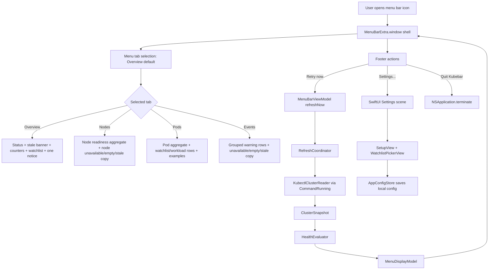

# Phase 09: CodexBar-Inspired Tabbed Menu Redesign - Research

**Researched:** 2026-04-22 [VERIFIED: current session date]
**Domain:** Native macOS SwiftUI `MenuBarExtra.window` menu redesign for a Kubernetes status utility [VERIFIED: AGENTS.md, 09-CONTEXT.md, 09-UI-SPEC.md]
**Confidence:** HIGH for local architecture and phase constraints; MEDIUM for visible macOS menu automation limits because final menu traversal still needs human UAT evidence [VERIFIED: local source review, 06-UAT.md, Context7 SwiftUI docs]

<user_constraints>
## User Constraints (from CONTEXT.md)

All constraints in this block are copied from `.planning/phases/09-codexbar-inspired-tabbed-menu-redesign/09-CONTEXT.md`. [VERIFIED: 09-CONTEXT.md]

### Phase Boundary

This phase redesigns Kubebar's opened menu from a single vertical status page
into a CodexBar-inspired tabbed menu while preserving Kubebar's lightweight
menu-bar purpose.

This phase delivers:

- A tabbed menu structure with `Overview`, `Nodes`, `Pods`, and `Events`.
- `Overview` as the default home tab for the current cluster state.
- Settings moved out of the menu body into an independent settings dialog or
  window.
- A visible `Quit Kubebar` action from the opened menu.
- A clearer division between high-level status and resource-specific detail.
- Tests and UAT updates for the redesigned menu structure and app actions.

This phase does not deliver:

- A full Kubernetes dashboard.
- Deep troubleshooting, shell handoff, watch streams, or `Open in k9s`.
- New health states beyond `OK`, `Watch`, `Bad`, and `Stale`.
- Provider-style CodexBar features such as usage meters, provider registries,
  widgets, browser-cookie flows, or update infrastructure.
- A change from `MenuBarExtra.window` to an AppKit `NSStatusItem`.

### Locked Decisions

#### CodexBar Adaptation

- **D-01:** Use CodexBar as a menu-organization reference: the menu bar icon is
  the first signal, the opened menu explains the state, and tabs keep related
  details separate.
- **D-02:** Adapt CodexBar's `Overview` idea, not its AI-provider product model.
  Kubebar tabs represent Kubernetes resource views, not providers.
- **D-03:** Preserve Kubebar's small-instrument feel. The redesign should make
  information easier to scan, not expand the app into a dashboard.
- **D-04:** Keep the app dockless and native menu-bar-first.

#### Tab Structure

- **D-05:** The opened menu uses four top-level tabs: `Overview`, `Nodes`,
  `Pods`, and `Events`.
- **D-06:** `Overview` is the default selected tab whenever the menu opens.
- **D-07:** The tab control should be compact and native-feeling, using a
  segmented or tab-style control that is keyboard reachable.
- **D-08:** Switching tabs must not trigger a Kubernetes read by itself. Refresh
  remains explicit or cadence-driven through the existing refresh model.
- **D-09:** The selected tab is menu-local UI state. It should not be persisted
  unless the implementation naturally needs it for accessibility or testing.

#### Overview Tab

- **D-10:** `Overview` keeps the main daily-use answer: current context, health
  state, primary reason, stale banner when needed, compact counters, and the
  first-screen watchlist.
- **D-11:** Watchlist remains first-class in `Overview`; the tabbed design must
  not bury the operator's tracked namespaces or workloads.
- **D-12:** Keep first-screen watchlist rows capped at 3-5 items. Overflow may
  stay behind a secondary row or a later detail affordance.
- **D-13:** Overview may show only the most important event or section notice
  summary when space is tight; fuller warning detail belongs in `Events`.

#### Nodes Tab

- **D-14:** `Nodes` focuses on node readiness and node-section availability. It
  should answer whether node data is current, unavailable, or unhealthy.
- **D-15:** If the existing model only has aggregate node readiness, the first
  version may show aggregate readiness plus safe unavailable-state copy.
- **D-16:** If richer node rows are added, they must come through the core
  display model and remain short. Do not show raw `kubectl` output or a full
  troubleshooting table.

#### Pods Tab

- **D-17:** `Pods` focuses on pod readiness, workload health, affected pod
  counts, and 1-3 example pod names.
- **D-18:** The tab should reuse existing watchlist/workload detail behavior
  where possible, because that already carries actionable pod reasons.
- **D-19:** A future implementation may add safe pod status buckets such as
  running, not ready, restarting, pending, or failed if they are shaped in
  `MenuDisplayModel`.
- **D-20:** Do not turn `Pods` into an all-namespace pod inventory. The tab
  should help decide whether to open deeper tools, not replace them.

#### Events Tab

- **D-21:** `Events` owns warning event details that are too much for the
  overview tab.
- **D-22:** Event rows should keep the existing shape: reason, location, age,
  occurrence count, and a shortened message when useful.
- **D-23:** Repeated warnings remain grouped by reason plus involved object.
- **D-24:** The Events tab may show more rows than Overview, but it still needs
  a cap so the menu stays readable.
- **D-25:** Empty, unavailable, and partial event data states must be explicit
  and must not look healthy.

#### Settings Dialog

- **D-26:** Move setup/edit configuration out of the menu body into a separate
  settings dialog or window.
- **D-27:** Settings should contain context selection, watchlist editing,
  refresh cadence, and any kubectl path or recovery controls that already
  belong to app configuration.
- **D-28:** The menu should expose a concise `Settings...` action that opens the
  dialog instead of replacing the menu content with the setup screen.
- **D-29:** First-use and recovery states should guide the user to Settings
  without making stale or missing configuration look like healthy cluster data.
- **D-30:** Settings remains local-app configuration. It must not introduce
  cloud sync, account concepts, or multi-cluster switching for this phase.

#### Quit Action

- **D-31:** Add a visible `Quit Kubebar` button or menu-row action at the bottom
  of the opened menu.
- **D-32:** Quitting exits the app without changing saved context, watchlist, or
  refresh cadence.
- **D-33:** The app should also preserve the standard macOS `Quit Kubebar`
  command behavior where available.

#### Architecture and State

- **D-34:** Keep `MenuDisplayModel` as the only render contract for cluster
  status. Views may choose which tab renders which fields, but they must not
  decide cluster health.
- **D-35:** `HealthEvaluator` remains the single source of truth for `OK`,
  `Watch`, `Bad`, and `Stale`.
- **D-36:** Any new tab-specific display fields should be shaped in
  `KubebarCore` before SwiftUI renders them.
- **D-37:** Keep external reads behind existing injectable boundaries. The
  redesign must not make SwiftUI views call `kubectl`.
- **D-38:** Preserve native keyboard reachability for tabs, refresh, settings,
  watchlist details, warning events, and quit.

#### Verification

- **D-39:** Add or update model/view-model tests for new tab display data,
  settings-opening behavior, and quit-action wiring where practical.
- **D-40:** Update UAT expectations so manual checks cover the tabbed menu,
  first-use settings path, keyboard tab navigation, and the quit action.
- **D-41:** Run `./scripts/swift-quality-gate.sh local` before completing
  implementation.

### Claude's Discretion

- The planner may choose the exact SwiftUI control used for tabs if it remains
  compact, native-feeling, and keyboard reachable.
- The planner may choose exact section titles and microcopy as long as
  `Overview`, `Nodes`, `Pods`, `Events`, `Settings...`, and `Quit Kubebar`
  remain recognizable.
- The planner may decide whether settings opens as a SwiftUI `Window`, panel,
  or app-modal dialog based on what fits the existing `MenuBarExtra.window`
  shell best.
- The planner may decide exact caps for Events rows and pod/node detail rows,
  as long as the menu remains glanceable.

### Deferred Ideas (OUT OF SCOPE)

- Full Kubernetes dashboard and arbitrary resource browsing.
- Filters, search, sorting controls, and user-customizable tabs.
- Multi-cluster switching beyond the existing saved context.
- Deep debugging handoff such as `Open in k9s`.
- Live watch streams or real-time event feeds.
- CodexBar-style widgets, status polling, provider toggles, or usage meters.
</user_constraints>

## Summary

Phase 09 should be planned as a native SwiftUI menu composition change plus a small amount of core display-model shaping. [VERIFIED: Kubebar/Views/MenuBarRootView.swift, KubebarCore/Models/MenuDisplayModel.swift, 09-UI-SPEC.md] The existing app already uses `MenuBarExtra.window`, `MenuDisplayModel`, stale banners, compact counters, watchlist rows, warning summaries, node aggregate display, setup UI, refresh cadence, and keyboard shortcuts, so the safest plan is to reorganize those pieces into fixed tabs before adding richer data. [VERIFIED: Kubebar/KubebarApp.swift, Kubebar/Views/*.swift, KubebarCore/Services/HealthEvaluator.swift]

The planning risk is that `Nodes`, `Pods`, and `Events` need explicit empty, unavailable, stale, and partial states, while today most of those states are represented as general counters, `sectionNotices`, and watchlist detail rather than tab-specific display contracts. [VERIFIED: KubebarCore/Models/MenuDisplayModel.swift, KubebarCore/Models/ClusterSnapshot.swift, 09-UI-SPEC.md] The planner should require any new tab-specific data to be added in `KubebarCore` and tested in `KubebarTests/Models`, not derived inside SwiftUI views. [VERIFIED: AGENTS.md, docs/architecture/system-overview.md, .planning/codebase/TESTING.md]

Settings should be planned as an independent SwiftUI settings surface, with the menu footer calling the environment `openSettings` action when possible. [CITED: Context7 /websites/developer_apple_swiftui, Apple Settings docs] A visible `Quit Kubebar` action can use the standard `NSApplication.terminate(_:)` app-quit path, while preserving saved config because config changes are already explicit save operations. [CITED: Apple NSApplication docs] [VERIFIED: KubebarCore/Services/AppConfigStore.swift, MenuBarViewModel.swift]

**Primary recommendation:** Use a SwiftUI `Picker` with `.segmented` for fixed menu-local tabs, keep `MenuBarExtra.window`, move `SetupView` into a `Settings` scene, add `Settings...` and `Quit Kubebar` footer actions, and add only the minimum `MenuDisplayModel` fields needed to make each tab's empty/unavailable/stale states explicit. [CITED: Context7 SwiftUI Picker/MenuBarExtra/Settings docs] [VERIFIED: 09-UI-SPEC.md, AGENTS.md]

## Architectural Responsibility Map

| Capability | Primary Tier | Secondary Tier | Rationale |
|------------|-------------|----------------|-----------|
| Menu bar status icon | macOS App Shell | KubebarCore display model | `KubebarApp` renders the icon from `MenuBarStatusPresentation`, while state still comes from `MenuDisplayModel.state`. [VERIFIED: Kubebar/KubebarApp.swift, KubebarCore/Models/MenuBarStatusPresentation.swift] |
| Fixed tab selection | SwiftUI Menu Views | View Model if lifecycle reset needs coordination | Selected tab is menu-local UI state and should not trigger reads or persistence. [VERIFIED: 09-CONTEXT.md, 09-UI-SPEC.md] |
| Overview content | SwiftUI Menu Views | KubebarCore display model | Existing `StatusSummaryView`, `StaleBannerView`, `CompactCountersView`, and `WatchlistSectionView` already render model-shaped data. [VERIFIED: Kubebar/Views/*.swift] |
| Nodes content | KubebarCore display model | SwiftUI Menu Views | Aggregate node readiness exists; richer node rows must be shaped in core before views render them. [VERIFIED: ClusterSnapshot.swift, MenuDisplayModel.swift, 09-CONTEXT.md] |
| Pods content | KubebarCore display model | SwiftUI Menu Views | Existing watchlist detail carries affected pod count and example pod names; non-watchlist pod inventory is out of scope. [VERIFIED: MenuDisplayModel.swift, TrackedItemDetailView.swift, 09-CONTEXT.md] |
| Events content | KubebarCore display model | SwiftUI Menu Views | Warning rows are grouped and capped by `HealthEvaluator`; Events tab should reuse that model and adjust Overview to show at most one compact notice. [VERIFIED: HealthEvaluator.swift, WarningEventsView.swift, 09-UI-SPEC.md] |
| Settings dialog/window | macOS App Shell | View Model and Setup state | A SwiftUI `Settings` scene presents app settings, while `MenuBarViewModel` owns setup state and save actions. [CITED: Context7 Apple Settings docs] [VERIFIED: MenuBarViewModel.swift, SetupView.swift] |
| Quit action | macOS App Shell | AppKit | App termination is an application-level action; it should not mutate `AppConfigStore`. [CITED: Apple NSApplication terminate docs] [VERIFIED: AppConfigStore.swift] |
| Kubernetes refresh | KubebarCore Services | View Model | Refresh remains explicit or cadence-driven through `RefreshCoordinator`; tab switching must not call `kubectl`. [VERIFIED: MenuBarViewModel.swift, RefreshCoordinator.swift, 09-CONTEXT.md] |

## Project Constraints (from AGENTS.md)

- Kubebar is a native macOS menu bar app for quickly checking Kubernetes health, not a replacement for `k9s`. [VERIFIED: AGENTS.md]
- The menu bar icon categories remain exactly `OK`, `Watch`, `Bad`, and `Stale`. [VERIFIED: AGENTS.md]
- The dropdown remains watchlist-first, and first-screen watchlist rows stay capped at 3-5 items. [VERIFIED: AGENTS.md]
- Stale data must never look healthy or current. [VERIFIED: AGENTS.md, docs/architecture/runtime-invariants.md]
- `MenuDisplayModel` is the UI render contract, and `HealthEvaluator` is the source of truth for severity. [VERIFIED: AGENTS.md, docs/architecture/system-overview.md]
- External reads go through injectable boundaries, and SwiftUI views must not call `kubectl`. [VERIFIED: AGENTS.md, .planning/codebase/ARCHITECTURE.md]
- Production code should avoid force unwraps, `try!`, undocumented `fatalError`, singleton services, and callback pyramids. [VERIFIED: AGENTS.md]
- Use `async`/`await`, value types, explicit access control, exhaustive enum switches, dependency injection, and thin views. [VERIFIED: AGENTS.md]
- Run `./scripts/swift-quality-gate.sh local` before finishing implementation. [VERIFIED: AGENTS.md, scripts/swift-quality-gate.sh]
- `CLAUDE.md` is not present in this worktree, so no additional CLAUDE-specific directives were found. [VERIFIED: shell `test -f CLAUDE.md`]

## Standard Stack

### Core

| Library / Tool | Version | Purpose | Why Standard |
|---------|---------|---------|--------------|
| Swift | 6.0 source compatibility; local toolchain Apple Swift 6.3.1 | App and core implementation | The package and Xcode project declare Swift 6.0, and local tooling builds with Apple Swift 6.3.1. [VERIFIED: Package.swift, project.yml, `swift --version`] |
| macOS | 14.0 deployment target | Runtime platform | `Package.swift` and `project.yml` both target macOS 14.0. [VERIFIED: Package.swift, project.yml] |
| SwiftUI | Platform framework | Menu bar window, settings scene, controls, keyboard shortcuts | Current app uses SwiftUI `App`, `MenuBarExtra`, `View`, `Button`, `Picker`, `DisclosureGroup`, and the approved UI spec requires native SwiftUI controls. [VERIFIED: Kubebar/KubebarApp.swift, Kubebar/Views/*.swift, 09-UI-SPEC.md] |
| SwiftUI `MenuBarExtra.window` | macOS 13+ API | Opened menu shell | Apple documents the `.window` style for data-rich menu bar extras with standard controls, and Phase 09 forbids migrating to AppKit `NSStatusItem`. [CITED: Context7 Apple MenuBarExtra docs] [VERIFIED: 09-CONTEXT.md] |
| SwiftUI `Settings` scene + `openSettings` | macOS Settings scene; `OpenSettingsAction` on macOS 14+ | Independent settings surface | Apple documents `Settings` as the SwiftUI scene for app settings and `openSettings` as the environment action for presenting it. [CITED: Context7 Apple Settings docs] |
| AppKit `NSApplication.terminate(_:)` | Platform framework | Visible quit action | Apple documents `terminate(_:)` as the standard app termination request path. [CITED: Apple NSApplication docs] |
| Swift Testing | Swift 6 toolchain | Unit tests | Existing tests use `import Testing`, `@Suite`, `@Test`, and `#expect`, and no XCTest files are present. [VERIFIED: .planning/codebase/TESTING.md, KubebarTests/*.swift] |

### Supporting

| Library / Tool | Version | Purpose | When to Use |
|---------|---------|---------|-------------|
| Xcode | Local Xcode 26.4.1 | macOS app build and test | Required by `scripts/swift-quality-gate.sh` when an Xcode project is present. [VERIFIED: `xcodebuild -version`, scripts/swift-quality-gate.sh] |
| XcodeGen | Local 2.44.1 | Regenerate `Kubebar.xcodeproj` from `project.yml` | Use if Phase 09 adds app scenes, target membership, or build settings that must be source-of-truth in `project.yml`. [VERIFIED: `xcodegen --version`, project.yml, memory note from prior Kubebar app-icon work] |
| `kubectl` | Local v1.35.3 client | Runtime Kubernetes reads and setup candidate discovery | Existing services read cluster state through `kubectl` and fake this boundary in tests. [VERIFIED: `kubectl version --client=true --output=yaml`, KubebarCore/Services/KubectlClusterReader.swift] |
| `scripts/compile-and-run.sh` | Repo script | Visible-app smoke proof | Use for UAT launch evidence after the automated quality gate. [VERIFIED: scripts/compile-and-run.sh, 07-CONTEXT.md] |

### Alternatives Considered

| Instead of | Could Use | Tradeoff |
|------------|-----------|----------|
| SwiftUI `Settings` scene | A separate `Window` scene | A `Window` scene may be useful if settings needs custom singleton window behavior, but `Settings` already matches macOS settings semantics and enables standard app settings behavior. [CITED: Context7 Apple Settings docs] |
| SwiftUI segmented `Picker` | Custom tab bar buttons | A custom tab bar increases keyboard and accessibility risk; Apple documents segmented picker style for picker-style selection, and the UI spec allows a segmented/native tab-style control. [CITED: Context7 Apple Picker docs] [VERIFIED: 09-UI-SPEC.md] |
| Reusing `WarningEventsView` in Events | New raw event table | Raw event tables are out of scope and would violate runtime rules against command transcripts and dashboard expansion. [VERIFIED: docs/architecture/runtime-invariants.md, 09-CONTEXT.md] |
| Reusing `WatchlistSectionView` and `TrackedItemDetailView` in Pods | All-namespace pod inventory | All-namespace inventory is explicitly out of scope; current detail already supports affected pod counts and up to three example pod names. [VERIFIED: 09-CONTEXT.md, MenuDisplayModel.swift, TrackedItemDetailView.swift] |

**Installation:** No new package installation is recommended for Phase 09. [VERIFIED: 09-UI-SPEC.md registry safety, Package.swift]

```bash
# No npm, SwiftPM, or third-party UI packages needed.
```

**Version verification:** No npm package versions apply to this native macOS SwiftUI phase. Local tool versions were verified with `swift --version`, `xcodebuild -version`, `xcodegen --version`, and `kubectl version --client=true --output=yaml`. [VERIFIED: local commands]

## Architecture Patterns

### System Architecture Diagram



This diagram follows the current app flow where `MenuBarViewModel` bridges UI actions to core services and `MenuDisplayModel` is the only render input. [VERIFIED: docs/architecture/system-overview.md, MenuBarViewModel.swift, MenuDisplayModel.swift]

### Recommended Project Structure

```text
Kubebar/
├── KubebarApp.swift              # Add Settings scene, Settings... action plumbing, Quit action closure if needed.
├── MenuBarViewModel.swift        # Keep refresh/setup state; avoid persisting selected tab.
└── Views/
    ├── MenuBarRootView.swift     # Compose fixed tabs, footer actions, scroll behavior.
    ├── MenuTab.swift             # Optional UI-only enum for Overview/Nodes/Pods/Events.
    ├── SettingsRootView.swift    # Optional wrapper around SetupView for independent Settings surface.
    ├── NodesTabView.swift        # Optional short tab view using model-shaped node data.
    ├── PodsTabView.swift         # Optional short tab view using watchlist/workload detail data.
    └── EventsTabView.swift       # Optional tab view reusing grouped warning event display.
KubebarCore/
└── Models/MenuDisplayModel.swift # Add tab-specific display fields only when current fields are insufficient.
KubebarCore/
└── Services/HealthEvaluator.swift # Build any new display fields and keep caps/safe copy centralized.
KubebarTests/
└── Models/MenuDisplayModelTests.swift # Cover tab display data, caps, empty/unavailable/stale states.
```

The file placement follows the existing structure where views live under `Kubebar/Views`, product display contracts live under `KubebarCore/Models`, and display mapping tests live under `KubebarTests/Models`. [VERIFIED: .planning/codebase/STRUCTURE.md]

### Pattern 1: Fixed Local Tab Enum

**What:** Use a small UI-only enum for `Overview`, `Nodes`, `Pods`, and `Events`, bound to a segmented `Picker`. [VERIFIED: 09-CONTEXT.md, 09-UI-SPEC.md]  
**When to use:** Use this when the selected tab only changes local presentation and does not change refresh behavior or persisted configuration. [VERIFIED: 09-CONTEXT.md]  
**Example:**

```swift
// Source: 09-UI-SPEC.md + Apple Picker docs via Context7.
private enum MenuTab: String, CaseIterable, Identifiable {
    case overview = "Overview"
    case nodes = "Nodes"
    case pods = "Pods"
    case events = "Events"

    var id: String { rawValue }
}

@State private var selectedTab: MenuTab = .overview

Picker("Menu section", selection: $selectedTab) {
    ForEach(MenuTab.allCases) { tab in
        Text(tab.rawValue).tag(tab)
    }
}
.pickerStyle(.segmented)
```

### Pattern 2: Core-Owned Tab Display Data

**What:** If a tab needs information not already in `MenuDisplayModel`, add a small value type in `KubebarCore/Models` and build it from `HealthEvaluator`. [VERIFIED: AGENTS.md, docs/architecture/system-overview.md]  
**When to use:** Use this for node unavailable copy, pod example rows, Events tab caps, and tab-specific empty states when current counters and notices are not enough. [VERIFIED: 09-UI-SPEC.md, MenuDisplayModel.swift]  
**Example:**

```swift
// Source: Existing MenuDisplayModel.swift pattern.
public struct NodeTabDisplay: Equatable, Sendable {
    public let summary: String
    public let unavailableReason: String?
    public let emptyMessage: String?
}
```

### Pattern 3: Settings as Native App Settings

**What:** Use a SwiftUI `Settings` scene and present it from the menu footer with the environment `openSettings` action where practical. [CITED: Context7 Apple Settings docs]  
**When to use:** Use this because Phase 09 requires Settings to be independent, not a menu tab or replacement menu body. [VERIFIED: 09-CONTEXT.md, 09-UI-SPEC.md]  
**Example:**

```swift
// Source: Apple SwiftUI Settings docs via Context7.
@main
struct KubebarApp: App {
    var body: some Scene {
        MenuBarExtra { /* menu */ } label: { /* status icon */ }
            .menuBarExtraStyle(.window)

        Settings {
            SettingsRootView(/* existing setup bindings/actions */)
        }
    }
}
```

### Pattern 4: Visible Quit Uses App Termination

**What:** Wire the footer `Quit Kubebar` action to `NSApplication.shared.terminate(nil)`. [CITED: Apple NSApplication docs]  
**When to use:** Use this for the visible footer action because quitting is app-level behavior and should not alter saved config. [VERIFIED: 09-CONTEXT.md, AppConfigStore.swift]  
**Example:**

```swift
// Source: Apple AppKit NSApplication terminate docs.
Button("Quit Kubebar") {
    NSApplication.shared.terminate(nil)
}
.keyboardShortcut("q", modifiers: .command)
```

### Anti-Patterns to Avoid

- **Making Settings a fifth tab:** Phase 09 explicitly says Settings is not a tab and must open independently. [VERIFIED: 09-CONTEXT.md, 09-UI-SPEC.md]
- **Tab switching triggers refresh:** The selected tab is menu-local UI state, and refresh remains explicit or cadence-driven. [VERIFIED: 09-CONTEXT.md]
- **SwiftUI views infer section health:** Views render `MenuDisplayModel`; health and stale decisions belong in `HealthEvaluator`. [VERIFIED: AGENTS.md, docs/architecture/system-overview.md]
- **Fake per-node rows:** Current snapshot data has aggregate `NodeSummary`; per-node rows should not appear unless core model data is added. [VERIFIED: ClusterSnapshot.swift, 09-CONTEXT.md]
- **All-pod inventory:** `Pods` should reuse watchlist/workload detail and avoid becoming an all-namespace browser. [VERIFIED: 09-CONTEXT.md]
- **Raw `kubectl` output in UI:** Runtime rules prohibit command transcripts and unsafe error text in menu views. [VERIFIED: docs/architecture/runtime-invariants.md]
- **Custom focus system:** UI spec says to use native SwiftUI controls unless native controls cannot reach a required element. [VERIFIED: 09-UI-SPEC.md]

## Phase Implementation Surface

| File | Likely Change | Planning Notes |
|------|---------------|----------------|
| `Kubebar/KubebarApp.swift` | Add `Settings` scene, pass settings/quit actions, possibly add command wiring. | Keep `MenuBarExtra.window`; do not migrate to `NSStatusItem`. [VERIFIED: KubebarApp.swift, 09-CONTEXT.md] |
| `Kubebar/MenuBarViewModel.swift` | Reuse setup save/load actions for independent Settings; avoid adding persisted tab state. | View model already owns setup, refresh, cadence, target loading, and config save. [VERIFIED: MenuBarViewModel.swift] |
| `Kubebar/Views/MenuBarRootView.swift` | Main redesign point for tab control, tab content, footer actions, dimensions, and scroll behavior. | Current view is a single vertical menu; tab shell should keep existing components reusable. [VERIFIED: MenuBarRootView.swift, 09-UI-SPEC.md] |
| `Kubebar/Views/SetupView.swift` | Reuse inside independent Settings; adjust copy from `Finish setup` vs `Save Settings` if existing config is edited. | Current setup surface already covers context, watchlist, refresh cadence, and save. [VERIFIED: SetupView.swift, 09-UI-SPEC.md] |
| `Kubebar/Views/WatchlistPickerView.swift` | Reuse inside Settings; avoid redesigning into menu content. | Current view handles namespace/workload toggles, loading, failure, and retry. [VERIFIED: WatchlistPickerView.swift] |
| `Kubebar/Views/StatusSummaryView.swift` | Reuse in Overview; ensure opened menu still shows explicit state text. | Existing view shows context, state label, symbol, primary reason, tooltip, and accessibility label. [VERIFIED: StatusSummaryView.swift] |
| `Kubebar/Views/StaleBannerView.swift` | Reuse in Overview and resource tabs when stale. | UI spec requires stale banner before tab-specific content. [VERIFIED: StaleBannerView.swift, 09-UI-SPEC.md] |
| `Kubebar/Views/CompactCountersView.swift` | Reuse in Overview; optionally use counters as tab section summaries. | Existing counters are string-shaped and include dash for unavailable data. [VERIFIED: CompactCountersView.swift, HealthEvaluator.swift] |
| `Kubebar/Views/WatchlistSectionView.swift` | Reuse in Overview and likely Pods. | Empty state needs UI-spec copy with Settings prompt, not only a generic line. [VERIFIED: WatchlistSectionView.swift, 09-UI-SPEC.md] |
| `Kubebar/Views/TrackedItemDetailView.swift` | Reuse in Pods for affected pod count and examples. | Current detail supports affected pod count, up to three example names, and latest warning. [VERIFIED: TrackedItemDetailView.swift, MenuDisplayModelTests.swift] |
| `Kubebar/Views/WarningEventsView.swift` | Move fuller version to Events; Overview should show at most one compact notice. | Current view already groups notices and warning summaries, but it does not distinguish Overview vs Events caps by caller. [VERIFIED: WarningEventsView.swift, 09-UI-SPEC.md] |
| `Kubebar/Views/NodeDetailsView.swift` | Become starting point for Nodes tab. | Current implementation only takes a string summary, so unavailable/empty/stale copy may need a display model. [VERIFIED: NodeDetailsView.swift, 09-UI-SPEC.md] |
| `KubebarCore/Models/MenuDisplayModel.swift` | Add only minimal tab-specific display data if current fields cannot express required states. | Current model has counters, warning summaries, section notices, watch items, and stale banner. [VERIFIED: MenuDisplayModel.swift] |
| `KubebarCore/Models/ClusterSnapshot.swift` | Avoid changing unless richer node/pod rows are truly required. | Snapshot already has aggregate node/pod sections, warning records, tracked item status, and section failures. [VERIFIED: ClusterSnapshot.swift] |
| `KubebarCore/Services/HealthEvaluator.swift` | Build any new tab display fields, caps, and safe copy. | It already centralizes visible watchlist cap, warning group cap, primary reason, stale banner, and section notices. [VERIFIED: HealthEvaluator.swift] |
| `KubebarTests/Models/MenuDisplayModelTests.swift` | Add tests for tab display states, caps, and non-color/stale invariants. | Existing tests already cover many display states and are the closest pattern. [VERIFIED: MenuDisplayModelTests.swift] |
| `KubebarTests/Models/MenuRuntimeStateTests.swift` | Add tests if settings surface state is reshaped in core. | Existing runtime tests cover setup/menu surfaces and target loading. [VERIFIED: MenuRuntimeStateTests.swift] |

## Data Model Gaps

| Tab | Current Support | Gap | Recommendation |
|-----|-----------------|-----|----------------|
| Overview | Current model supports status, primary reason, stale banner, counters, visible watchlist, hidden count, warning summaries, and section notices. [VERIFIED: MenuDisplayModel.swift] | Overview should show at most one compact event/notice, but current `warningEventSummaries` is capped at three globally. [VERIFIED: HealthEvaluator.swift, 09-UI-SPEC.md] | Either let the Overview view render `prefix(1)` from existing arrays or add an explicit `overviewNotice` if copy/caps become more complex. [VERIFIED: 09-UI-SPEC.md] |
| Nodes | Current snapshot supports aggregate `NodeSummary` and node section availability. [VERIFIED: ClusterSnapshot.swift] | Current `NodeDetailsView` only accepts a summary string and cannot express `Node data unavailable`, `No node data yet`, or stale state by itself. [VERIFIED: NodeDetailsView.swift, 09-UI-SPEC.md] | Add a small `NodeTabDisplay` or pass `MenuDisplayModel` plus filtered `sectionNotices`; do not fake per-node rows. [VERIFIED: 09-CONTEXT.md] |
| Pods | Current model supports aggregate pod counter and watchlist item details with affected pod count and up to three examples. [VERIFIED: MenuDisplayModel.swift, MenuDisplayModelTests.swift] | There is no standalone pod tab contract for empty/unavailable copy, and global pod inventory is out of scope. [VERIFIED: 09-UI-SPEC.md] | Reuse watchlist/workload rows for Pods and add only safe `Pods unavailable` or `No pod data yet` display state if needed. [VERIFIED: 09-CONTEXT.md, 09-UI-SPEC.md] |
| Events | Current model supports grouped `WarningEventDisplay` rows, occurrence counts, location, age, optional message, and section notices. [VERIFIED: MenuDisplayModel.swift, HealthEvaluator.swift] | Overview and Events need different row caps; Events owns fuller details while Overview shows only one notice. [VERIFIED: 09-UI-SPEC.md] | Keep `HealthEvaluator` as the cap owner or expose separate `overviewWarningSummary` and `eventRows` fields if planner wants the cap enforced outside views. [VERIFIED: AGENTS.md, HealthEvaluator.swift] |
| Settings | Current setup model supports context, watchlist, refresh cadence, target loading, retry, and save. [VERIFIED: SetupView.swift, WatchlistPickerView.swift, MenuRuntimeState.swift] | Current menu embeds setup as the menu body through `isShowingSetup`; Phase 09 wants Settings independent from the menu body. [VERIFIED: MenuBarRootView.swift, 09-CONTEXT.md] | Reuse `SetupView` inside a Settings root and keep first-use menu state as a short prompt to open Settings. [VERIFIED: 09-UI-SPEC.md] |

## Settings Window Recommendation

| Option | Pros | Cons | Recommendation |
|--------|------|------|----------------|
| SwiftUI `Settings` scene + `openSettings` | Matches macOS app settings semantics, is documented by Apple, and fits the `Settings...` command. [CITED: Context7 Apple Settings docs] | Requires checking how bindings/actions are shared from `@StateObject MenuBarViewModel` into another scene. [VERIFIED: KubebarApp.swift] | Recommended. It best matches Phase 09 and macOS conventions. [VERIFIED: 09-CONTEXT.md] |
| SwiftUI `Window` scene | Gives explicit singleton window identity and sizing control. [CITED: Context7 Apple scene keyboardShortcut docs] | Less semantically direct for settings and may require extra command/menu management. [CITED: Context7 Apple Settings docs] | Use only if `Settings` cannot share the existing setup state cleanly. [VERIFIED: MenuBarViewModel.swift] |
| App-modal dialog inside the menu | Keeps code local to `MenuBarRootView`. [VERIFIED: MenuBarRootView.swift] | Conflicts with the requirement that Settings opens independently and does not replace selected menu content. [VERIFIED: 09-CONTEXT.md, 09-UI-SPEC.md] | Avoid. [VERIFIED: 09-CONTEXT.md] |

## Don't Hand-Roll

| Problem | Don't Build | Use Instead | Why |
|---------|-------------|-------------|-----|
| Tab control | Custom focusable button row | SwiftUI `Picker` with `.segmented`, unless native tab style proves better | Native controls preserve keyboard and accessibility expectations with less custom state. [CITED: Context7 Apple Picker docs] [VERIFIED: 09-UI-SPEC.md] |
| Settings window management | Custom floating panel manager | SwiftUI `Settings` scene or `Window` scene | Apple provides scene-level settings/window presentation; custom AppKit panel plumbing is unnecessary for this phase. [CITED: Context7 Apple Settings docs] |
| Quit behavior | Manual process kill or config mutation | `NSApplication.shared.terminate(nil)` | AppKit provides normal termination semantics; Phase 09 says quitting preserves saved config. [CITED: Apple NSApplication docs] [VERIFIED: 09-CONTEXT.md] |
| Health state per tab | Local `if counter == "-"` severity logic in views | `HealthEvaluator` and `MenuDisplayModel` | Existing architecture requires `HealthEvaluator` as severity source and views as renderers. [VERIFIED: AGENTS.md, HealthEvaluator.swift] |
| Warning event grouping | View-level grouping/sorting | Existing `HealthEvaluator.makeWarningEventSummaries` behavior | The evaluator already groups repeated warnings by reason plus object and caps rows. [VERIFIED: HealthEvaluator.swift, MenuDisplayModelTests.swift] |
| Kubernetes reads on navigation | `kubectl` calls from tab views | Existing refresh cadence/manual retry path | Tab changes are navigation only and must not trigger reads. [VERIFIED: 09-CONTEXT.md] |

**Key insight:** The redesign should split reading surfaces, not split the system of truth; tabs are presentation, while freshness, severity, section availability, caps, and safe copy remain core display behavior. [VERIFIED: 09-CONTEXT.md, AGENTS.md, docs/architecture/system-overview.md]

## Common Pitfalls

### Pitfall 1: Treating Tabs as Data Fetching Boundaries

**What goes wrong:** Switching to `Nodes`, `Pods`, or `Events` starts a fresh `kubectl` read. [VERIFIED: 09-CONTEXT.md]  
**Why it happens:** The tab names sound like resource queries rather than presentation filters. [VERIFIED: 09-CONTEXT.md]  
**How to avoid:** Make the selected tab local SwiftUI state and keep reads behind `Retry now` and the refresh loop. [VERIFIED: MenuBarViewModel.swift, 09-CONTEXT.md]  
**Warning signs:** A tab view imports `KubebarCore/Services`, references `kubectl`, or calls `refreshNow()` on selection change. [VERIFIED: AGENTS.md]

### Pitfall 2: Moving Setup but Losing First-Use Guidance

**What goes wrong:** Removing embedded setup leaves first launch or empty watchlist as an empty menu that looks harmless. [VERIFIED: docs/architecture/runtime-invariants.md, 09-UI-SPEC.md]  
**Why it happens:** The current root view uses `isShowingSetup` to replace menu content, so moving setup requires a new first-use prompt path. [VERIFIED: MenuBarRootView.swift]  
**How to avoid:** Keep first-use menu content short and explicit, with `Settings...` as the next action, while Settings owns the full setup surface. [VERIFIED: 09-UI-SPEC.md]  
**Warning signs:** `No tracked workloads yet` appears without the UI-spec message `Open Settings to choose namespaces or workloads to watch.` [VERIFIED: WatchlistSectionView.swift, 09-UI-SPEC.md]

### Pitfall 3: Fake Detail Rows

**What goes wrong:** Nodes or Pods show made-up per-resource rows based on aggregate counters. [VERIFIED: ClusterSnapshot.swift, 09-CONTEXT.md]  
**Why it happens:** The tab design asks for dedicated pages, but current node data is aggregate-only. [VERIFIED: ClusterSnapshot.swift]  
**How to avoid:** First version can show aggregate readiness and unavailable-state copy; only add per-node or pod buckets when core snapshot/display data supports them. [VERIFIED: 09-CONTEXT.md, 09-UI-SPEC.md]  
**Warning signs:** A view constructs node names or pod status buckets that do not exist in `ClusterSnapshot` or `MenuDisplayModel`. [VERIFIED: ClusterSnapshot.swift, MenuDisplayModel.swift]

### Pitfall 4: Overview Stops Being Watchlist-First

**What goes wrong:** Tabs make Overview a generic summary and push watchlist below less important content. [VERIFIED: docs/brainstorms/2026-04-19-kubebar-watchlist-first-requirements.md]  
**Why it happens:** Resource tabs can tempt planners to make Overview look like a dashboard landing page. [VERIFIED: 09-CONTEXT.md]  
**How to avoid:** Keep Overview order as status, stale banner, counters, watchlist, then one notice. [VERIFIED: 09-UI-SPEC.md]  
**Warning signs:** Watchlist appears after Events/Nodes content or more than five watchlist rows are visible in Overview. [VERIFIED: 09-UI-SPEC.md]

### Pitfall 5: Assuming Menu Open/Close Events Are Directly Observable

**What goes wrong:** The plan relies on a documented open/close binding that was not verified in Apple docs. [CITED: Context7 Apple MenuBarExtra docs]  
**Why it happens:** `MenuBarExtra` has `isInserted` APIs, but those APIs control whether the extra exists in the menu bar, not whether the popover window is currently open. [CITED: Context7 Apple MenuBarExtra docs]  
**How to avoid:** Reset selected tab in the menu content lifecycle, then verify with visible-app UAT that reopening returns to Overview. [VERIFIED: 09-UI-SPEC.md, 06-UAT.md]  
**Warning signs:** A plan says "bind MenuBarExtra open state" without a cited API or visible UAT fallback. [CITED: Context7 Apple MenuBarExtra docs]

### Pitfall 6: Adding UI Test Requirements That This Repo Cannot Yet Run

**What goes wrong:** The plan marks native menu traversal as automated when prior UAT says Computer Use could not inspect `MenuBarExtra.window` or `SystemUIServer`. [VERIFIED: 06-UAT.md]  
**Why it happens:** Unit tests cover core behavior, but current repo has no UI test target. [VERIFIED: .planning/codebase/TESTING.md]  
**How to avoid:** Use model tests for deterministic display behavior and UAT rows with screenshot paths or `pending-human-verification` for menu traversal. [VERIFIED: 07-CONTEXT.md, 09-UI-SPEC.md]  
**Warning signs:** UAT rows for keyboard navigation are marked passed without screenshot, app path/PID, or human verification note. [VERIFIED: 07-CONTEXT.md]

## Code Examples

Verified patterns from official and local sources:

### Swift Testing Model Test Pattern

```swift
// Source: KubebarTests/Models/MenuDisplayModelTests.swift.
import Foundation
import Testing
@testable import KubebarCore

@Suite("Menu display model")
struct MenuDisplayModelTests {
    @Test("events tab rows are capped")
    func eventsTabRowsAreCapped() {
        let display = HealthEvaluator().evaluate(
            snapshot: snapshotWithWarnings,
            now: Date(timeIntervalSince1970: 220)
        )

        #expect(display.warningEventSummaries.count == 3)
    }
}
```

### Existing Footer Action Pattern

```swift
// Source: Kubebar/Views/MenuBarRootView.swift.
Button("Retry now", action: onRefresh)
    .keyboardShortcut("r", modifiers: .command)
    .help(Text(isRefreshing ? "Refresh in progress" : "Refresh now"))
    .disabled(isRefreshing)
```

### Existing Middle Truncation Pattern

```swift
// Source: Kubebar/Views/WatchlistSectionView.swift.
Text(item.title)
    .lineLimit(1)
    .truncationMode(.middle)
    .help(Text(item.title))
    .accessibilityLabel(item.title)
```

### Settings Scene Pattern

```swift
// Source: Apple SwiftUI Settings docs via Context7.
Settings {
    SettingsRootView()
}
```

### MenuBarExtra Window Pattern

```swift
// Source: Kubebar/KubebarApp.swift and Apple MenuBarExtra docs via Context7.
MenuBarExtra {
    MenuBarRootView(/* bindings and actions */)
} label: {
    Image("KubebarLogo")
}
.menuBarExtraStyle(.window)
```

## State of the Art

| Old / Current Approach | Current Phase Approach | When Changed | Impact |
|--------------|------------------|--------------|--------|
| Single vertical menu with setup replacing menu body. [VERIFIED: MenuBarRootView.swift] | Fixed tabs plus independent Settings surface. [VERIFIED: 09-CONTEXT.md, 09-UI-SPEC.md] | Phase 09, planned 2026-04-22. [VERIFIED: 09-CONTEXT.md] | Reduces menu scanning load while preserving a small menu utility boundary. [VERIFIED: 09-UI-SPEC.md] |
| `Edit watchlist` action embedded in footer. [VERIFIED: MenuBarRootView.swift] | `Settings...` opens context, watchlist, refresh cadence, and recovery controls. [VERIFIED: 09-CONTEXT.md] | Phase 09. [VERIFIED: 09-CONTEXT.md] | Makes configuration app-level instead of status-tab content. [VERIFIED: 09-UI-SPEC.md] |
| Warning events displayed below watchlist in the same menu. [VERIFIED: MenuBarRootView.swift] | Overview shows at most one notice; Events owns fuller grouped warning rows. [VERIFIED: 09-UI-SPEC.md] | Phase 09. [VERIFIED: 09-UI-SPEC.md] | Keeps watchlist primary while still making warnings reachable. [VERIFIED: 09-UI-SPEC.md] |
| Node details as a small secondary section. [VERIFIED: NodeDetailsView.swift] | Nodes becomes its own short readiness tab. [VERIFIED: 09-CONTEXT.md] | Phase 09. [VERIFIED: 09-CONTEXT.md] | Requires explicit unavailable/empty/stale copy because aggregate-only display is insufficient for the UI spec. [VERIFIED: 09-UI-SPEC.md] |

**Deprecated/outdated:**

- `Edit watchlist` as the menu footer label should be replaced by `Settings...` for Phase 09. [VERIFIED: MenuBarRootView.swift, 09-UI-SPEC.md]
- Embedded setup as the normal menu body should be removed after Settings exists, except first-use may still show a short prompt that guides the user to Settings. [VERIFIED: 09-CONTEXT.md, 09-UI-SPEC.md]
- Planning an AppKit `NSStatusItem` migration is out of scope for this phase. [VERIFIED: 09-CONTEXT.md]

## Assumptions Log

All claims in this research were verified against local files, official Apple/OWASP documentation, Context7 Apple SwiftUI docs, or the CodexBar repository references. [VERIFIED: Sources section]

| # | Claim | Section | Risk if Wrong |
|---|-------|---------|---------------|
| None | No `[ASSUMED]` claims were used. | All sections | No user confirmation needed from unverified assumptions. |

## Open Questions

1. **How reliably can `Overview` reset on every menu reopen?**  
   - What we know: Phase 09 requires reset to Overview every time the menu opens, and Apple docs verified here show `MenuBarExtra` insertion binding, not a popover open-state binding. [VERIFIED: 09-CONTEXT.md] [CITED: Context7 Apple MenuBarExtra docs]  
   - What's unclear: Whether `.onAppear` on the menu root fires for every `MenuBarExtra.window` open in the current app lifecycle. [CITED: Context7 Apple MenuBarExtra docs]  
   - Recommendation: Plan a small implementation spike or UAT row that switches tabs, closes the menu, reopens it, and records whether Overview is selected. [VERIFIED: 09-UI-SPEC.md]

2. **Should Events cap remain 3 or become a separate value for Events vs Overview?**  
   - What we know: Runtime invariants cap warning summaries at 3; UI spec says Overview at most 1 and Events at most 3 under current invariant. [VERIFIED: docs/architecture/runtime-invariants.md, 09-UI-SPEC.md]  
   - What's unclear: Whether the implementation should expose separate model fields or let views apply `prefix(1)` for Overview. [VERIFIED: MenuDisplayModel.swift]  
   - Recommendation: Use view-level `prefix(1)` only if copy remains identical; otherwise add explicit model fields so the cap stays testable in `HealthEvaluator`. [VERIFIED: AGENTS.md, HealthEvaluator.swift]

3. **How much should `SetupView` copy change for editing existing settings?**  
   - What we know: UI spec requires `Finish setup` for first use and `Save Settings` for existing config editing. [VERIFIED: 09-UI-SPEC.md]  
   - What's unclear: Current `SetupView` always renders the primary button as `Finish setup`. [VERIFIED: SetupView.swift]  
   - Recommendation: Plan a small state/copy parameter for first-use vs existing settings mode, with model tests if the state is moved into `SetupFlowState`. [VERIFIED: SetupFlowStateTests.swift]

## Environment Availability

| Dependency | Required By | Available | Version | Fallback |
|------------|------------|-----------|---------|----------|
| Swift | Build/test and SwiftUI implementation | yes | Apple Swift 6.3.1 local toolchain; project declares Swift 6.0 | None needed. [VERIFIED: `swift --version`, Package.swift] |
| Xcode / xcodebuild | macOS app build and Xcode tests | yes | Xcode 26.4.1 | SwiftPM-only tests can run with `swift test`, but final app gate needs Xcode. [VERIFIED: `xcodebuild -version`, scripts/swift-quality-gate.sh] |
| XcodeGen | Project regeneration if `project.yml` changes | yes | 2.44.1 | Avoid project changes if not needed; otherwise run `xcodegen generate`. [VERIFIED: `xcodegen --version`, project.yml] |
| kubectl | Runtime app reads and visible UAT with real cluster | yes | v1.35.3 client | Unit tests use fake command runners; visible app UAT can mark real-cluster rows pending if no cluster state is suitable. [VERIFIED: `kubectl version --client=true --output=yaml`, KubectlClusterReaderTests.swift, 07-CONTEXT.md] |
| osascript/open/pgrep | Visible app smoke script | yes | system tools | Manual launch can be used if automation fails. [VERIFIED: command availability, scripts/compile-and-run.sh] |

**Missing dependencies with no fallback:** None found. [VERIFIED: environment probes]

**Missing dependencies with fallback:** None found. [VERIFIED: environment probes]

## Validation Architecture

### Test Framework

| Property | Value |
|----------|-------|
| Framework | Swift Testing with `import Testing`, `@Suite`, `@Test`, and `#expect`. [VERIFIED: .planning/codebase/TESTING.md, KubebarTests] |
| Config file | `Package.swift` test target `KubebarCoreTests`; `project.yml` Xcode target `KubebarTests`. [VERIFIED: Package.swift, project.yml] |
| Quick run command | `swift test --filter MenuDisplayModelTests` for display-model changes; add narrower filters for new test files. [VERIFIED: .planning/codebase/TESTING.md] |
| Full suite command | `./scripts/swift-quality-gate.sh local` [VERIFIED: AGENTS.md, scripts/swift-quality-gate.sh] |
| Visible app smoke command | `./scripts/compile-and-run.sh` [VERIFIED: scripts/compile-and-run.sh, 07-CONTEXT.md] |

### Phase Requirements -> Test Map

Requirement IDs below are derived from Phase 09 decisions because `.planning/REQUIREMENTS.md` is absent in this worktree. [VERIFIED: init.phase-op output, user prompt]

| Req ID | Behavior | Test Type | Automated Command | File Exists? |
|--------|----------|-----------|-------------------|-------------|
| REQ-09-01 | Fixed tabs are exactly `Overview`, `Nodes`, `Pods`, `Events`; default selected tab is Overview. [VERIFIED: 09-CONTEXT.md] | unit + UAT | Add `swift test --filter MenuTabStateTests` or cover with view-model/core state if extracted. | No, Wave 0 if planner extracts tab state. |
| REQ-09-02 | Switching tabs does not trigger refresh or `kubectl` reads. [VERIFIED: 09-CONTEXT.md] | unit if tab state extracted; UAT otherwise | `swift test --filter MenuTabStateTests` or `swift test --filter MenuRuntimeStateTests` | Partial; existing `MenuRuntimeStateTests` does not cover tabs. [VERIFIED: MenuRuntimeStateTests.swift] |
| REQ-09-03 | Overview shows status, stale banner when present, counters, watchlist-first rows capped at 3-5, and at most one notice. [VERIFIED: 09-UI-SPEC.md] | unit | `swift test --filter MenuDisplayModelTests` | Existing, needs additions for Overview-specific notice cap. [VERIFIED: MenuDisplayModelTests.swift] |
| REQ-09-04 | Nodes tab shows aggregate readiness plus explicit unavailable/empty/stale states and does not fake rows. [VERIFIED: 09-CONTEXT.md, 09-UI-SPEC.md] | unit + UAT | `swift test --filter MenuDisplayModelTests` | Existing model tests cover unavailable counters, but no node-tab display tests. [VERIFIED: MenuDisplayModelTests.swift] |
| REQ-09-05 | Pods tab reuses watchlist/workload detail with affected pod count and up to 3 example names. [VERIFIED: 09-CONTEXT.md, MenuDisplayModelTests.swift] | unit + UAT | `swift test --filter MenuDisplayModelTests` | Existing partial; needs Pods tab empty/unavailable test if new model fields are added. |
| REQ-09-06 | Events tab shows grouped warning rows, explicit unavailable/empty/stale states, and capped rows. [VERIFIED: 09-UI-SPEC.md, HealthEvaluator.swift] | unit + UAT | `swift test --filter MenuDisplayModelTests` | Existing partial; warning grouping/cap tests exist. [VERIFIED: MenuDisplayModelTests.swift] |
| REQ-09-07 | `Settings...` opens independent Settings dialog/window and menu no longer embeds setup as normal edit path. [VERIFIED: 09-CONTEXT.md] | UAT + optional app-shell test | `./scripts/compile-and-run.sh` plus UAT row | No automated app-shell test exists. [VERIFIED: .planning/codebase/TESTING.md] |
| REQ-09-08 | `Quit Kubebar` is visible and exits app without changing saved config. [VERIFIED: 09-CONTEXT.md] | UAT + optional script check | `./scripts/compile-and-run.sh` then manual menu quit verification | No automated menu action test exists. [VERIFIED: 06-UAT.md] |
| REQ-09-09 | Keyboard reaches tabs, retry, settings, quit, watchlist details, warning events, node/pod summaries, and settings controls. [VERIFIED: 09-UI-SPEC.md] | UAT | UAT row with screenshot path or `pending-human-verification` | Existing UAT format available from Phase 06. [VERIFIED: 06-UAT.md] |
| REQ-09-10 | Long names use middle truncation and full tooltip/accessibility labels. [VERIFIED: 09-UI-SPEC.md] | unit for model full values + UAT for visual truncation | `swift test --filter MenuDisplayModelTests` plus UAT | Existing partial tests preserve full model values. [VERIFIED: MenuDisplayModelTests.swift] |

### Sampling Rate

- **Per task commit:** Run focused Swift tests for changed core/model files, such as `swift test --filter MenuDisplayModelTests` or `swift test --filter MenuRuntimeStateTests`. [VERIFIED: .planning/codebase/TESTING.md]
- **Per wave merge:** Run `./scripts/swift-quality-gate.sh local`. [VERIFIED: AGENTS.md]
- **Phase gate:** Run `./scripts/swift-quality-gate.sh local`, run `./scripts/compile-and-run.sh`, and update Phase 09 UAT rows with screenshot paths or `pending-human-verification`. [VERIFIED: 07-CONTEXT.md, 09-UI-SPEC.md]

### Wave 0 Gaps

- [ ] `KubebarTests/Models/MenuDisplayModelTests.swift` additions for tab-specific empty/unavailable/stale data if new fields are introduced. [VERIFIED: MenuDisplayModelTests.swift]
- [ ] `KubebarTests/Models/MenuTabStateTests.swift` only if tab selection is extracted into a testable value type. [VERIFIED: 09-CONTEXT.md]
- [ ] `KubebarTests/Models/MenuRuntimeStateTests.swift` additions only if Settings mode or setup/edit copy moves into core runtime state. [VERIFIED: MenuRuntimeStateTests.swift]
- [ ] `.planning/phases/09-codexbar-inspired-tabbed-menu-redesign/09-UAT.md` with rows from the UI spec for OK/Watch/Bad/Stale, tab switching, reopen reset, empty watchlist, Settings, Quit, keyboard navigation, and long names. [VERIFIED: 09-UI-SPEC.md, 06-UAT.md]
- [ ] App-shell automated tests are not currently configured; planner should not require them unless it also changes Package/Xcode target structure. [VERIFIED: .planning/codebase/TESTING.md, Package.swift, project.yml]

## Security Domain

Security enforcement is treated as enabled because `.planning/config.json` is absent and no config disables it. [VERIFIED: shell `test -f .planning/config.json`]

### Applicable ASVS Categories

ASVS category names below follow OWASP ASVS current public documentation. [CITED: OWASP ASVS]

| ASVS Category | Applies | Standard Control |
|---------------|---------|-----------------|
| V2 Authentication | No app-managed authentication in this phase | Do not add accounts, cloud sync, OAuth, provider tokens, or browser-cookie flows. [VERIFIED: 09-CONTEXT.md] |
| V3 Session Management | No browser or server session in this phase | Keep state local in `AppConfigStore`; no session storage is introduced. [VERIFIED: AppConfigStore.swift, 09-CONTEXT.md] |
| V4 Access Control | Indirectly applies through local `kubectl` permissions | Use app-owned selected context and do not bypass Kubernetes RBAC; no UI action should imply broader access than `kubectl` has. [VERIFIED: docs/architecture/runtime-invariants.md, KubectlClusterReader.swift] |
| V5 Validation, Sanitization and Encoding | Yes | Keep user-facing error copy short and safe; avoid raw command transcripts, JSON, kubeconfig paths, or token-like strings. [VERIFIED: docs/architecture/runtime-invariants.md, 09-UI-SPEC.md] |
| V6 Stored Cryptography | No new secrets or crypto in this phase | Do not add credential storage, Keychain token storage, or cloud sync. [VERIFIED: 09-CONTEXT.md] |
| V8 Data Protection | Yes, local config/status only | Keep config and displayed cluster status local to the app; avoid exposing sensitive command output in UAT evidence. [VERIFIED: docs/architecture/runtime-invariants.md, 07-CONTEXT.md] |
| V14 Configuration | Yes | Settings edits must save local app config only and preserve corrupt/missing config recovery paths. [VERIFIED: AppConfigStore.swift, 09-CONTEXT.md] |

### Known Threat Patterns for This Stack

| Pattern | STRIDE | Standard Mitigation |
|---------|--------|---------------------|
| Command output or kubeconfig details exposed in UI | Information Disclosure | Render only app-owned display strings and safe short reasons; do not show raw stderr/stdout/JSON. [VERIFIED: docs/architecture/runtime-invariants.md, 09-UI-SPEC.md] |
| Tab view calls `kubectl` directly | Tampering / Elevation of responsibility | Keep external reads behind `CommandRunning`, `ClusterReading`, and `RefreshCoordinator`. [VERIFIED: AGENTS.md, .planning/codebase/ARCHITECTURE.md] |
| Stale data displayed as OK | Spoofing / Information Integrity | `HealthEvaluator` and stale banner rules must mark old/failed data as `Stale`. [VERIFIED: docs/architecture/runtime-invariants.md, HealthEvaluator.swift] |
| Quit action accidentally clears saved config | Denial of Service to app configuration | Quit must call app termination only and not mutate `AppConfigStore`. [VERIFIED: 09-CONTEXT.md, AppConfigStore.swift] |
| UAT screenshots leak cluster names or paths | Information Disclosure | Redact sensitive values or use fixture/demo states; mark real-cluster evidence carefully. [VERIFIED: 07-CONTEXT.md] |

## Sources

### Primary (HIGH confidence)

- `.planning/phases/09-codexbar-inspired-tabbed-menu-redesign/09-CONTEXT.md` - locked Phase 09 decisions, phase boundary, discretion, deferred ideas. [VERIFIED: local read]
- `.planning/phases/09-codexbar-inspired-tabbed-menu-redesign/09-UI-SPEC.md` - approved UI contract, tab rules, spacing, copy, UAT expectations. [VERIFIED: local read]
- `AGENTS.md` - repo product, architecture, coding, build/test constraints. [VERIFIED: local read]
- `docs/architecture/system-overview.md` - app/core/service ownership and request flow. [VERIFIED: local read]
- `docs/architecture/runtime-invariants.md` - stale, watchlist, keyboard, privacy, warning, and failure rules. [VERIFIED: local read]
- `.planning/codebase/ARCHITECTURE.md`, `.planning/codebase/STRUCTURE.md`, `.planning/codebase/TESTING.md`, `.planning/codebase/CONCERNS.md` - local codebase map and risk inventory. [VERIFIED: local read]
- `Kubebar/KubebarApp.swift`, `Kubebar/MenuBarViewModel.swift`, `Kubebar/Views/*.swift`, `KubebarCore/Models/MenuDisplayModel.swift`, `KubebarCore/Models/ClusterSnapshot.swift`, `KubebarCore/Services/HealthEvaluator.swift` - implementation surface. [VERIFIED: local read]
- Context7 `/websites/developer_apple_swiftui` - SwiftUI `MenuBarExtra.window`, `Settings`, `OpenSettingsAction`, `PickerStyle.segmented`, and scene keyboard shortcut docs. [CITED: Context7]
- Apple Developer Documentation - `NSApplication.terminate(_:)`, `MenuBarExtra`, `MenuBarExtraStyle`, `Settings`, `KeyboardShortcut`, `PickerStyle`. [CITED: developer.apple.com]

### Secondary (MEDIUM confidence)

- `https://github.com/steipete/CodexBar` - CodexBar README for menu-bar app shape, Settings-driven configuration, optional Overview tab, minimal UI, and deferred product features not to copy. [CITED: GitHub]
- `https://raw.githubusercontent.com/steipete/CodexBar/main/docs/ui.md` - CodexBar UI notes for menu bar, Overview, menu card, icon, and preferences patterns. [CITED: GitHub raw]
- `.planning/phases/04-codexbar-inspired-menu-reliability-and-freshness/04-CONTEXT.md`, `06-CONTEXT.md`, `07-CONTEXT.md` - prior Kubebar decisions about CodexBar adaptation, keyboard/UAT boundaries, and verification evidence. [VERIFIED: local read]
- OWASP ASVS project page and OWASP Developer Guide - ASVS category names and current ASVS reference context. [CITED: owasp.org, devguide.owasp.org]

### Tertiary (LOW confidence)

- None. [VERIFIED: research process]

## Metadata

**Confidence breakdown:**

- Standard stack: HIGH - Project manifests, local tool versions, Apple docs, and existing source agree. [VERIFIED: Package.swift, project.yml, local version commands, Context7]
- Architecture: HIGH - Local docs and source consistently define `MenuDisplayModel`, `HealthEvaluator`, injectable reads, and SwiftUI view ownership. [VERIFIED: AGENTS.md, docs/architecture/system-overview.md, source files]
- Pitfalls: HIGH for local data/model risks and MEDIUM for MenuBarExtra reopen detection because visible behavior needs UAT. [VERIFIED: source files, 06-UAT.md, Context7]
- Validation: HIGH for unit-test strategy and MEDIUM for menu UI automation because current repo has no UI test target and prior automation could not inspect the menu bar extra. [VERIFIED: .planning/codebase/TESTING.md, 06-UAT.md]

**Research date:** 2026-04-22 [VERIFIED: current session date]
**Valid until:** 2026-05-22 for local architecture; re-check Apple SwiftUI docs before planning if macOS/SwiftUI APIs are changed or if the target macOS version changes. [CITED: Context7 Apple SwiftUI docs]
