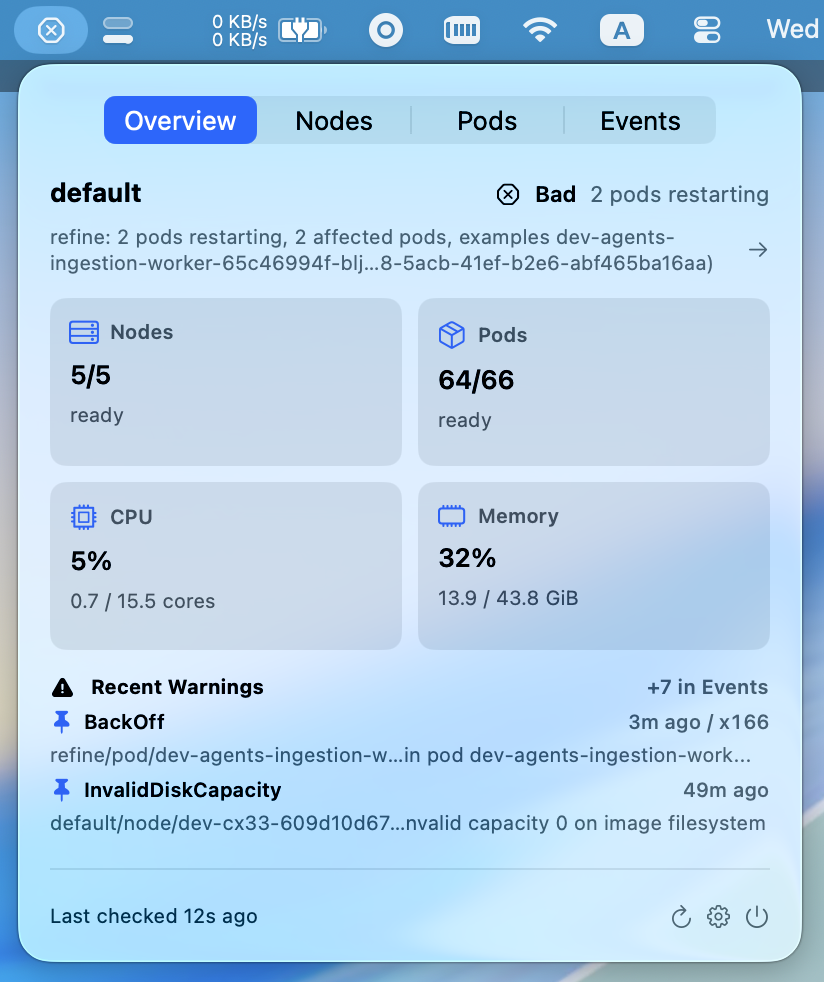
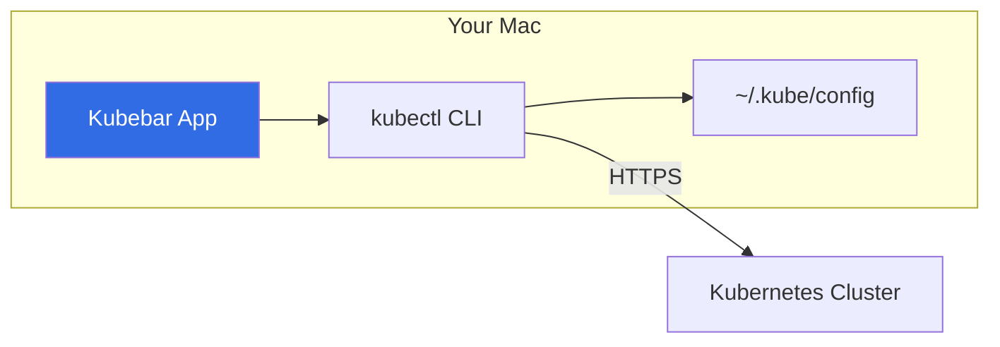

# Kubebar ☸️

  

**Kubebar is a native macOS menu bar for Kubernetes health.**

Kubebar gives Kubernetes operators a lightweight, watchlist-first status instrument that shows whether critical workloads are healthy, need attention, or have gone stale before opening deeper troubleshooting tools.



## Key Features

- **Watchlist-First Monitoring**: Don't get overwhelmed. Monitor only the namespaces and workloads that matter to you.
- **One-Click `k9s` Handoff**: Jump directly from a menu bar warning into deep troubleshooting in `k9s` with `⌘K`.
- **Context-Aware**: The menu bar automatically follows your active `kubectl` context, switching watches as you work.
- **Glanceable Health Summaries**: See Pod readiness, Node availability, and recent Warning events without leaving your current app.
- **Native & Lightweight**: Built with SwiftUI for macOS, ensuring minimal CPU/Memory footprint.

## Why Kubebar?

Kubebar is not a replacement for `k9s` or `kubectl`. It is the small, persistent dashboard you look at *before* you dive into deeper troubleshooting tools. It focuses on:
- **Visibility**: Always-on health status in your menu bar.
- **Speed**: Instant access to workload reasons and warning events.
- **Trust**: Clear indicators for stale data and connectivity issues.

## Why You Can Trust It

- **Local-only**: Kubebar runs on your Mac and keeps cluster status local to the app.
- **Uses your existing `kubectl`**: Cluster access goes through the Kubernetes CLI already configured on your machine.
- **No credential storage**: Kubebar stores selected context, watchlist, and refresh cadence only; it does not store Kubernetes tokens, certificates, or passwords.
- **No telemetry**: Kubebar does not send usage data or cluster information to external servers.

### Architecture



See [docs/PERMISSIONS.md](docs/PERMISSIONS.md) for the detailed permissions and privacy boundary.

## Prerequisites

Kubebar relies on the official Kubernetes CLI to interact with your clusters.
- **kubectl**: Must be installed and available in your `PATH`.
  ```bash
  brew install kubernetes-cli
  ```
- **Kubeconfig**: You must have a valid `~/.kube/config` with the contexts you wish to monitor.

## Getting Started

### 1. Installation

#### Option A: Download Pre-compiled
Download `Kubebar.zip` from the [latest GitHub Release](https://github.com/nexttylabs/kubebar/releases/latest), extract it, and move `Kubebar.app` to your `/Applications` folder.

If you need the pinned `v0.2.0` build, download `Kubebar.zip` from the [`v0.2.0` release](https://github.com/nexttylabs/kubebar/releases/tag/v0.2.0).

#### Option B: Build from Source
```bash
git clone https://github.com/nexttylabs/kubebar.git
cd kubebar
xcodegen generate
open Kubebar.xcodeproj
# Or use the local install script
./scripts/install-local.sh
```

### 2. First Run
- Open Kubebar.
- Follow the **Setup** flow to select your Kubernetes context.
- Pick the namespaces and workloads you want to add to your **Watchlist**.
- Set your preferred **Refresh Cadence**.

---

## FAQ

**Q: Why does macOS say the app is "unverified" or "damaged"?**
**A**: Currently, Kubebar is distributed with an **Ad-hoc signature** because it is an open-source project without a paid Apple Developer account. To run the app:
1. **Right-click** `Kubebar.app` in Finder and select **Open**.
2. Click **Open** again in the security dialog.
3. If it still won't open, run: `xattr -cr /Applications/Kubebar.app` in your terminal.

**Q: Does Kubebar store my Kubernetes credentials?**
**A**: **No.** Kubebar uses your existing `kubectl` configuration. It never asks for, stores, or transmits your tokens or certificates. See [docs/PERMISSIONS.md](docs/PERMISSIONS.md) for details.

---

## Documentation
- [Permissions & Privacy](docs/PERMISSIONS.md) — How we use `kubectl` and handle your data.
- [Release Process](docs/RELEASING.md) — How the app is built and signed.
- [Architecture](docs/architecture/README.md) — High-level system overview.
- [Product Roadmap](docs/plans/2026-04-19-002-kubebar-product-roadmap.md) — What’s coming next.

## Build and Test

To run quality checks locally:
```bash
./scripts/swift-quality-gate.sh local
```

## Local Development

Kubebar uses `XcodeGen` to manage the project file. If you add files or change targets, run:
```bash
xcodegen generate
```

## License
MIT • [Nextty Labs](https://github.com/nexttylabs)
