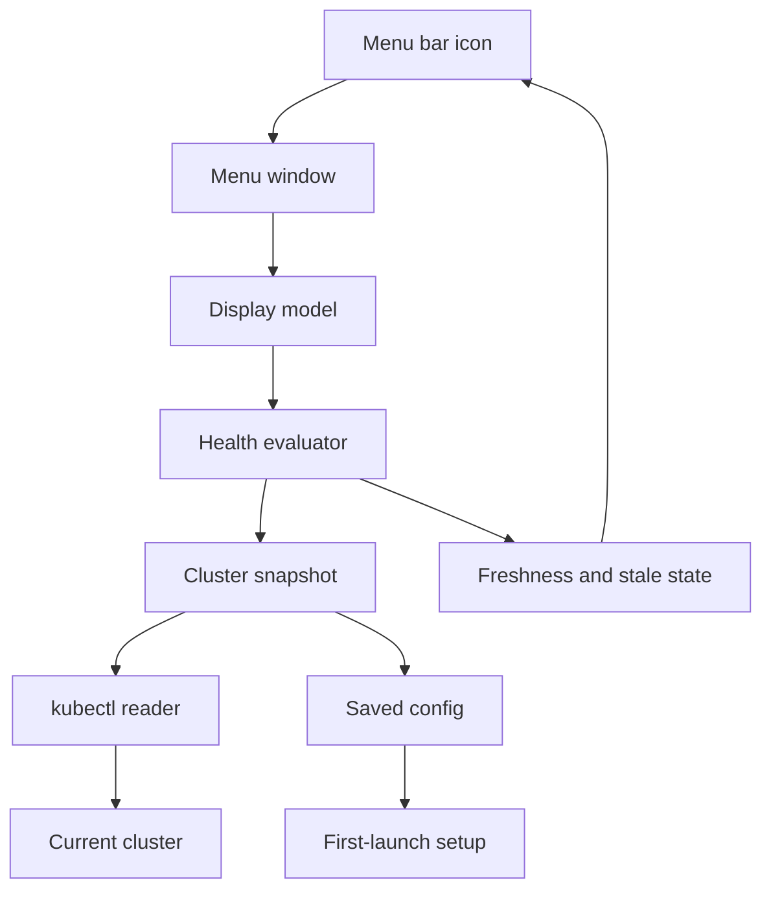

# feat: Build Kubebar watchlist menu

## Overview

Build `Kubebar` as a native macOS menu bar app that shows Kubernetes health at a glance. The first version should turn the repository from a generic template into a focused product with a menu bar shell, saved context setup, a watchlist-first dropdown, `kubectl`-backed cluster reads, freshness handling, and tests around the status rules that make the tool trustworthy.

## Problem Frame

The origin document defines `Kubebar` as a small personal operations instrument, not a `k9s` replacement (see origin: `docs/brainstorms/2026-04-19-kubebar-watchlist-first-requirements.md`). The app must help a daily cluster operator quickly answer whether the cluster is healthy, which watched workload needs attention, and whether the displayed data is fresh enough to trust.

The current repository still reads as an AI-native project template. Planning therefore needs to include the product scaffold and documentation cleanup before feature implementation can be meaningful.

## Requirements Trace

- R1. Menu bar icon communicates `OK`, `Watch`, `Bad`, or `Stale`.
- R2. Menu opens with saved context and a one-line health summary.
- R3. First screen includes compact node, pod, and warning event counts.
- R4. Menu identifies attention-worthy issues in a few seconds.
- R5. First screen prioritizes the user-selected watchlist.
- R6. First screen shows only `3-5` tracked items.
- R7. Extra tracked items move behind a secondary entry.
- R8. Tracked rows show short unhealthy reasons.
- R9. Tracked item details confirm the problem without becoming a troubleshooting console.
- R10. Stale data never looks healthy or current.
- R11. Failed refresh keeps old data only when clearly marked `Stale`.
- R12. Stale state shows last successful update, failure reason when available, and `Retry now`.
- R13. Warning and failure states do not rely on color alone.
- R14. First launch uses an explicit setup state.
- R15. App saves and uses its own chosen cluster context.
- R16. First-use flow guides watchlist selection.
- R17. Empty watchlist is a real state with an add action.
- R18. Dropdown feels like a disciplined menu bar utility, not a dashboard.
- R19. First screen uses typography, order, and spacing before decoration.
- R20. Long object names truncate consistently.
- R21. Keyboard navigation works across top-level rows and submenus.

## Scope Boundaries

- Version 1 does not replace `k9s`.
- Version 1 does not provide full incident troubleshooting.
- Version 1 does not auto-generate a watchlist.
- Version 1 does not support multi-cluster switching inside the app.
- Version 1 does not optimize for team/shared operational workflows.

### Deferred to Separate Tasks

- Distribution packaging, notarization, Homebrew, and release automation are future work.
- `Open in k9s` is future work.
- Kubernetes watch streams are future work unless fixed polling proves inadequate.

## Context & Research

### Relevant Code and Patterns

- `README.md` still describes the repository as an AI-native project template and needs product replacement.
- `docs/architecture/README.md` is a placeholder and can host product architecture notes after the scaffold exists.
- `_lang/swift/AGENTS.md` contains useful Swift conventions: thin UI entry points, separated domain logic, dependency injection, explicit access control, and async/await preference.
- `_lang/swift/testing.md` defines the expected test tiers: unit, integration, and UI tests.
- `_lang/swift/scripts/swift-quality-gate.sh` exists but is iOS-oriented by default, so the product should own a macOS-appropriate quality gate under `scripts/`.

### Institutional Learnings

- No relevant `docs/solutions/` learnings exist in this repository yet.

### External References

- Apple `MenuBarExtra` documentation confirms this is the right SwiftUI scene for persistent menu bar access and that `.window` style fits richer content.
- Apple `Process` documentation confirms subprocess execution is the native Foundation surface for invoking local commands, with sandboxing caveats to consider.
- Apple Human Interface Guidelines for the menu bar reinforce keeping menus familiar, ordered, and system-like.
- Kubernetes `kubectl` reference confirms JSON output is a supported format for `get`, which fits a stable parsing boundary.

## Key Technical Decisions

- **Create a native macOS app scaffold:** The repo has no product app yet, so the first work unit creates the app target, tests, and product documentation.
- **Use SwiftUI menu bar shell:** `MenuBarExtra` with window-style content fits the watchlist-first dropdown and avoids custom AppKit chrome.
- **Use app-owned context:** The app stores the chosen context and does not silently follow the terminal’s current context.
- **Use `kubectl` as the version-1 data boundary:** This reuses the user’s existing cluster access and keeps authentication/certificate handling out of the first version.
- **Keep domain rules outside the UI:** Health evaluation, freshness, display mapping, config, and command execution stay separate so they can be tested without UI automation.
- **Use stale-first failure semantics:** A failed refresh keeps previous data only if the UI clearly marks it stale.

## Open Questions

### Resolved During Planning

- **Should version 1 use `kubectl` or a Swift Kubernetes client?** Use `kubectl` for version 1 because it best matches the local operator workflow and avoids owning cluster authentication in the app.
- **Should the main menu show all watched items?** No. Show `3-5` items first, then move the rest behind `View all tracked`.
- **Should failed refresh clear old data?** No. Keep old data visible only when clearly marked stale.

### Deferred to Implementation

- **Exact menu bar icon assets:** Final symbol and visual treatment should be chosen while building the SwiftUI shell and verifying readability in the menu bar.
- **Exact `kubectl` command grouping:** The plan fixes the data categories and JSON parsing boundary, but implementation may adjust command batching after seeing real output shape and latency.
- **Exact setup picker layout:** The first-use flow is fixed, but the final control choice can follow what is simplest in the created macOS app scaffold.

## Output Structure

```text
Kubebar/
  KubebarApp.swift
  Views/
KubebarCore/
  Models/
  Services/
KubebarTests/
  Models/
  Services/
scripts/
  swift-quality-gate.sh
docs/
  architecture/
  brainstorms/
  plans/
```

The tree shows the intended output shape. The implementer may adjust target folder names if the created Xcode project requires a different convention, but the same boundaries should remain.

## High-Level Technical Design

> *This illustrates the intended approach and is directional guidance for review, not implementation specification. The implementing agent should treat it as context, not code to reproduce.*



## Implementation Units

- [x] **Unit 1: Product scaffold and quality gate**

**Goal:** Turn the repository from a template into a macOS `Kubebar` product scaffold with app, test targets, and a local quality path.

**Requirements:** R1-R4, R14-R21

**Dependencies:** None

**Files:**
- Create: `Package.swift`
- Create: `Kubebar/KubebarApp.swift`
- Create: `Kubebar/Views/MenuBarRootView.swift`
- Create: `KubebarTests/Models/MenuBarStatusPresentationTests.swift`
- Create: `scripts/swift-quality-gate.sh`
- Create or modify: `AGENTS.md`
- Modify: `README.md`

**Approach:**
- Create the native macOS app shell before product logic.
- Set the app up as a menu bar utility with no Dock-first product posture.
- Replace template-facing README language with `Kubebar` product setup and local verification guidance.
- Adapt the Swift quality gate for the macOS app rather than relying on the iOS-oriented template overlay.

**Execution note:** Start with the smallest app/test scaffold that builds, then add behavior in later units.

**Patterns to follow:**
- `_lang/swift/AGENTS.md`
- `_lang/swift/testing.md`
- `_lang/swift/scripts/swift-quality-gate.sh`

**Test scenarios:**
- Happy path: launching the app target creates a menu bar scene without requiring a main document window.
- Integration: local quality gate detects the macOS project and selected scheme.
- Error path: quality gate gives a clear failure if the scheme/project cannot be detected.

**Verification:**
- Repository identity is `Kubebar`, not the generic template.
- The app scaffold and tests are discoverable by the Swift quality gate.

- [x] **Unit 2: Domain and display models**

**Goal:** Define the status, snapshot, watchlist, and display types that every later unit uses.

**Requirements:** R1-R13, R18-R21

**Dependencies:** Unit 1

**Files:**
- Create: `KubebarCore/Models/ClusterHealthState.swift`
- Create: `KubebarCore/Models/ClusterSnapshot.swift`
- Create: `KubebarCore/Models/WatchTarget.swift`
- Create: `KubebarCore/Models/MenuBarStatusPresentation.swift`
- Create: `KubebarCore/Models/MenuDisplayModel.swift`
- Create: `KubebarCore/Services/HealthEvaluator.swift`
- Create: `KubebarTests/Models/ClusterHealthStateTests.swift`
- Create: `KubebarTests/Models/MenuDisplayModelTests.swift`

**Approach:**
- Model `OK`, `Watch`, `Bad`, and `Stale` as first-class states.
- Keep raw cluster facts separate from the menu-ready display model.
- Include freshness and last-success metadata in the model so stale handling cannot be forgotten by the UI.
- Define display fields for truncation, one-line reasons, and capped watchlist presentation.

**Patterns to follow:**
- `_lang/swift/AGENTS.md` guidance on value types, exhaustive enums, and thin views.

**Test scenarios:**
- Happy path: healthy snapshot maps to `OK` state with compact counters.
- Happy path: watched item failure produces a short user-visible reason.
- Edge case: more than five tracked items returns only first-screen items plus overflow metadata.
- Edge case: long object names produce a consistent shortened display string.
- Error path: stale snapshot carries previous data plus freshness metadata.

**Verification:**
- UI can render from `MenuDisplayModel` without knowing raw Kubernetes output details.

- [x] **Unit 3: Saved context and first-launch setup**

**Goal:** Add local configuration for the saved context, refresh interval, and explicit watchlist selection.

**Requirements:** R14-R17, R21

**Dependencies:** Unit 2

**Files:**
- Create: `KubebarCore/Services/AppConfigStore.swift`
- Create: `KubebarCore/Services/ContextCatalog.swift`
- Create: `KubebarCore/Models/SetupFlowState.swift`
- Create: `KubebarCore/Models/WatchlistSelectionState.swift`
- Create: `Kubebar/Views/SetupView.swift`
- Create: `Kubebar/Views/WatchlistPickerView.swift`
- Create: `KubebarTests/Services/AppConfigStoreTests.swift`
- Create: `KubebarTests/Services/ContextCatalogTests.swift`
- Create: `KubebarTests/Models/SetupFlowStateTests.swift`
- Create: `KubebarTests/Models/WatchlistSelectionStateTests.swift`

**Approach:**
- Treat missing config as an explicit setup state.
- Persist the app-owned selected context and selected watch targets.
- Keep empty watchlist separate from configured watchlist with no matching data.
- Use dependency seams for context discovery so tests can provide fake contexts and workloads.

**Patterns to follow:**
- `_lang/swift/testing.md` guidance to mock external boundaries and assert user-visible state transitions.

**Test scenarios:**
- Happy path: no saved config shows setup state with context selection.
- Happy path: selecting a context and watch targets stores them and exits setup.
- Edge case: saved context exists but watchlist is empty shows an add-watchlist action.
- Error path: config file is unreadable or malformed and the app shows recovery copy rather than pretending it is configured.
- UI: first launch can be completed with keyboard navigation.

**Verification:**
- First launch never appears as a healthy cluster until setup is complete.

- [x] **Unit 4: kubectl reader and JSON fixtures**

**Goal:** Add a tested boundary for reading cluster data through `kubectl` and decoding stable JSON output into internal snapshots.

**Requirements:** R2-R4, R8, R10-R13, R15

**Dependencies:** Units 2 and 3

**Files:**
- Create: `KubebarCore/Services/CommandRunner.swift`
- Create: `KubebarCore/Services/KubectlClusterReader.swift`
- Create: `KubebarTests/Services/ContextCatalogTests.swift`
- Create: `KubebarTests/Services/KubectlClusterReaderTests.swift`

**Approach:**
- Wrap command execution behind an injectable runner.
- Decode JSON fixtures into app-owned snapshot types.
- Separate command failure, timeout, empty output, and malformed JSON so stale/error UI can explain the failure honestly.
- Avoid relying on terminal current context by always using the app-owned selected context when constructing reads.

**Execution note:** Add parser and failure tests before connecting the reader to refresh behavior.

**Patterns to follow:**
- Apple Foundation `Process` as the subprocess boundary.
- Kubernetes `kubectl get ... -o json` as the output contract.

**Test scenarios:**
- Happy path: ready nodes, healthy pods, and no warnings decode into a complete snapshot.
- Happy path: warning events decode with reason, involved object, namespace, and timestamp where available.
- Edge case: empty event list decodes as no current warnings, not an error.
- Error path: command timeout returns a refresh failure suitable for stale display.
- Error path: malformed JSON returns a parsing failure without crashing.
- Integration: reader uses the saved context when building cluster reads.

**Verification:**
- Cluster data can be tested entirely from fixtures and fake command output.

- [x] **Unit 5: Health evaluator and refresh coordinator**

**Goal:** Convert raw snapshots and refresh outcomes into trustworthy health and freshness states.

**Requirements:** R1-R13

**Dependencies:** Units 2 and 4

**Files:**
- Create: `KubebarCore/Services/HealthEvaluator.swift`
- Create: `KubebarCore/Services/RefreshCoordinator.swift`
- Create: `KubebarTests/Models/MenuDisplayModelTests.swift`
- Create: `KubebarTests/Services/RefreshCoordinatorTests.swift`

**Approach:**
- Keep the health evaluator as the single source of truth for `OK`, `Watch`, `Bad`, and `Stale`.
- Treat stale/failure as freshness state layered over the last known snapshot.
- Support manual refresh from day one.
- Use a conservative fixed refresh model first, with implementation free to tune exact interval controls within the product boundary.
- Inject time so stale age and last-updated text are deterministic in tests.

**Execution note:** Implement status rules test-first because they are the trust boundary of the app.

**Patterns to follow:**
- `_lang/swift/AGENTS.md` guidance on dependency injection and avoiding UI-owned business logic.

**Test scenarios:**
- Happy path: all watched items healthy and nodes ready maps to `OK`.
- Happy path: warning events without hard failures map to `Watch`.
- Happy path: node not ready or watched workload failure maps to `Bad`.
- Error path: failed refresh with previous data maps to `Stale` and keeps previous display content.
- Error path: failed refresh without previous data maps to setup/error display rather than healthy.
- Edge case: partial section failure marks only unavailable sections while preserving successful sections.
- Integration: manual refresh updates snapshot and last-updated metadata.

**Verification:**
- No UI path has to decide severity independently.

- [x] **Unit 6: Watchlist-first menu bar UI**

**Goal:** Build the user-facing menu bar experience: icon state, first-screen hierarchy, stale banner, watchlist rows, details, and actions.

**Requirements:** R1-R21

**Dependencies:** Units 2, 3, and 5

**Files:**
- Create: `Kubebar/MenuBarViewModel.swift`
- Create: `Kubebar/Views/MenuBarRootView.swift`
- Create: `Kubebar/Views/StatusSummaryView.swift`
- Create: `Kubebar/Views/CompactCountersView.swift`
- Create: `Kubebar/Views/WatchlistSectionView.swift`
- Create: `Kubebar/Views/TrackedItemDetailView.swift`
- Create: `Kubebar/Views/StaleBannerView.swift`
- Create: `Kubebar/Views/NodeDetailsView.swift`
- Create: `Kubebar/Views/WarningEventsView.swift`
- Create: `KubebarTests/Views/MenuDisplaySnapshotTests.swift`
- Create: `KubebarTests/Models/MenuDisplayModelTests.swift`
- Create: `KubebarTests/Models/MenuBarStatusPresentationTests.swift`

**Approach:**
- Render only from the display model.
- Keep the first screen calm: context, health sentence, compact counters, capped watchlist, then secondary sections.
- Use words or symbols in addition to color for warning and failure states.
- Keep tracked item details short: object name, namespace, state, recent reason, and last updated.
- Add `Refresh now` and `Edit watchlist` actions where the user expects them.

**Patterns to follow:**
- Apple `MenuBarExtra` documentation for menu bar scene shape and `.window` style.
- Apple menu bar guidance for system-like menu order and restraint.

**Test scenarios:**
- Happy path: healthy state shows neutral icon, context, counters, and watchlist rows.
- Happy path: watched item in trouble appears before lower-priority global details.
- Edge case: more than five watch items shows capped rows and `View all tracked`.
- Edge case: long object names truncate consistently.
- Error path: stale state shows stale banner, last updated time, failure reason, and retry action.
- Error path: no config shows setup state, not healthy menu content.
- UI: keyboard navigation reaches refresh, edit watchlist, and tracked item details.

**Verification:**
- Opening the menu answers the core status question without scrolling through a long dashboard.

- [x] **Unit 7: Architecture notes and final readiness**

**Goal:** Document the product architecture and verify the planned user states are covered before implementation is considered complete.

**Requirements:** All requirements

**Dependencies:** Units 1-6

**Files:**
- Create: `docs/architecture/system-overview.md`
- Create: `docs/architecture/runtime-invariants.md`
- Modify: `README.md`
- Modify: `AGENTS.md`

**Approach:**
- Capture the final product flow, data boundaries, and invariants that should not regress.
- Document runtime guarantees: app-owned context, stale visibility, capped watchlist, single health evaluator, and no mini-dashboard drift.
- Make local verification and known limitations easy to find.

**Patterns to follow:**
- `docs/architecture/README.md`

**Test scenarios:**
- Test expectation: none -- this unit is documentation and final readiness work, but it depends on passing the test scenarios from Units 1-6.

**Verification:**
- Docs explain how to run, verify, and reason about version 1 without relying on prior chat history.

## System-Wide Impact

- **Interaction graph:** App launch enters setup or menu display based on saved config. Refresh updates the snapshot, health evaluator creates display state, and UI renders without owning cluster logic.
- **Error propagation:** `kubectl` failures become explicit refresh failures, then stale display state, then user-visible banner and icon state.
- **State lifecycle risks:** The main risk is showing old data as healthy. The plan prevents this by making freshness part of the display model and status rules.
- **API surface parity:** Manual refresh, scheduled refresh, setup, and UI rendering must all use the same config and health evaluator.
- **Integration coverage:** Parser fixtures, refresh coordination, and UI state tests are required because unit tests alone cannot prove the menu communicates stale/error states correctly.
- **Unchanged invariants:** Deep troubleshooting remains outside the app; version 1 remains single-context and watchlist-first.

## Risks & Dependencies

| Risk | Mitigation |
|------|------------|
| Repository template cleanup expands scope | Keep cleanup limited to files needed for product identity, local verification, and contributor guidance |
| `kubectl` output or failures are inconsistent across clusters | Decode from JSON fixtures and test timeout, empty, malformed, and warning cases |
| UI becomes a mini dashboard | Keep first-screen cap, detail depth rules, and no-card visual discipline in tests/docs |
| Stale data misleads the user | Model freshness explicitly and require stale banner tests |
| macOS project setup consumes too much first-version time | Start with the smallest native app scaffold that can build and show the menu bar shell |

## Documentation / Operational Notes

- Replace template-facing README content with `Kubebar` setup and verification guidance.
- Add architecture notes only after the implemented boundaries exist.
- Keep release/distribution instructions out of version 1 unless the app graduates beyond local use.

## Sources & References

- **Origin document:** [docs/brainstorms/2026-04-19-kubebar-watchlist-first-requirements.md](../brainstorms/2026-04-19-kubebar-watchlist-first-requirements.md)
- Apple `MenuBarExtra`: https://developer.apple.com/documentation/SwiftUI/MenuBarExtra
- Apple `Process`: https://developer.apple.com/documentation/Foundation/Process
- Apple menu bar guidance: https://developer.apple.com/design/human-interface-guidelines/the-menu-bar
- Kubernetes `kubectl` reference: https://kubernetes.io/docs/reference/kubectl/kubectl-cmds/
