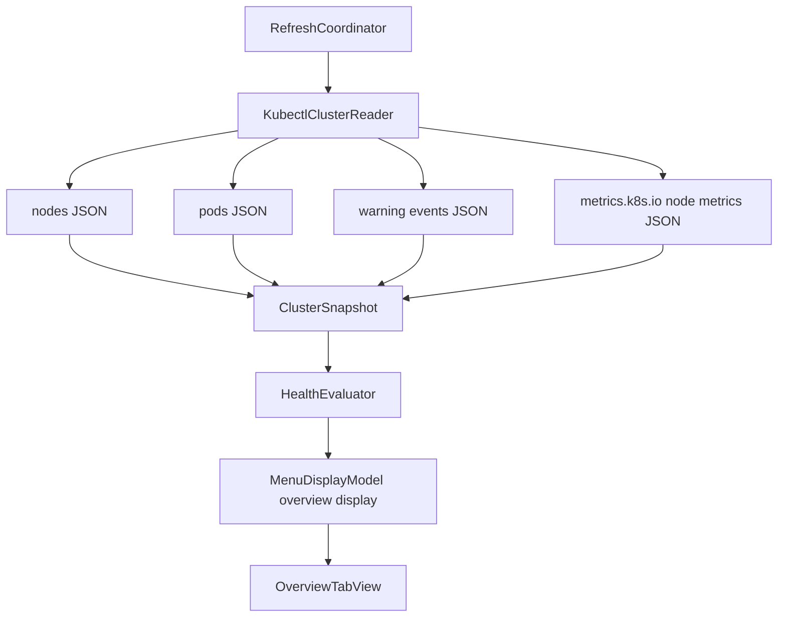

# feat: Redesign Overview cluster cards

## Overview

Redesign the Overview tab into a compact cluster snapshot: one top cluster/status row, four required cards for Nodes, Pods, CPU, and Memory, and a capped `Recent Warnings` section. The change keeps Kubebar as a glanceable menu bar utility while replacing the visible `Watching` section with first-screen tracked-object signals in the status row and warning ordering.

The implementation should continue to use app-owned `kubectl` reads and `MenuDisplayModel` as the UI boundary. The UI must not read Kubernetes directly, decide cluster health, or show stale or unavailable values as normal current data.

## Problem Frame

Kubebar's current Overview still reads like a status explanation: it shows a context header, stale banner, watchlist rows, compact counters, and a single overview notice. The requested design changes the first scan into a visual cluster summary: cluster identity and health at the top, then Nodes, Pods, CPU, and Memory cards, then recent warnings, while preserving watchlist-first priority without the visible `Watching` label (see origin: `docs/brainstorms/2026-04-22-kubebar-overview-design-requirements.md`).

The user explicitly wants:

- top row: cluster information, health icon, and health text,
- cards: `nodes <ready count>/<all count>`, `pods <ready>/<all>`, CPU, Memory,
- metrics from `kubectl`,
- no separate `Watching` section in Overview,
- warnings shown as `Recent Warnings`.

## Requirements Trace

- R1. Overview starts with cluster/context information, a health-state icon, and short status text.
- R2. Overview has four required cards below the top row: Nodes, Pods, CPU, and Memory.
- R3. Existing tabs remain: `Overview`, `Nodes`, `Pods`, and `Events`.
- R4. Overview stays readable in the current about-360-point menu width.
- R5. First-screen areas are top cluster/status row, four cards, and Recent Warnings.
- R6. Cards use a compact two-column rhythm where it fits and avoid dashboard sprawl.
- R7. CPU and memory come from actual current usage values read through `kubectl`.
- R8. Missing metrics show unavailable, not fake values.
- R9. Old metric values can remain only when marked stale.
- R10. `0` is valid only when it came from a successful metrics read.
- R11. The plan accounts for a new kubectl-backed metrics read.
- R12. Trend rendering is out of required scope.
- R13. Stale, unavailable, and neutral empty states remain visually distinct.
- R14. Overview removes `Watching` and long health prose such as `Cluster looks healthy` or `needs watching`.
- R15. Overview keeps a readable health description paired with the health icon.
- R16. Warning events appear under `Recent Warnings`.
- R17. Warning rows show reason, affected object, and age compactly.
- R18. No-warning empty state stays neutral and does not become a health claim.
- R19. Tracked objects remain first-screen signals through top-row status text and pinned warning priority but do not appear as a separate `Watching` label, section, or tracked-focus card.
- R20. Tracked objects that need attention influence the top-row status and Recent Warnings ordering first.
- R21. Deeper node, pod, and event details stay in their dedicated tabs.
- R22. Recent Warnings is capped on Overview so warning overflow cannot push the top row or four cards out of the first scan area.
- R23. Top-row status text is concise, single-line, and exposes full detail through tooltip/accessibility text when truncated.
- R24. Overview defines keyboard focus order for the top row, cards, warning rows, and overflow affordance.

## Scope Boundaries

- No Prometheus, Grafana, custom metrics pipeline, or external monitoring dependency.
- No full dashboard expansion.
- No trend chart in this plan.
- No deep troubleshooting actions.
- No removal of watchlist behavior from Kubebar; this only changes how Overview presents it.
- No changes to the app-owned context model or terminal current-context behavior.
- No Kubernetes Secrets reads.

## Context & Research

### Relevant Code and Patterns

- `AGENTS.md` requires the menu bar icon to stay categorical, UI to render `MenuDisplayModel`, `HealthEvaluator` to own severity, and external reads to go through injectable boundaries.
- `docs/architecture/system-overview.md` documents the current flow: `RefreshCoordinator` -> `KubectlClusterReader` -> `ClusterSnapshot` -> `HealthEvaluator` -> `MenuDisplayModel` -> SwiftUI views.
- `docs/architecture/runtime-invariants.md` requires stale data to remain visibly stale, partial section failures to be visible as unavailable, and warning summaries to stay capped and safe.
- `KubebarCore/Services/KubectlClusterReader.swift` already reads nodes, pods, warning events, and workload metadata concurrently through `kubectl`, decoding JSON into `ClusterSnapshot`.
- `KubebarCore/Models/ClusterSnapshot.swift` already represents node, pod, warning, and workload sections as `SnapshotSection`, making metrics a natural additional section.
- `KubebarCore/Services/HealthEvaluator.swift` already maps snapshot facts into display fields, handles stale snapshots, caps warnings, ranks watched objects, and chooses the current state.
- `KubebarCore/Models/MenuDisplayModel.swift` is the existing UI contract and should grow an Overview-specific display shape rather than making `OverviewTabView` infer raw rules.
- `Kubebar/Views/OverviewTabView.swift` currently composes `StatusSummaryView`, `StaleBannerView`, `WatchlistSectionView`, `CompactCountersView`, and a single overview notice.
- `Kubebar/Views/WarningEventsView.swift` already provides compact warning rows and accessibility text; Overview can reuse or adapt this pattern with the `Recent Warnings` title.
- `KubebarTests/Services/KubectlClusterReaderTests.swift` and `KubebarTests/Models/MenuDisplayModelTests.swift` are the primary behavior tests to extend.

### Institutional Learnings

- Preserve Kubebar's watchlist-first product role, but avoid drifting into a generic dashboard.
- `kubectl` CLI JSON parsing is the current V1 data boundary; keep the simplest trustworthy data source first.
- `./scripts/swift-quality-gate.sh local` is the repo's expected final local verification gate.
- For visual/menu work, automated tests prove display data and safe state handling, but final visual comfort may still need human UAT.

### External References

- Kubernetes `kubectl top` displays CPU/memory usage and depends on Metrics Server.
- Kubernetes Metrics API exposes node and pod CPU/memory usage under `metrics.k8s.io/v1beta1`.
- Metrics API memory usage is memory working set.

## Key Technical Decisions

- **Use Metrics API JSON through `kubectl get --raw`:** Use `kubectl` to read `/apis/metrics.k8s.io/v1beta1/nodes` instead of parsing human-oriented `kubectl top` text. This satisfies the kubectl boundary while keeping the app's preferred JSON parsing pattern.
- **Use node metrics for the CPU and Memory cards:** Aggregate `NodeMetricsList` usage across nodes and compare it with node allocatable values decoded from the existing node JSON. This gives cluster-level CPU and memory card values without adding pod-level metrics scope.
- **Treat metrics as card-level availability, not cluster health by itself:** Metrics failures should not discard otherwise valid node, pod, warning, or workload data, and a metrics-only failure must not be the sole reason the menu or top-row state becomes `Watch`. CPU and Memory cards show unavailable or stale states, and the display model keeps that data trust boundary visible.
- **Show Pods as ready/all on Overview from a real summary field:** Extend `PodSummary` or add a sibling readiness summary so Overview can show ready/all without reusing running/all. The reader should derive this from decoded pod conditions before raw pod records are discarded.
- **Keep watchlist-first without the `Watching` section:** Overview no longer shows a `Watching` label, but tracked objects remain visible first-screen signals through the top-row state text and pinned `Recent Warnings` ordering.
- **Replace one overview notice with capped Recent Warnings:** Overview should show recent warning rows directly, with watched-object warnings ordered first and visible rows capped so warnings cannot crowd out the top row or cards. Section failures remain visible through cards or top-row state, not as a generic single notice competing with warnings.
- **Keep views thin:** `OverviewTabView` renders precomputed display fields and does not inspect raw snapshot facts or decide health.

## Open Questions

### Resolved During Planning

- **Which exact kubectl read should provide CPU and memory?** Read node metrics JSON through `kubectl get --raw` at `/apis/metrics.k8s.io/v1beta1/nodes`, then aggregate usage and compare against node allocatable values from the existing nodes JSON.
- **What priority chooses the top-row health text?** Use the existing health state, but choose the short status text in this priority: stale refresh state, bad tracked object, node readiness deficit, pod readiness deficit, warning tracked object, warning event count, non-metrics unavailable sections, metrics unavailable as secondary data trust text, all-clear state.
- **Should the trend be planned now?** No. Trend rendering is explicitly out of this required Overview layout.

### Deferred to Implementation

- **Exact card labels and percentage formatting:** Decide during implementation after seeing how the existing SwiftUI typography fits at the 360-point menu width.
- **Exact helper/type names:** Keep names consistent with the implementation once the new display shape is introduced.
- **Exact wording for metrics-only unavailable top-row text:** Implementation should keep Metrics API unavailability visible through CPU/Memory cards and, if space allows, a short data-trust phrase. It must not become the sole reason for `Watch` when nodes, pods, warnings, and workloads are otherwise OK.

## High-Level Technical Design

> *This illustrates the intended approach and is directional guidance for review, not implementation specification. The implementing agent should treat it as context, not code to reproduce.*

## Implementation Units

- [x] **Unit 1: Add kubectl-backed metrics snapshot data**

**Goal:** Add a tested snapshot representation for cluster CPU and memory usage based on real node metrics.

**Requirements:** R7, R8, R9, R10, R11, R13

**Dependencies:** None

**Files:**
- Modify: `KubebarCore/Models/ClusterSnapshot.swift`
- Modify: `KubebarCore/Services/KubectlClusterReader.swift`
- Test: `KubebarTests/Services/KubectlClusterReaderTests.swift`

**Approach:**
- Add a metrics section to `ClusterSnapshot` using the existing `SnapshotSection` pattern.
- If metrics participates in `SnapshotSectionName`, distinguish metrics-only unavailability from health-impacting section failures so existing section-failure logic does not automatically mark an otherwise healthy cluster as `Watch`.
- Decode node allocatable CPU/memory from the existing nodes JSON. Use allocatable as the denominator for percentage cards because that matches the default `kubectl top node` framing better than total capacity.
- Add a new `KubectlRead` case for the Metrics API node metrics endpoint using `kubectl get --raw`.
- Decode `NodeMetricsList` JSON and aggregate CPU and memory usage across nodes.
- Keep quantity parsing focused but aligned with Kubernetes resource quantity forms. CPU and memory parsing should cover decimal SI suffixes such as `n`, `u`, `m`, `k`, `M`, `G`, and binary SI suffixes such as `Ki`, `Mi`, `Gi`, `Ti`, not only the units present in the first fixture.
- If metrics cannot be read or decoded, mark only the metrics section unavailable. Do not fail the whole snapshot while nodes, pods, warnings, or workloads are otherwise available.
- Do not query pods metrics in this unit; the required cards are cluster CPU and memory, which can be derived from node usage.

**Execution note:** Add decoding and quantity parser coverage before wiring the values into the display model.

**Patterns to follow:**
- `decodedSection` and `mappedSection` in `KubebarCore/Services/KubectlClusterReader.swift`
- Existing safe failure handling in `KubebarCore/Services/KubectlClusterReader.swift`
- Existing section availability tests in `KubebarTests/Services/KubectlClusterReaderTests.swift`

**Test scenarios:**
- Happy path: nodes JSON with allocatable CPU/memory plus metrics JSON with usage -> snapshot contains aggregated CPU/memory usage and denominator values.
- Happy path: metrics usage is exactly zero from JSON -> metric value is retained as real `0`, not treated as unavailable.
- Edge case: multiple nodes with mixed CPU units and memory units -> totals normalize correctly.
- Edge case: decimal SI and binary SI quantity suffixes outside the first fixture set still parse or fail safely with a tested unavailable state.
- Edge case: nodes JSON lacks allocatable CPU or memory -> metrics card data becomes unavailable rather than using `0` as denominator.
- Error path: Metrics API command fails while nodes/pods/warnings succeed -> snapshot still returns, metrics section is unavailable with a safe reason.
- Error path: malformed metrics JSON -> metrics section is unavailable without throwing away the rest of the snapshot.
- Error path: metrics failure stderr contains path or token-like text -> displayed reason is sanitized by the existing safe failure path.

**Verification:**
- Cluster snapshots can carry metrics availability independently of node, pod, warning, and workload availability.
- Missing metrics never become fake `0` usage.
- Metrics-only unavailability is available to the display model without automatically changing cluster health severity.

- [x] **Unit 2: Extend readiness data and Overview display mapping**

**Goal:** Convert snapshot facts into an Overview-specific display contract for the top row, four cards, and recent warnings, with real pod ready/all data.

**Requirements:** R1, R2, R5, R7, R8, R9, R10, R13, R14, R15, R16, R17, R18, R19, R20, R23

**Dependencies:** Unit 1

**Files:**
- Modify: `KubebarCore/Models/ClusterSnapshot.swift`
- Modify: `KubebarCore/Models/MenuDisplayModel.swift`
- Modify: `KubebarCore/Services/KubectlClusterReader.swift`
- Modify: `KubebarCore/Services/HealthEvaluator.swift`
- Test: `KubebarTests/Services/KubectlClusterReaderTests.swift`
- Test: `KubebarTests/Models/MenuDisplayModelTests.swift`

**Approach:**
- Add an Overview-specific display shape to `MenuDisplayModel` rather than making SwiftUI infer from raw counters.
- Include top-row fields for context, state, symbol, and short status text.
- Keep top-row status text single-line and concise in the display contract; full detail belongs in tooltip/accessibility fields rather than wrapping visible text.
- Include four card display values: Nodes, Pods, CPU, and Memory.
- Make the Nodes card show ready/all from `NodeSummary`.
- Make the Pods card show ready/all from a stable snapshot field. Extend `PodSummary` with `ready` while preserving `running`, or add a sibling pod-readiness summary; do not make `OverviewTabView` infer readiness from strings or raw pods.
- Derive pod readiness in `KubectlClusterReader` from decoded pod records before they are reduced into the snapshot. A pod should count ready only when the existing `PodRecord.isNotReady` logic does not mark it not ready.
- Keep existing deeper Pods tab behavior compatible; if the tab still needs running/all wording, separate the Overview card value from tab summary.
- Add metric card states for current, stale, and unavailable. Stale values may carry prior values only when the whole display is stale from a failed or aged-out refresh; current refreshes with missing metrics show unavailable, not last-good values.
- Keep metrics-only unavailability out of the cluster health severity decision. It can affect CPU/Memory card state and optional short data-trust text, but nodes/pods/warnings/workloads remain the cluster-health basis.
- Use `WarningEventDisplay` rows for `Recent Warnings`, capped for Overview and ordered so warning rows affecting tracked objects appear first.
- Replace long health prose in Overview with short text. Avoid strings such as `Cluster looks healthy` and `needs watching` in Overview-facing fields; prefer compact factual phrases such as `All tracked items OK`, `2 pods not ready`, or `Metrics unavailable`.
- Preserve existing `ClusterHealthState` categories and `MenuBarStatusPresentation` icon mapping.

**Execution note:** Implement display-model tests first because UI correctness depends on the model contract.

**Patterns to follow:**
- Existing `MenuDisplayModel` initializer defaults
- `HealthEvaluator.primaryStatusReason` priority logic
- Existing warning grouping in `HealthEvaluator.makeWarningEventSummaries`

**Test scenarios:**
- Happy path: all nodes and pods ready, metrics current, no warnings -> Overview has OK state, four cards with ready/all and metric values, and neutral no-warning text.
- Happy path: tracked workload is bad while global nodes are ready -> top-row status text prioritizes the tracked object reason, but no `Watching` section is required.
- Happy path: one node not ready -> Nodes card shows `<ready>/<all>` and top-row text identifies the node readiness deficit.
- Happy path: one pod not ready -> Pods card shows ready/all from the new snapshot readiness field rather than running/all.
- Happy path: warning events exist -> Recent Warnings rows are populated with reason, affected object, and age, with tracked-object warnings first.
- Edge case: metrics unavailable with otherwise OK cluster data -> CPU/Memory cards show unavailable, and the top-row/menu state does not become `Watch` solely because Metrics API is missing.
- Edge case: stale display from previous snapshot with metrics -> old metric values are shown only with stale marking.
- Error path: no previous data and metrics unavailable -> Overview does not show fake card values.
- Regression: Pods tab summary can still show running/all if that remains the existing tab wording.
- Regression: Overview-facing text no longer includes `Watching`, `Cluster looks healthy`, or `needs watching`.

**Verification:**
- `MenuDisplayModel` fully describes the new Overview without raw Kubernetes facts leaking into views.
- Pod ready/all and pod running/all semantics are both explicit where they are used.
- Top-row state text remains short, accessible, single-line, and driven by `HealthEvaluator`.

- [x] **Unit 3: Replace Overview UI with top row, cards, and Recent Warnings**

**Goal:** Render the new Overview design from `MenuDisplayModel` while keeping the menu compact and keyboard/accessibility friendly.

**Requirements:** R1, R2, R3, R4, R5, R6, R14, R15, R16, R17, R18, R19, R20, R21, R22, R23, R24

**Dependencies:** Unit 2

**Files:**
- Modify: `Kubebar/Views/OverviewTabView.swift`
- Modify: `Kubebar/Views/StatusSummaryView.swift`
- Modify: `Kubebar/Views/WarningEventsView.swift`
- Modify: `Kubebar/Views/MenuBarRootView.swift`
- Test: `KubebarTests/QA/MenuStateFixtureCatalogTests.swift`

**Approach:**
- Remove the old visible `Watching` section and `CompactCountersView` from Overview composition. Reuse view helpers only if they can render the new unlabeled top-row/pinned-warning behavior without reintroducing the `Watching` section.
- Render the top row with context, state icon, state label, and short status text.
- Enforce one-line visible top-row status text with truncation at the view layer; expose the full value through tooltip and accessibility label.
- Render a two-by-two card grid for Nodes, Pods, CPU, and Memory where available width allows.
- Use stable card dimensions and truncation so value changes do not shift layout dramatically.
- Put `Recent Warnings` below the cards. Reuse existing warning row behavior, but allow the title to be `Recent Warnings` on Overview while the Events tab can keep its broader Events wording if desired.
- Cap Overview-visible warning rows, with `2` rows as the default target unless implementation proves `3` still leaves the top row and four cards comfortably visible at the current menu height. Additional warnings should be summarized with a compact count or left to the Events tab, not rendered inline on Overview.
- Preserve watchlist-first behavior by rendering tracked-object attention in the top row and by putting warning rows related to tracked objects before unrelated warnings.
- Make unavailable and stale card states visibly different from neutral no-warning text.
- Preserve the segmented tab picker and menu width. If content exceeds the existing max content height, keep scrolling behavior inside the existing root container rather than expanding the menu into a dashboard, but do not let warning overflow push the top row or four cards out of the first scan area.
- Define keyboard focus order as: top status row, Nodes card, Pods card, CPU card, Memory card, visible Recent Warnings rows, then any warning overflow affordance. Cards should be focusable accessibility containers with their label, value, and state combined.

**Patterns to follow:**
- `StatusSummaryView` for icon/state/accessibility composition
- `WarningEventsView` for warning row truncation and accessibility
- `MenuBarRootView` for content height measurement and scroll containment
- Existing one-line truncation and tooltip patterns in `WatchlistSectionView`, `NodeDetailsView`, and `WarningEventsView`

**Test scenarios:**
- Happy path: QA fixture metadata for healthy/OK state describes a top status row, four cards, and Recent Warnings.
- Happy path: watch/bad fixtures describe warnings or tracked-object attention in the top row without a `Watching` section.
- Edge case: long context or warning object names remain one-line truncated with full tooltip/accessibility labels.
- Edge case: many warning rows show only the capped Overview count and do not move the top row or cards out of the first scan area.
- Edge case: metrics unavailable fixture describes unavailable CPU/Memory cards rather than normal-looking values.
- Error path: stale fixture keeps stale banner/card markers visible.
- Accessibility: focus order follows top row -> Nodes -> Pods -> CPU -> Memory -> warning rows -> overflow affordance.

**Verification:**
- Overview renders only the new top row, cards, and Recent Warnings content.
- Overview no longer renders a separate `Watching` label or watchlist section.
- The first scan always includes the top row and four cards before warning overflow.

- [x] **Unit 4: Update fixtures, QA expectations, and docs**

**Goal:** Keep operator-facing QA and architecture docs aligned with the new Overview contract.

**Requirements:** R3, R4, R5, R13, R14, R16, R18, R19, R20, R21, R22, R24

**Dependencies:** Units 1-3

**Files:**
- Modify: `KubebarCore/QA/MenuStateFixtureCatalog.swift`
- Modify: `KubebarTests/QA/MenuStateFixtureCatalogTests.swift`
- Modify: `docs/qa/operator-verification.md`
- Modify: `docs/architecture/system-overview.md`
- Modify: `docs/architecture/runtime-invariants.md`
- Modify: `scripts/generate-qa-evidence.sh`

**Approach:**
- Update QA fixture expected behavior text so it refers to the new Overview shape.
- Add or adjust fixture states to represent metrics available, metrics unavailable, warning rows, and stale cards if the existing catalog does not already cover those states naturally.
- Update architecture docs to mention metrics as a `kubectl`-backed snapshot section and Overview display model output.
- Update runtime invariants to preserve the new contract: Overview top row, four cards, capped Recent Warnings, no fake metrics, no metrics-only health degradation, no separate `Watching` Overview section.
- Update QA/operator text so watchlist-first behavior is described as top-row and pinned-warning priority rather than a visible `Watching` block.
- Add the expected keyboard focus order to QA notes for human verification.
- Keep human-only visual checks explicit; do not call visual UAT complete based only on model tests.

**Patterns to follow:**
- Existing QA fixture catalog and operator verification table
- Existing architecture doc tone and scope boundaries

**Test scenarios:**
- Happy path: fixture catalog tests require metadata for all visible QA states.
- Happy path: fixture behavior descriptions mention the new Overview layout where relevant.
- Edge case: metrics unavailable fixture text cannot be confused with a normal current metric state.
- Edge case: warning-heavy fixture still describes a capped Recent Warnings section.
- Regression: docs and generated QA evidence no longer describe Overview as showing `Watching` rows.
- Regression: docs still state tracked objects remain first-screen priority signals.

**Verification:**
- QA artifacts describe the same visible states that implementation now renders.
- Architecture docs still preserve `MenuDisplayModel` and `HealthEvaluator` as the UI and severity boundaries.

- [x] **Unit 5: Final integration and validation**

**Goal:** Verify the full feature path from kubectl reads to display model to Overview rendering.

**Requirements:** All requirements, especially R4, R8, R9, R10, R13, R18, R21, R22, R24

**Dependencies:** Units 1-4

**Files:**
- Modify: `docs/qa/operator-verification.md`
- Test: `KubebarTests/Services/KubectlClusterReaderTests.swift`
- Test: `KubebarTests/Models/MenuDisplayModelTests.swift`
- Test: `KubebarTests/QA/MenuStateFixtureCatalogTests.swift`

**Approach:**
- Confirm all feature-bearing paths are covered by focused unit tests before running the full quality gate.
- Confirm the final Overview path preserves the app-owned context and no UI code calls `kubectl`.
- Confirm the menu still has dedicated Nodes, Pods, and Events tabs.
- Confirm stale, unavailable, and neutral empty states are all represented in tests or QA fixtures.
- Confirm metrics-only unavailability does not make an otherwise OK cluster display as `Watch`.
- Confirm tracked-object warnings are ordered before unrelated warnings on Overview and warning rows remain capped.
- Record any visual-only UAT gap clearly if automated checks cannot inspect menu comfort.

**Patterns to follow:**
- Existing final-gate expectation in `AGENTS.md`
- Existing QA docs that distinguish automated proof from human visual verification

**Test scenarios:**
- Integration: successful refresh with nodes, pods, warning events, and metrics -> display model and Overview fixtures agree on top row, cards, and warning rows.
- Integration: Metrics API unavailable but nodes/pods/warnings succeed -> Overview keeps real node/pod/warning data and marks CPU/Memory unavailable.
- Integration: failed refresh with previous metrics -> display is stale and old values are not shown as current.
- Integration: many warnings with tracked-object warnings present -> Overview shows tracked warnings first and caps visible rows.
- Integration: pod ready/all differs from running/all -> Overview and Pods tab each use their intended wording.
- Regression: no test or fixture relies on `Watching` as Overview-visible copy.

**Verification:**
- Focused tests pass for reader, display model, and QA fixtures.
- Full Swift quality gate passes before the work is considered complete.
- Any remaining visual UAT is documented as human verification rather than silently accepted.

## System-Wide Impact

- **Interaction graph:** `RefreshCoordinator` remains the orchestrator; `KubectlClusterReader` adds one metrics read; `ClusterSnapshot` carries an additional metrics section; `HealthEvaluator` maps it into `MenuDisplayModel`; `OverviewTabView` renders only display-model data.
- **Error propagation:** Metrics failures should become card-level unavailable/stale states and safe section reasons. They should not expose command transcripts, erase valid node/pod/warning/workload data, or become the sole reason for a `Watch` cluster state.
- **State lifecycle risks:** Previous metrics may be shown only as stale when the entire snapshot is stale. Current snapshots with missing metrics must show unavailable instead of old values.
- **Watchlist-first preservation:** Tracked objects remain first-screen signals through top-row priority and pinned Recent Warnings ordering, even though the visible `Watching` section is removed.
- **First-screen protection:** Warning rows remain capped on Overview so the top row and four cards stay visible before warning overflow.
- **API surface parity:** The menu bar icon, Nodes tab, Pods tab, Events tab, setup flow, saved context, and watchlist storage remain in place. Only Overview composition and display data expand.
- **Integration coverage:** Unit tests must cover reader decoding, display mapping, and stale/unavailable behavior. QA fixtures cover visible states that model tests cannot fully prove.
- **Unchanged invariants:** UI does not read raw `kubectl` output; `HealthEvaluator` remains the source of severity; warning rows remain capped and safe; no Secrets are queried.

## Risks & Dependencies

| Risk | Mitigation |
|------|------------|
| Metrics Server is not installed or the Metrics API is unavailable | Show CPU and Memory cards as unavailable; do not fake values; keep node/pod/warning data visible; do not mark the cluster `Watch` solely for metrics-only failure |
| Kubernetes quantity parsing is wrong | Add focused tests for Kubernetes decimal SI and binary SI CPU/memory unit variants before wiring UI |
| Pods ready/all conflicts with existing running/all assumptions | Add explicit readiness data and keep Overview-ready/all separate from any deeper tab summary that still needs running semantics |
| Overview becomes a mini dashboard | Limit required layout to one top row, four cards, and capped Recent Warnings; keep trend and deep troubleshooting out |
| Warning overflow hides cards | Cap Overview-visible warning rows and route deeper warning browsing to Events |
| Watchlist-first value is weakened | Keep tracked objects as first-screen signals through top-row status and pinned warning ordering; only remove the visible `Watching` section from Overview |
| Visual state is inaccessible or color-only | Preserve icon, state text, short reason, tooltips, accessibility labels, and explicit focus order for top row/cards/warnings |

## Documentation / Operational Notes

- Update architecture docs when metrics become a new cluster snapshot section.
- Update QA docs and generated QA evidence text so human verification checks the new Overview surface.
- Do not document Metrics Server as a hard Kubebar prerequisite; document CPU/Memory cards as unavailable when Metrics API data is unavailable.
- Document that missing Metrics API data is a card-level availability state, not a cluster-health failure by itself.
- Keep final validation tied to the repo quality gate and separate any human-only visual UAT.

## Sources & References

- **Origin document:** [docs/brainstorms/2026-04-22-kubebar-overview-design-requirements.md](../brainstorms/2026-04-22-kubebar-overview-design-requirements.md)
- Related architecture: [docs/architecture/system-overview.md](../architecture/system-overview.md)
- Related invariants: [docs/architecture/runtime-invariants.md](../architecture/runtime-invariants.md)
- Existing reader: `KubebarCore/Services/KubectlClusterReader.swift`
- Existing display mapping: `KubebarCore/Services/HealthEvaluator.swift`
- Existing display model: `KubebarCore/Models/MenuDisplayModel.swift`
- Existing Overview view: `Kubebar/Views/OverviewTabView.swift`
- Kubernetes `kubectl top` reference: https://kubernetes.io/docs/reference/kubectl/generated/kubectl_top/
- Kubernetes resource metrics pipeline: https://kubernetes.io/zh-cn/docs/tasks/debug/debug-cluster/resource-metrics-pipeline/
- Kubernetes Metrics API reference: https://kubernetes.io/docs/reference/external-api/metrics.v1beta1/
