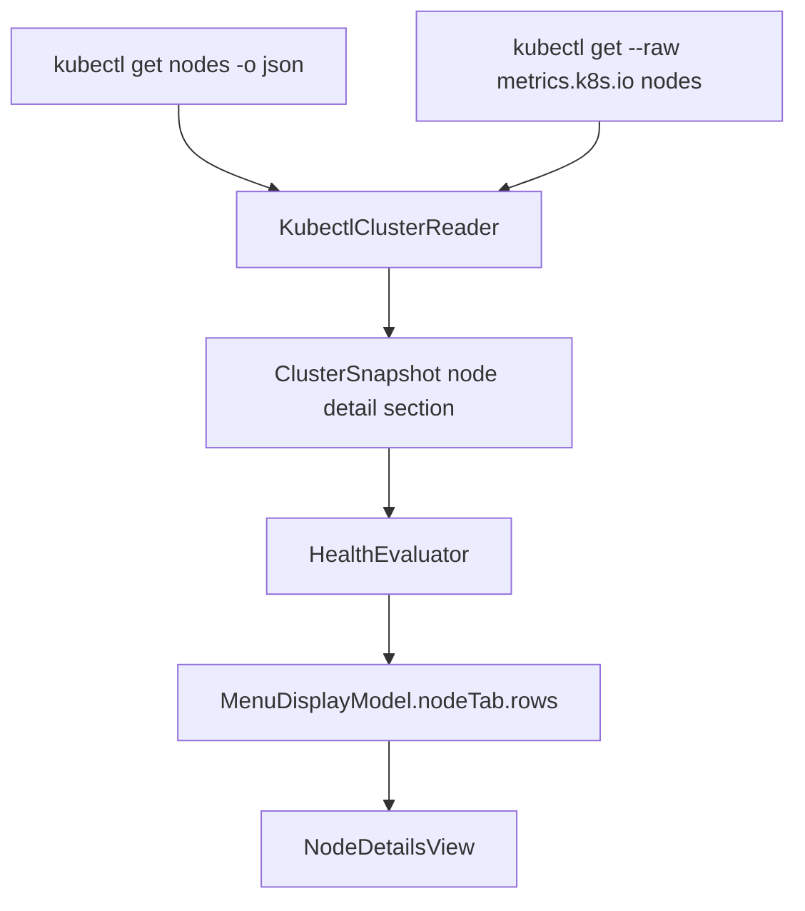

# feat: Add Nodes item display

## Overview

Add per-node rows to the Nodes tab so operators can see each node name,
readiness, CPU usage, memory usage, and a short Not Ready reason without
leaving Kubebar. The change keeps Kubebar glanceable: Ready nodes stay compact,
Not Ready nodes become visually stronger and show one extra diagnostic line.

The implementation should keep Kubernetes reads behind `KubectlClusterReader`,
map cluster facts through `HealthEvaluator`, and render only `MenuDisplayModel`
from SwiftUI.

## Problem Frame

The current Nodes tab only shows a readiness summary such as `3/4 nodes ready`.
That answers whether a problem exists, but not which node is affected or whether
resource pressure is involved. The requirements ask for balanced node rows:
normal rows are compact, Not Ready rows are visibly error-like and explain the
reason (see origin: `docs/brainstorms/2026-04-22-kubebar-nodes-item-display-requirements.md`).

## Requirements Trace

- R1. Each node item shows the node name.
- R2. Each node item shows `Ready` or `Not Ready`.
- R3. Each node item shows CPU and memory when metrics are available.
- R4. CPU and memory are shown as percentages.
- R5. Missing CPU or memory data shows `-`, not `0`.
- R6. Ready nodes use the normal compact row style.
- R7. Not Ready nodes use a stronger error style.
- R8. Not Ready nodes show a short error description below the primary row.
- R9. Error descriptions use useful node condition reason and message data.
- R10. Long error descriptions stay one visible line while preserving full text
  through help and accessibility.
- R11. Not Ready nodes appear before Ready nodes.
- R12. Nodes with the same readiness state are sorted by name.
- R13. The Nodes tab remains compact and does not become a deep dashboard.
- R14. All nodes remain reachable; scrolling is acceptable when the list is tall.
- R15. If node data is unavailable, show the existing unavailable message rather
  than partial or misleading rows.
- R16. If metrics are unavailable but node readiness is available, rows still
  show node names and readiness while CPU and memory show unavailable.

## Scope Boundaries

- No deep troubleshooting actions, drill-down console, logs, or shell commands.
- No pod-level metrics.
- No Prometheus, Grafana, or external monitoring dependency.
- No change to menu bar health categories: `OK`, `Watch`, `Bad`, and `Stale`
  remain the only states.
- No removal or redesign of Overview, Pods, or Events tabs.
- No Kubernetes Secrets reads.

## Context & Research

### Relevant Code and Patterns

- `AGENTS.md` requires UI to render `MenuDisplayModel`, `HealthEvaluator` to own
  severity, external reads to use injectable boundaries, and deep
  troubleshooting to stay out of version 1.
- `docs/architecture/runtime-invariants.md` requires stale or unavailable data
  to stay visibly distinct and forbids raw command transcripts in menu views.
- `Kubebar/Views/NodesTabView.swift` currently renders `StaleBannerView` and
  `NodeDetailsView`.
- `Kubebar/Views/NodeDetailsView.swift` currently renders only the `Node
  readiness` heading, summary, unavailable message, and empty message.
- `KubebarCore/Models/MenuDisplayModel.swift` has `NodeTabDisplay`, but it has
  no node row display data yet.
- `KubebarCore/Models/ClusterSnapshot.swift` has `NodeSummary` and
  `ClusterMetricsSummary`, but no per-node snapshot data.
- `KubebarCore/Services/KubectlClusterReader.swift` currently decodes node
  readiness and aggregate node metrics. Its private `NodeRecord` and
  `NodeMetricsRecord` structs do not decode node names yet.
- `KubebarCore/Services/HealthEvaluator.swift` already formats node summary,
  metrics percentages, tab unavailable messages, stale state, and overall
  severity.
- `KubebarTests/Services/KubectlClusterReaderTests.swift` and
  `KubebarTests/Models/MenuDisplayModelTests.swift` are the main behavior test
  files for this work.
- `KubebarCore/QA/MenuStateFixtureCatalog.swift` and
  `docs/qa/operator-verification.md` define deterministic visual QA states.

### Institutional Learnings

- No `docs/solutions/` directory exists in this repo, so there are no prior
  solution notes to carry forward.
- Existing plans emphasize keeping Kubebar a glanceable menu bar utility, not a
  `k9s` replacement.
- Visual/menu changes need model tests plus visible QA fixture coverage when
  possible.

### External References

- Kubernetes Node status documentation shows node conditions include `type`,
  `status`, `reason`, and `message`, and that `Ready=False` or `Ready=Unknown`
  means a node is not healthy or not recently heard from.
- Kubernetes Metrics API `NodeMetrics` includes standard metadata and a
  required `usage` resource list; `NodeMetricsList` contains node metrics rows.

## Key Technical Decisions

- **Add node detail snapshot data without replacing `NodeSummary`:** Keep
  existing summary behavior stable and add a separate per-node section for row
  data. This reduces churn across Overview and health evaluation.
- **Match per-node metrics by node name:** Decode `metadata.name` from both
  nodes JSON and NodeMetrics JSON. Use that stable identity to attach usage to
  node rows.
- **Make row metrics optional:** A node row can still exist when metrics are
  missing. CPU and memory display as `-` unless both usage and allocatable
  values for that node can produce a trustworthy percentage.
- **Keep aggregate metrics behavior separate:** Existing CPU/Memory Overview
  cards can keep using aggregate cluster metrics. Per-node row metrics should
  not force a broader change to Overview card semantics.
- **Derive Not Ready reason from node conditions:** Prefer the `Ready`
  condition when it is not `True`; include reason and message when available.
  If `Ready` is missing, use a safe fallback instead of an empty row.
- **Keep sorting in display mapping:** `HealthEvaluator` should order Not Ready
  rows first and then sort by name so the view only renders the prepared model.
- **Use non-color-only error presentation:** Not Ready rows should combine text,
  symbol, border/background, or weight so the state remains clear without
  relying only on red.

## Open Questions

### Resolved During Planning

- **Can node metrics be matched to nodes?** Yes. Official Metrics API
  `NodeMetrics` includes standard object metadata; planning should decode
  `metadata.name` and match it to node names.
- **Can Not Ready rows show condition reason and message?** Yes. Kubernetes node
  conditions include `reason` and `message`; planning should decode those fields
  for the `Ready` condition and any useful pressure conditions.
- **Should rows disappear when metrics are unavailable?** No. Requirements say
  node readiness remains visible and CPU/Memory show unavailable.

### Deferred to Implementation

- **Exact row visual treatment:** Choose the final SwiftUI spacing, symbol, and
  border/background details while checking the 360-point menu width.
- **Exact type names:** Use names that fit nearby `ClusterSnapshot`,
  `MenuDisplayModel`, and `HealthEvaluator` conventions.
- **Pressure-condition fallback order:** Implementation can refine whether a
  non-Ready `Ready` condition or a `DiskPressure`/`MemoryPressure`/`PIDPressure`
  condition provides the clearest message for a given fixture.

## High-Level Technical Design

> *This illustrates the intended approach and is directional guidance for review, not implementation specification. The implementing agent should treat it as context, not code to reproduce.*

## Implementation Units

- [x] **Unit 1: Add per-node snapshot data**

**Goal:** Capture node name, readiness, condition details, allocatable values,
and optional per-node usage in app-owned snapshot data.

**Requirements:** R1, R2, R3, R5, R9, R15, R16

**Dependencies:** None

**Files:**
- Modify: `KubebarCore/Models/ClusterSnapshot.swift`
- Modify: `KubebarCore/Services/KubectlClusterReader.swift`
- Test: `KubebarTests/Services/KubectlClusterReaderTests.swift`

**Approach:**
- Add a value type for per-node snapshot rows. It should carry the node name,
  readiness status, optional condition reason/message text, allocatable CPU and
  memory, and optional CPU/memory usage.
- Keep `NodeSummary` as the existing ready/total summary contract.
- Add a snapshot section for node detail rows. When node data is unavailable,
  this section should be unavailable for the same safe reason as `nodesSection`.
- Decode `metadata.name` from node JSON and metrics JSON.
- Decode optional `reason` and `message` from node conditions.
- Build node detail rows from node JSON even when metrics JSON is unavailable.
- Attach metrics only when a matching metrics item and parseable allocatable
  values exist for that node.
- Preserve the current aggregate `ClusterMetricsSummary` behavior for Overview
  cards unless implementation reveals a simpler shared calculation.

**Execution note:** Add reader-level tests before exposing the rows in the menu
display model.

**Patterns to follow:**
- `SnapshotSection` usage in `KubebarCore/Models/ClusterSnapshot.swift`
- `decodedSection`, `mappedSection`, `makeNodeSummary`, and
  `makeMetricsSection` in `KubebarCore/Services/KubectlClusterReader.swift`
- Quantity parsing tests in `KubebarTests/Services/KubectlClusterReaderTests.swift`

**Test scenarios:**
- Happy path: nodes JSON with `metadata.name`, Ready condition, allocatable
  CPU/memory, and matching metrics JSON -> node detail rows include names,
  Ready labels, and raw values that can produce CPU/Memory percentages.
- Happy path: one Ready node and one Not Ready node -> summary remains ready/total
  and row data preserves each node's readiness.
- Happy path: Not Ready node has `Ready=False` with reason and message -> row
  data preserves both values for display mapping.
- Edge case: `Ready=Unknown` -> row data treats the node as Not Ready and
  preserves available reason/message.
- Edge case: metrics JSON has no item for one node -> that node row keeps name
  and readiness but has no CPU/Memory usage.
- Edge case: node allocatable is missing or unparsable for one node -> that
  node row has unavailable CPU/Memory values rather than zero.
- Error path: nodes JSON is unavailable or malformed -> node detail section is
  unavailable and no partial rows are exposed.
- Error path: metrics command fails while nodes succeed -> node detail rows are
  available with missing CPU/Memory usage.
- Regression: existing aggregate metrics tests still pass, including real zero
  metrics and metrics-only unavailability.

**Verification:**
- `ClusterSnapshot` can represent all node rows independently from the existing
  ready/total summary.
- Metrics unavailability does not erase node names or readiness.
- Missing per-node metric inputs never become fake zero values.

- [x] **Unit 2: Map node rows into `MenuDisplayModel`**

**Goal:** Extend the Nodes tab display contract so SwiftUI receives ordered,
formatted node rows with accessibility/help text ready to render.

**Requirements:** R1, R2, R3, R4, R5, R8, R9, R10, R11, R12, R15, R16

**Dependencies:** Unit 1

**Files:**
- Modify: `KubebarCore/Models/MenuDisplayModel.swift`
- Modify: `KubebarCore/Services/HealthEvaluator.swift`
- Test: `KubebarTests/Models/MenuDisplayModelTests.swift`

**Approach:**
- Add a `NodeItemDisplay` style value type under the display model layer. It
  should include name, status label, readiness state, CPU label, memory label,
  optional issue text, full help text, and accessibility label.
- Add `rows` to `NodeTabDisplay` while preserving summary,
  `unavailableMessage`, and `emptyMessage`.
- Format CPU and memory percentages in `HealthEvaluator` from usage and
  allocatable values. A valid zero usage should become `0%`; missing usage or
  invalid denominator should become `-`.
- Build Not Ready issue text from the best available condition reason and
  message. Avoid empty punctuation when one part is missing.
- Sort rows with Not Ready first, then by node name.
- When node detail rows are unavailable, keep `NodeTabDisplay.rows` empty and
  use the existing unavailable message path.
- Preserve stale behavior: previous node rows may be shown only as part of a
  stale display with the stale banner visible.

**Execution note:** Implement display-model tests first so UI rendering does
not own product rules.

**Patterns to follow:**
- `WarningEventDisplay` and `WatchItemDisplay` display-shaping patterns in
  `KubebarCore/Models/MenuDisplayModel.swift`
- `HealthEvaluator.makeNodeTab`, `percentage`, and tab unavailable helpers
- Existing tests for stale tab display and section unavailable copy in
  `KubebarTests/Models/MenuDisplayModelTests.swift`

**Test scenarios:**
- Happy path: Ready node with complete metrics -> display row shows node name,
  `Ready`, CPU percent, and memory percent.
- Happy path: Not Ready node with reason/message -> display row shows
  `Not Ready` and an issue text containing useful condition detail.
- Happy path: valid zero CPU/memory usage -> display row shows `0%`, not `-`.
- Edge case: missing metrics for one node -> CPU and Memory labels are `-`
  while node name and readiness remain present.
- Edge case: long node name and long issue message -> full text remains in help
  or accessibility fields while visible fields can be truncated by the view.
- Edge case: mixed Ready and Not Ready nodes with unsorted names -> display
  rows are Not Ready first and name-sorted within each group.
- Error path: node section unavailable -> unavailable message is set and rows
  are empty.
- Regression: existing `nodeTab.summary`, stale display, and Overview node card
  behavior stay compatible.

**Verification:**
- The display model fully answers what each node row should render.
- The view does not need to inspect raw cluster state or sort rows itself.

- [x] **Unit 3: Render balanced node rows in the Nodes tab**

**Goal:** Update the Nodes tab UI so Ready rows are compact and Not Ready rows
are visually stronger with a one-line issue description.

**Requirements:** R6, R7, R8, R10, R13, R14, R15, R16

**Dependencies:** Unit 2

**Files:**
- Modify: `Kubebar/Views/NodeDetailsView.swift`
- Modify: `Kubebar/Views/NodesTabView.swift`
- Test: `KubebarTests/Models/MenuDisplayModelTests.swift`
- Test: `KubebarTests/QA/MenuStateFixtureCatalogTests.swift`

**Approach:**
- Keep the existing summary/unavailable behavior at the top of the Nodes tab.
- Render rows only when `NodeTabDisplay.unavailableMessage` is nil.
- Use a compact repeated row layout with a first line for name and status, and
  a resource line for CPU and Memory.
- For Not Ready rows, add a non-color-only error cue and show the issue text on
  one visible line below the primary line.
- Keep node names and issue text truncatable with help/accessibility preserving
  full content.
- Rely on `MenuBarRootView`'s existing measured-content scroll behavior when
  the list exceeds the menu's maximum content height.
- Avoid putting troubleshooting actions or raw command output in rows.

**Patterns to follow:**
- One-line truncation and help text in `NodeDetailsView`,
  `WarningEventRowView`, and `PodRowView`
- `OverviewCardView` unavailable/stale visual distinction patterns
- Native focusability patterns in `WarningEventsView` and `StatusSummaryView`

**Test scenarios:**
- Integration: accessibility label for a Ready row includes name, Ready status,
  CPU, and Memory.
- Integration: accessibility label for a Not Ready row includes name, Not Ready
  status, CPU, Memory, and issue text.
- Integration: QA fixture data includes Ready and Not Ready node rows so visible
  inspection can confirm row density, error styling, and truncation.

**Verification:**
- Ready rows remain compact.
- Not Ready rows are easy to spot before reading the issue text.
- Long text does not overflow the menu width.
- All rows remain reachable through the existing tab content scrolling.

- [x] **Unit 4: Add QA fixture coverage and documentation updates**

**Goal:** Make the new Nodes tab behavior visible in deterministic QA fixtures
and keep project documentation aligned with the new display.

**Requirements:** R7, R8, R10, R13, R14, R15, R16

**Dependencies:** Units 1-3

**Files:**
- Modify: `KubebarCore/QA/MenuStateFixtureCatalog.swift`
- Modify: `KubebarTests/QA/MenuStateFixtureCatalogTests.swift`
- Modify: `docs/architecture/runtime-invariants.md`
- Modify: `docs/architecture/system-overview.md`
- Modify: `docs/qa/operator-verification.md`
- Test: `KubebarTests/QA/MenuStateFixtureCatalogTests.swift`

**Approach:**
- Update existing `bad` or `metrics-unavailable` fixtures so the Nodes tab can
  demonstrate Not Ready row styling and metrics-unavailable row values.
- If one fixture cannot clearly cover both behaviors, add fixture data while
  preserving the existing QA state list unless a new state is materially useful.
- Add fixture assertions for row order, Not Ready reason, and metrics
  unavailable labels.
- Update runtime invariants to state that Nodes tab rows come from display
  model data, Not Ready states are non-color-only, and missing per-node metrics
  show unavailable.
- Update system overview to mention per-node rows in the menu display model.
- Update operator verification text so human checks include opening the Nodes
  tab and confirming Not Ready description, resource labels, truncation, and
  scrolling behavior.

**Patterns to follow:**
- Existing QA fixture metadata and state assertions in
  `MenuStateFixtureCatalog.swift` and `MenuStateFixtureCatalogTests.swift`
- Existing operator verification wording for metrics-unavailable and warning-heavy states
- `docs/architecture/runtime-invariants.md` data and failure rule style

**Test scenarios:**
- Happy path: QA fixture exposes at least one Ready row with CPU/Memory labels.
- Happy path: QA fixture exposes at least one Not Ready row before Ready rows
  with a non-empty issue text.
- Edge case: metrics-unavailable fixture keeps node rows but shows `-` for CPU
  and memory.
- Regression: QA fixture metadata remains complete and sensitive-string checks
  still pass.

**Verification:**
- QA fixtures give a deterministic way to inspect the new Nodes tab states.
- Documentation reflects the final user-visible behavior and data trust rules.

## System-Wide Impact

- **Interaction graph:** `KubectlClusterReader` adds node detail facts to
  `ClusterSnapshot`; `HealthEvaluator` formats those facts into
  `MenuDisplayModel.nodeTab`; `NodeDetailsView` renders the result. No SwiftUI
  view reads Kubernetes data directly.
- **Error propagation:** Node read failure keeps using the existing node
  unavailable message. Metrics failure stays row-level unavailable for CPU and
  Memory and must not hide readiness rows.
- **State lifecycle risks:** Stale snapshots may preserve previous node rows,
  but only when the stale banner is visible. Current refreshes with missing
  metrics must not reuse old per-node metric values as current.
- **API surface parity:** Existing Overview node card, pod tab, warning rows,
  setup, and menu bar state behavior should remain unchanged except where node
  detail data is added to the display model.
- **Integration coverage:** Reader tests prove parsed facts; display model tests
  prove ordering, formatting, and unavailable behavior; QA fixtures support
  visual inspection.
- **Unchanged invariants:** Health severity remains owned by
  `HealthEvaluator`; menu bar categories remain unchanged; Kubebar still uses
  the app-owned context and does not query Secrets.

## Risks & Dependencies

| Risk | Mitigation |
|------|------------|
| Per-node metrics cannot be matched reliably | Decode `metadata.name` from both nodes and NodeMetrics; show `-` for unmatched rows rather than hiding nodes. |
| Missing metrics look like zero usage | Model CPU/Memory labels as unavailable unless usage and denominator are both present and valid. |
| Not Ready explanation chooses noisy condition text | Prefer non-Ready `Ready` condition reason/message first; keep a safe fallback and refine pressure-condition fallback during implementation. |
| Nodes tab becomes too dense | Keep Ready rows compact, show extra issue text only for Not Ready rows, and rely on existing menu scrolling for tall lists. |
| UI starts deciding product rules | Keep sorting, labels, and issue text in `HealthEvaluator` and `MenuDisplayModel`. |

## Documentation / Operational Notes

- Update architecture docs because the display model will carry per-node row
  data.
- Update operator QA docs so manual verification includes Nodes tab inspection.
- Final implementation should run the repo quality gate before completion:
  `./scripts/swift-quality-gate.sh local`.

## Sources & References

- **Origin document:** [docs/brainstorms/2026-04-22-kubebar-nodes-item-display-requirements.md](docs/brainstorms/2026-04-22-kubebar-nodes-item-display-requirements.md)
- Related code: `Kubebar/Views/NodeDetailsView.swift`
- Related code: `Kubebar/Views/NodesTabView.swift`
- Related code: `KubebarCore/Models/ClusterSnapshot.swift`
- Related code: `KubebarCore/Models/MenuDisplayModel.swift`
- Related code: `KubebarCore/Services/KubectlClusterReader.swift`
- Related code: `KubebarCore/Services/HealthEvaluator.swift`
- Tests: `KubebarTests/Services/KubectlClusterReaderTests.swift`
- Tests: `KubebarTests/Models/MenuDisplayModelTests.swift`
- Tests: `KubebarTests/QA/MenuStateFixtureCatalogTests.swift`
- External docs: [Kubernetes Node Status](https://kubernetes.io/docs/reference/node/node-status/)
- External docs: [Kubernetes Metrics API v1beta1](https://kubernetes.io/docs/reference/external-api/metrics.v1beta1/)
