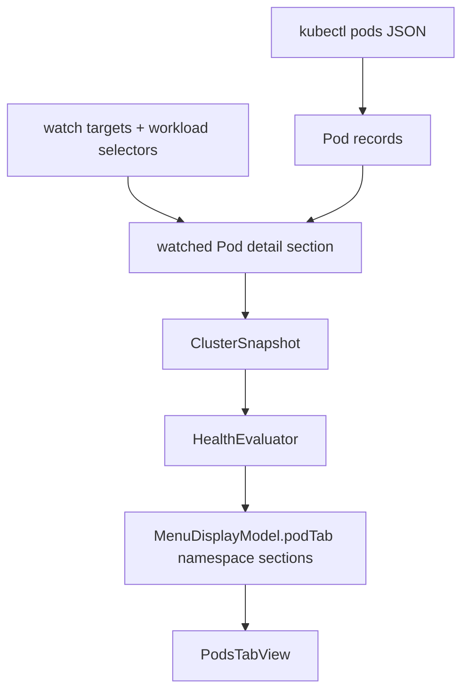

# feat: Add Pod item menu UI

## Overview

Add namespace-grouped Pod rows to the Pods tab so operators can scan watched
Pods directly. Each row shows a status dot, Pod name, per-Pod ready/all count,
and one short secondary issue line when a Pod needs attention. The change keeps
Kubebar watchlist-first, compact, and shallow: the tab explains visible Pod
state without adding logs, shell actions, or deep troubleshooting.

The implementation should keep raw Kubernetes reads in `KubectlClusterReader`,
carry Pod details through app-owned snapshot data, map display-ready groups in
`HealthEvaluator`, and let SwiftUI render only `MenuDisplayModel`.

## Problem Frame

The current Pods tab shows Pod readiness summary text and watchlist-style rows.
That helps explain watched targets, but it does not let the operator inspect
the actual Pod items by namespace. The requirements ask for a scannable Pod
item list with namespace grouping, dot status, `ready/all` labels, and small
gray issue text below affected Pod names (see origin:
`docs/brainstorms/2026-04-22-kubebar-pod-item-menu-ui-requirements.md`).

## Requirements Trace

- R1. Pod items are grouped by namespace.
- R2. Namespace headers are lighter than Pod names but easy to scan.
- R3. Default scope is watched namespaces.
- R3a. Workload-only targets show only matching Pods under their namespace.
- R4. Namespaces with attention-needed Pods appear before all-ready namespaces.
- R5. Namespaces with the same priority sort by name.
- R6. Each Pod item shows a circular status dot before the Pod name.
- R7. Each Pod item shows Pod name as primary text.
- R8. Each Pod item shows `<ready>/<all>` on the trailing side.
- R9. Ready/all counts represent ready containers over expected containers.
- R10. Missing container totals show a safe unavailable value, not fake health.
- R11. Ready Pods use normal row style and a green dot.
- R12. Partially ready, pending, or unknown Pods use Watch style and yellow dot.
- R13. Failed, actively restarting, or crash-looping Pods use Bad style and red
  dot.
- R14. Dot color is not the only status signal; help and accessibility include
  status text.
- R15. Pods with error, warning, or not-ready reason show a short secondary
  line below the Pod name.
- R16. Secondary issue text uses small gray text.
- R17. Secondary issue text prefers the most useful available reason.
- R18. Long issue text is one visible line with full text preserved for help and
  accessibility.
- R19. Ready Pods avoid secondary text unless a meaningful warning exists.
- R20. Pods needing attention appear before Ready Pods within each namespace.
- R21. Pods with the same attention level sort by Pod name.
- R22. Many Pods may scroll; Pods must not be silently hidden.
- R23. Rows stay compact, with slightly taller issue rows when needed.
- R24. The tab remains a menu bar utility, not a troubleshooting console.
- R25. Unavailable Pod data shows the safe unavailable message, not misleading
  partial rows.
- R26. Watched scope with no Pods shows a distinct empty message.
- R27. Stale data stays visibly stale and must not look current or healthy.

## Scope Boundaries

- No Pod logs, event drilldown, shell commands, or links into external tools.
- No Prometheus, Grafana, or external monitoring dependency.
- No change to menu bar health categories: `OK`, `Watch`, `Bad`, and `Stale`
  remain the only states.
- No replacement or redesign of Overview, Nodes, or Events tabs.
- No Kubernetes Secrets reads.
- No explicit "all namespaces" mode in this iteration.

## Context & Research

### Relevant Code and Patterns

- `AGENTS.md` requires UI to render `MenuDisplayModel`, `HealthEvaluator` to
  own severity, external reads to use injectable boundaries, and stale data to
  never look healthy or current.
- `docs/architecture/system-overview.md` states that `KubectlClusterReader`
  converts `kubectl` JSON into app-owned data and `MenuDisplayModel` is the
  only menu render shape.
- `docs/architecture/runtime-invariants.md` requires stale and unavailable data
  to be visibly distinct, failure text to stay safe, and warning/failure states
  to avoid color-only meaning.
- `KubebarCore/Services/KubectlClusterReader.swift` already decodes Pod
  namespace, name, phase, status reason/message, conditions, container
  readiness, restart count, and container waiting/terminated state.
- `KubebarCore/Services/KubectlClusterReader.swift` already matches Pods to
  namespace and workload targets through `WatchTarget` and workload selectors.
- `KubebarCore/Models/ClusterSnapshot.swift` currently keeps `PodSummary` but
  does not keep per-Pod details after decoding.
- `KubebarCore/Models/MenuDisplayModel.swift` currently models `PodTabDisplay`
  as a summary plus watchlist rows, so it needs a Pod item display shape.
- `KubebarCore/Services/HealthEvaluator.swift` already owns tab summaries,
  section unavailable messages, stale banners, sorting by attention for
  watchlist rows, and node row display mapping.
- `Kubebar/Views/NodeDetailsView.swift` is the closest visual pattern for a
  compact tab list with issue text, help text, and accessibility labels.
- `Kubebar/Views/PodsTabView.swift` is the primary view to update; it currently
  renders `DisclosureGroup` watchlist rows.
- `KubebarTests/Services/KubectlClusterReaderTests.swift`,
  `KubebarTests/Models/MenuDisplayModelTests.swift`, and
  `KubebarTests/QA/MenuStateFixtureCatalogTests.swift` are the main test files
  for this feature.

### Institutional Learnings

- No `docs/solutions/` directory exists in this repo, so there are no prior
  solution notes to carry forward.
- Existing plans and architecture docs consistently keep Kubebar glanceable and
  avoid turning menu tabs into deep dashboards.

### External References

- Not used. The local code already contains the required Kubernetes Pod data
  shape and matching patterns for this bounded UI change.

## Key Technical Decisions

- **Add Pod detail snapshot data beside `PodSummary`:** Keep the existing
  cluster-wide Pod summary for Overview and health decisions, while adding a
  watched-scope Pod detail section for the Pods tab.
- **Filter Pod details before display mapping:** `KubectlClusterReader` already
  knows the selected watch targets and workload selectors, so it should produce
  the watched Pod detail set without making `HealthEvaluator` understand raw
  selector rules.
- **Use a new Pod item display shape:** `PodTabDisplay` should carry grouped
  Pod item sections instead of asking SwiftUI to interpret watchlist rows or raw
  Pod facts.
- **Keep Overview Pod card semantics stable:** The Overview Pods card can
  continue using cluster-level ready/all data. The Pods tab summary should
  describe the visible watched Pod rows.
- **Treat missing per-Pod container totals as unavailable:** The row should show
  a safe value such as `-`, not `0/0` or `1/1`.
- **Do not mark historical restarts as current Bad rows:** Pod item Bad state
  should use current failed, waiting, or crash-looping state. A nonzero
  historical restart count alone should not turn an otherwise ready Pod red.
- **Keep issue text shallow:** Choose one best short reason per affected Pod;
  preserve the full text in help/accessibility instead of expanding into logs.
- **Preserve stale and unavailable behavior:** Stale banners and section
  unavailable messages remain owned by the existing display model flow.

## Open Questions

### Resolved During Planning

- **What is the fallback for missing per-container totals?** Use an unavailable
  row value such as `-`; do not infer readiness from phase alone.
- **What error message priority should rows use?** Prefer active container
  waiting reason/message, then failed/terminated reason/message, then Pod
  status reason/message, then not-ready condition reason/message, then a short
  phase-based fallback.
- **How should active restart differ from historical restart count?** A row is
  Bad for active waiting/crash-looping or failed state, not for restart count
  alone.
- **How should workload-only targets scope the Pods tab?** Show only matching
  Pods for that workload under the Pod namespace; do not show every Pod in the
  namespace unless that namespace is selected.

### Deferred to Implementation

- **Exact type and helper names:** Choose names that fit nearby
  `ClusterSnapshot`, `MenuDisplayModel`, and `HealthEvaluator` conventions.
- **Exact dot rendering:** Use a compact SwiftUI shape or system symbol that
  reads as a circular status dot and supports accessibility.
- **Exact menu spacing:** Tune row spacing while checking the existing menu
  width and scroll behavior.
- **Selector failure with mixed targets:** If namespace targets are usable but a
  workload selector read fails, implementation should choose the least
  misleading partial behavior and keep any unavailable scope visible.

## High-Level Technical Design

> *This illustrates the intended approach and is directional guidance for
> review, not implementation specification. The implementing agent should treat
> it as context, not code to reproduce.*

## Implementation Units

- [x] **Unit 1: Add Pod item data contracts**

**Goal:** Define app-owned snapshot and display model shapes for watched Pod
items, namespace groups, status, ready/all labels, issue text, help text, and
accessibility text.

**Requirements:** R1, R6, R7, R8, R9, R10, R14, R15, R18, R25, R26, R27

**Dependencies:** None

**Files:**
- Modify: `KubebarCore/Models/ClusterSnapshot.swift`
- Modify: `KubebarCore/Models/MenuDisplayModel.swift`
- Test: `KubebarTests/Models/MenuDisplayModelTests.swift`

**Approach:**
- Add a Pod detail snapshot section separate from `PodSummary`, mirroring the
  existing `nodeDetailsSection` pattern.
- Add display types for Pod item state, Pod item rows, and namespace sections.
- Let `PodTabDisplay` carry namespace sections, summary, unavailable message,
  and empty message.
- Keep compatibility defaults explicit so existing setup, stale, and fixture
  displays remain constructible while the new data flow is added.

**Patterns to follow:**
- `NodeDetail` and `nodeDetailsSection` in `ClusterSnapshot.swift`
- `NodeItemDisplay` and `NodeTabDisplay` in `MenuDisplayModel.swift`
- Existing model initializer defaults in `MenuDisplayModel.swift`

**Test scenarios:**
- Happy path: a `PodTabDisplay` can represent two namespace sections with Pod
  rows and a summary.
- Edge case: a Pod row with missing container totals carries an unavailable
  ready label instead of a fake numeric value.
- Error path: an unavailable Pod detail section can still produce a safe
  unavailable message without rows.
- Integration: existing `MenuDisplayModel` initializers used by tests and QA
  fixtures still build without requiring raw Pod details.

**Verification:**
- The core model has a stable shape for grouped Pod item UI and existing display
  model callers remain supported.

- [x] **Unit 2: Preserve watched Pod details from kubectl**

**Goal:** Convert decoded Pod records into watched-scope Pod details that retain
namespace, name, readiness counts, status facts, and issue candidates.

**Requirements:** R3, R3a, R8, R9, R10, R12, R13, R15, R17, R19, R25, R26

**Dependencies:** Unit 1

**Files:**
- Modify: `KubebarCore/Services/KubectlClusterReader.swift`
- Modify: `KubebarCore/Models/ClusterSnapshot.swift`
- Test: `KubebarTests/Services/KubectlClusterReaderTests.swift`

**Approach:**
- Build watched Pod details from decoded Pods and `watchTargets`.
- For namespace targets, include all Pods in the selected namespace.
- For workload targets, reuse the existing workload selector and fallback
  matching rules so only matching Pods are included.
- De-duplicate Pods when a namespace target and workload target include the
  same Pod.
- Decode Pod condition reason/message if needed for better secondary text.
- Capture ready container count and expected container count when container
  statuses are present; leave the row count unavailable when they are absent.
- Capture enough facts to distinguish failed, active waiting/crash-looping,
  pending/unknown, partially ready, and ready Pods.
- Keep the existing safe section-failure behavior for invalid Pod JSON and
  workload selector failures.

**Patterns to follow:**
- `makeNodeDetailsSection` in `KubectlClusterReader.swift`
- Existing `PodRecord.matches(target:workloadSelectors:)`
- Existing workload selector decoding and safe failure handling
- Existing tests for tracked Pod status and selector matching

**Test scenarios:**
- Happy path: selected namespace `api` includes only `api` Pods and excludes
  Pods from `monitoring`.
- Happy path: workload-only target `api/checkout` includes matching checkout
  Pods and excludes unrelated `api` Pods.
- Edge case: overlapping namespace and workload targets include a matching Pod
  only once.
- Edge case: Pod with two container statuses, one ready and one not ready,
  records `1/2` readiness facts.
- Edge case: Pod with no container statuses records an unavailable per-row ready
  count.
- Error path: invalid Pod JSON marks the Pod detail section unavailable with a
  safe reason.
- Error path: workload selector failure for workload-only scope does not show a
  misleading full namespace list.
- Integration: reader still does not request Kubernetes Secrets.
- Regression: existing tracked item status tests continue to pass unless the
  implementation intentionally tightens active restart semantics and updates
  those expectations.

**Verification:**
- Cluster snapshots can carry watched Pod item details independently from the
  existing cluster-level Pod summary.

- [x] **Unit 3: Map Pod details into grouped menu display**

**Goal:** Convert watched Pod details into namespace sections sorted by
attention, with display-ready status, ready/all labels, issue text, help text,
and accessibility text.

**Requirements:** R1, R2, R4, R5, R8, R10, R11, R12, R13, R14, R15, R16, R17,
R18, R19, R20, R21, R25, R26, R27

**Dependencies:** Unit 1, Unit 2

**Files:**
- Modify: `KubebarCore/Services/HealthEvaluator.swift`
- Modify: `KubebarCore/Models/MenuDisplayModel.swift`
- Test: `KubebarTests/Models/MenuDisplayModelTests.swift`

**Approach:**
- Keep status decisions in `HealthEvaluator`, not SwiftUI.
- Map Pod facts into `Ready`, `Watch`, or `Bad` display states.
- Sort namespace groups by attention first, then namespace name.
- Sort rows within each namespace by attention first, then Pod name.
- Use visible watched Pod rows to build the Pods tab summary, while leaving
  Overview card values based on the existing cluster-level summary.
- Reuse existing tab unavailable message patterns for Pod data and workload
  data failures.
- Preserve stale banners through the existing `staleBanner` path.

**Patterns to follow:**
- `makeNodeRows` and `makeNodeRow` in `HealthEvaluator.swift`
- `nodeIssueText` and `nodeHelpText` in `HealthEvaluator.swift`
- Existing `tabUnavailableMessage` and section notice handling
- Existing warning message truncation and help/accessibility patterns

**Test scenarios:**
- Happy path: two watched namespaces produce two sections with ready rows and
  correct `ready/all` labels.
- Happy path: a namespace with a Bad Pod sorts before an all-ready namespace.
- Happy path: rows within a namespace sort Bad, then Watch, then Ready, then
  name.
- Edge case: namespace names with the same attention level sort alphabetically.
- Edge case: a missing per-container total displays `-`, not `0/0`.
- Edge case: a Ready Pod with no warning has no secondary issue text.
- Error path: a failed Pod uses Bad state and an issue line from the best
  available reason/message.
- Error path: a pending or unknown Pod uses Watch state and a short phase or
  condition reason.
- Error path: a long issue message is shortened for the row and preserved in
  help/accessibility text.
- Integration: Pod tab unavailable messages still distinguish Pod data failure
  from workload data failure.
- Regression: Overview Pods card and menu counters continue to use the existing
  cluster-level Pod summary.
- Regression: stale display keeps the stale banner and does not make old Pod
  rows look current.

**Verification:**
- `MenuDisplayModel.podTab` fully describes the Pods tab without requiring the
  view to infer health, sorting, issue text, or fallback values.

- [x] **Unit 4: Render namespace-grouped Pod rows**

**Goal:** Replace watchlist-style Pods tab rows with grouped Pod item rows that
show dot status, Pod name, ready/all, and optional gray issue text.

**Requirements:** R1, R2, R6, R7, R8, R11, R12, R13, R14, R15, R16, R18, R19,
R22, R23, R24, R27

**Dependencies:** Unit 3

**Files:**
- Modify: `Kubebar/Views/PodsTabView.swift`
- Test: `KubebarTests/QA/MenuStateFixtureCatalogTests.swift`

**Approach:**
- Render namespace headers followed by Pod rows from `MenuDisplayModel.podTab`.
- Use a compact status dot plus text-backed help/accessibility so color is not
  the only signal.
- Keep Pod names one line with middle truncation and full help text.
- Show the ready/all label on the trailing side using stable spacing so rows do
  not shift as counts change.
- Show issue text only when present, in small gray secondary text, one visible
  line with truncation.
- Avoid nested cards and deep disclosure controls in the Pods tab.
- Let the existing menu scroll behavior handle tall lists rather than hiding
  rows.

**Patterns to follow:**
- `NodeDetailsView.swift` for compact rows, issue text, help text, and
  accessibility structure
- `WarningEventsView.swift` for reason/secondary text density patterns
- Existing `StaleBannerView` placement in `PodsTabView.swift`

**Test scenarios:**
- Happy path: QA fixture metadata includes a watched namespace with visible Pod
  rows, ready/all labels, and no setup fallback.
- Error path: QA fixture metadata includes an affected Pod row with issue text
  and non-color status wording in accessibility text.
- Visual verification: healthy, watch, bad, stale, and metrics-unavailable
  fixture menus still fit the menu surface with the Pods tab reachable.

**Verification:**
- The Pods tab visually matches the grouped Pod item design and remains usable
  in the menu width.

- [x] **Unit 5: Update QA fixtures and documentation**

**Goal:** Make deterministic QA states and docs reflect the new Pods tab so
future checks cover grouped Pod item behavior.

**Requirements:** R1, R3, R4, R8, R13, R15, R22, R25, R26, R27

**Dependencies:** Unit 4

**Files:**
- Modify: `KubebarCore/QA/MenuStateFixtureCatalog.swift`
- Modify: `KubebarTests/QA/MenuStateFixtureCatalogTests.swift`
- Modify: `docs/architecture/system-overview.md`
- Modify: `docs/architecture/runtime-invariants.md`
- Modify: `docs/qa/operator-verification.md`
- Modify: `scripts/generate-qa-evidence.sh`

**Approach:**
- Add Pod detail data to existing healthy, watch, bad, stale, and
  metrics-unavailable fixtures where it improves coverage.
- Ensure at least one fixture shows grouped namespaces, at least one shows a
  Bad Pod issue line, and at least one shows a Watch/partially ready Pod.
- Update QA expected behavior text to mention namespace-grouped Pod rows.
- Update architecture/runtime docs so they describe Pods tab rows coming from
  `MenuDisplayModel`, not watchlist rows.
- Keep QA fixture states bounded; avoid adding a new state unless existing
  states cannot cover the behavior cleanly.

**Patterns to follow:**
- Existing QA fixture structure in `MenuStateFixtureCatalog.swift`
- Existing locked fixture expectations in `MenuStateFixtureCatalogTests.swift`
- Current operator verification wording in `docs/qa/operator-verification.md`

**Test scenarios:**
- Happy path: healthy fixture exposes grouped ready Pod rows.
- Error path: watch or bad fixture exposes an affected Pod row with issue text.
- Edge case: metrics-unavailable fixture still keeps Pod rows visible because
  Pod readiness does not depend on metrics.
- Regression: required fixture metadata remains complete.
- Regression: safe metadata checks still exclude raw command transcripts,
  kubeconfig paths, tokens, and JSON.

**Verification:**
- QA fixtures and docs describe the new Pods tab behavior, and the Swift quality
  gate passes after implementation.

## System-Wide Impact

- **Interaction graph:** `RefreshCoordinator` continues to call
  `KubectlClusterReader`, which reads Pods through the app-owned context,
  returns `ClusterSnapshot`, and lets `HealthEvaluator` produce
  `MenuDisplayModel` for SwiftUI.
- **Error propagation:** Invalid Pod data and workload selector failures remain
  section unavailable messages. The UI must not show raw command transcripts or
  partial rows that look healthy.
- **State lifecycle risks:** Failed refreshes may preserve previous Pod rows
  only through the existing stale path. Old Pod rows must carry the stale banner
  and must not look current.
- **API surface parity:** Overview, Nodes, Events, setup, menu bar state, saved
  context, and watchlist storage remain in place. Pods tab composition changes,
  but watchlist state still controls the default scope.
- **Integration coverage:** Reader tests prove watched-scope filtering and Pod
  detail capture; display model tests prove grouping, sorting, labels, and
  unavailable behavior; QA fixtures prove the menu has deterministic visual
  states.
- **Unchanged invariants:** UI still renders only `MenuDisplayModel`;
  `HealthEvaluator` still owns severity and display ordering; `kubectl` remains
  behind the injectable command boundary; Kubernetes Secrets are not queried.

## Risks & Dependencies

| Risk | Mitigation |
|------|------------|
| Pod tab summary could conflict with Overview Pod card | Keep Overview cluster-level and Pods tab watched-scope; test both values explicitly |
| Historical restart counts could turn healthy Pods red | Base Pod item Bad state on current failed/waiting/crash-looping facts, not restart count alone |
| Workload selector failure could produce misleading namespace rows | Keep selector failure visible when workload-only scope cannot be resolved |
| Large watched namespaces could make the menu too tall | Preserve scrolling and avoid hiding rows; keep row content one line plus optional issue line |
| Color-only dots could fail accessibility | Include status words in help/accessibility and use text or shape differences where needed |
| Adding Pod details could duplicate snapshot state | Keep `PodSummary` for cluster summary and Pod detail section for watched tab rows |

## Documentation / Operational Notes

- Update architecture docs to say the Pods tab renders grouped Pod rows from
  `MenuDisplayModel`.
- Update runtime invariants with Pod row readiness, unavailable, stale, and
  non-color-only status rules.
- Update QA operator verification so visible checks include namespace groups,
  dot status, ready/all labels, and gray issue text.
- No rollout or migration is required; this is a local menu display change.

## Sources & References

- **Origin document:** [docs/brainstorms/2026-04-22-kubebar-pod-item-menu-ui-requirements.md](../brainstorms/2026-04-22-kubebar-pod-item-menu-ui-requirements.md)
- Related code: `KubebarCore/Models/ClusterSnapshot.swift`
- Related code: `KubebarCore/Models/MenuDisplayModel.swift`
- Related code: `KubebarCore/Services/KubectlClusterReader.swift`
- Related code: `KubebarCore/Services/HealthEvaluator.swift`
- Related code: `Kubebar/Views/PodsTabView.swift`
- Related tests: `KubebarTests/Services/KubectlClusterReaderTests.swift`
- Related tests: `KubebarTests/Models/MenuDisplayModelTests.swift`
- Related tests: `KubebarTests/QA/MenuStateFixtureCatalogTests.swift`
- Architecture: `docs/architecture/system-overview.md`
- Runtime rules: `docs/architecture/runtime-invariants.md`
