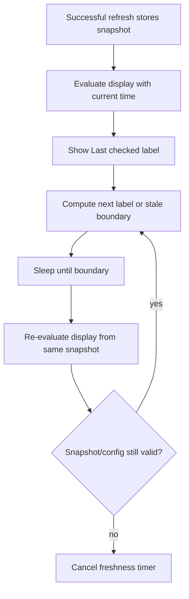

# fix: Keep menu footer stable and freshness current

## Overview

Polish the Kubebar menu so the bottom action row stays reachable, the tab bar
looks horizontally balanced, refresh cadence lives only in Settings, and the
`Last checked` label continues to age while the menu is visible. The change is
small in surface area but protects the menu's core job: showing current-looking
status only when the data is actually current.

## Problem Frame

The origin requirements identify four related menu rough edges. Long Events
content can compete with the footer, the segmented tab control needs equal
left/right spacing, the menu footer duplicates a refresh-cadence control that
already belongs in Settings, and `Last checked 0s ago` can remain stale because
the current timer only wakes near the stale-data threshold. These are UI polish
fixes, but they also affect operator trust because frozen freshness text can
make old data look less old than it is (see origin:
`docs/brainstorms/2026-04-22-kubebar-menu-polish-freshness-requirements.md`).

## Requirements Trace

- R1. The bottom action area stays at the bottom of the menu on every tab,
  including Events.
- R2. Long tab content scrolls above the bottom action area instead of pushing
  actions away.
- R3. The footer still shows latest checked time plus refresh, settings, and
  quit actions.
- R4. The tab bar has visually equal left and right spacing to the menu edges.
- R5. The tab bar remains aligned with the rest of the menu content.
- R6. Refresh cadence selection is removed from the menu footer.
- R7. Refresh cadence selection remains available in Settings.
- R8. Saved cadence, automatic refresh interval, setup, and settings behavior
  stay unchanged.
- R9. `Last checked` updates as time passes while the menu is open.
- R10. `Last checked 0s ago` does not stay stuck after time has passed.
- R11. Freshness label updates do not trigger or imply new cluster data reads.
- R12. Existing stale-data behavior remains intact.

## Scope Boundaries

- No warning-row redesign in Overview or Events.
- No change to the `OK`, `Watch`, `Bad`, and `Stale` menu-bar states.
- No removal of refresh cadence from Settings or saved configuration.
- No new troubleshooting controls in the menu.
- No change to the meaning of stale data or the saved auto-refresh cadence.
- No new browser or web UI testing surface; Kubebar is a native macOS app.

## Context & Research

### Relevant Code and Patterns

- `AGENTS.md` requires UI to render `MenuDisplayModel` and keep
  `HealthEvaluator` as the source of severity.
- `Kubebar/Views/MenuBarRootView.swift` owns the menu frame, segmented tab
  picker, selected-tab scroll container, and footer placement.
- `Kubebar/Views/MenuFooterView.swift` currently renders `Last checked`,
  refresh, cadence menu, settings, and quit.
- `Kubebar/Views/SetupView.swift` already includes the Settings refresh-cadence
  picker.
- `Kubebar/KubebarApp.swift` passes cadence and cadence-selection closures into
  the menu root and QA fixture root.
- `Kubebar/MenuBarViewModel.swift` owns refresh loops and the
  `freshnessTimerTask`; it currently schedules only around the stale threshold.
- `KubebarCore/Services/HealthEvaluator.swift` formats relative age as seconds,
  minutes, then hours, and applies stale age-out through `staleAfterSeconds`.
- `Package.swift` exposes `KubebarCore` to tests, while the SwiftUI app target
  is not directly covered by the current SwiftPM test target.
- `docs/qa/operator-verification.md` and the `warning-heavy` QA fixture provide
  the existing visible-app check path for menu layout behavior.

### Institutional Learnings

- No `docs/solutions/` directory exists in this repo.
- Recent plans treat visual menu changes as a mix of model/unit coverage plus
  QA fixture or visible-app verification when SwiftUI layout itself is not
  covered by an automated view-test harness.

### External References

- Not used. This work follows local SwiftUI structure and repo-specific
  freshness rules; external research would not materially change the plan.

## Key Technical Decisions

- **Keep cadence in Settings only:** The origin document defines cadence as a
  configuration choice, not a frequent menu action. Removing it from the footer
  reduces visual crowding without changing saved behavior.
- **Keep the footer outside scrollable tab content:** `MenuBarRootView` already
  has a footer outside the selected tab content. The fix should strengthen that
  structure by ensuring tab content consumes only the space available above the
  footer.
- **Use display-only freshness updates:** The freshness timer should
  re-evaluate `MenuDisplayModel` from the existing snapshot and current time.
  It must not call `refreshNow`, the refresh coordinator, or any Kubernetes
  reader.
- **Make timing rules testable outside the app target:** Because current package
  tests cover `KubebarCore`, add a small core scheduling helper for relative-age
  wakeups rather than relying on untested ad hoc timer math inside the SwiftUI
  app target. Keep its public surface narrow because the app target must be able
  to call it from another module.
- **Update at label-change boundaries:** Refresh the display at the next time
  the visible label can change: every second under one minute, each minute under
  one hour, each hour after that, and at the stale threshold when sooner.

## Open Questions

### Resolved During Planning

- **What is the lightest freshness timer behavior?** Use a boundary-based
  display timer. It updates only when `Last checked` or stale state can change,
  then reschedules itself.
- **Where should cadence selection live?** Settings only. The existing Settings
  picker remains the single cadence control.
- **How should layout be verified?** Use existing QA fixture and visible-app
  verification for the SwiftUI layout portions, because current tests do not
  import the `Kubebar` app target.

### Deferred to Implementation

- **Exact spacing and height constants:** Final numeric values should be tuned
  against the existing menu shape while keeping the requirements intact.
- **Whether a new QA fixture is necessary:** Prefer the existing `warning-heavy`
  fixture if it already produces enough Events rows; add fixture data only if
  implementation finds the current fixture too thin for footer verification.

## High-Level Technical Design

> *This illustrates the intended approach and is directional guidance for review, not implementation specification. The implementing agent should treat it as context, not code to reproduce.*

The timer loop updates only presentation derived from the last snapshot. Actual
cluster reads continue to come from manual refresh or the saved auto-refresh
cadence.

## Implementation Units

- [x] **Unit 1: Stabilize menu frame and tab spacing**

**Goal:** Keep the footer visible at the bottom while long tab content scrolls
above it, and make the segmented tab bar visually balanced.

**Requirements:** R1, R2, R3, R4, R5

**Dependencies:** None

**Files:**
- Modify: `Kubebar/Views/MenuBarRootView.swift`
- Test expectation: none -- existing automated tests do not import the SwiftUI
  app target, and this unit is layout-only. Visible verification is covered in
  Unit 4.

**Approach:**
- Preserve the overall menu structure: configured content first, divider, then
  `MenuFooterView`.
- Adjust the selected-tab height budget so Events and other long tabs scroll in
  the content area above the divider/footer.
- Keep footer width stable and avoid allowing measured content height to expand
  the menu beyond the visible screen limit.
- Give the segmented picker a full-width aligned container or equivalent
  symmetric horizontal treatment so its left and right edges read balanced with
  the rest of the menu.
- Keep Pods-specific inner scrolling compatible with the existing
  `podItemsMaxHeight` behavior.

**Patterns to follow:**
- Existing `VisibleScreenHeightReader` and measured-content pattern in
  `MenuBarRootView.swift`.
- Existing runtime invariant that long tab content scrolls inside the menu in
  `docs/architecture/runtime-invariants.md`.

**Test scenarios:**
- Layout verification: Events tab with enough warning rows to overflow -> tab
  body scrolls and the footer remains visible at the bottom.
- Layout verification: Overview, Nodes, Pods, and Events tabs -> footer position
  remains stable when switching tabs.
- Layout verification: segmented tab control has equal visual margin on both
  sides and remains aligned with the content column.
- Regression: Pods tab still keeps its summary visible while its item list can
  scroll independently.

**Verification:**
- The menu never requires scrolling the footer itself into view.
- Tab switching does not visibly shift the footer or make the tab bar look
  offset.

- [x] **Unit 2: Remove footer refresh cadence control**

**Goal:** Remove the cadence selector from the menu footer while preserving
refresh, settings, quit, saved cadence, setup, and Settings behavior.

**Requirements:** R3, R6, R7, R8

**Dependencies:** Unit 1 can be done before or after this unit; the changes are
independent.

**Files:**
- Modify: `Kubebar/Views/MenuFooterView.swift`
- Modify: `Kubebar/Views/MenuBarRootView.swift`
- Modify: `Kubebar/KubebarApp.swift`
- Test: `KubebarTests/Models/MenuRuntimeStateTests.swift`
- Test: `KubebarTests/Models/RefreshCadenceTests.swift`

**Approach:**
- Remove cadence-related input properties and binding logic from
  `MenuFooterView`.
- Remove cadence-related forwarding from `MenuBarRootView` and both live and QA
  menu roots in `KubebarApp.swift`.
- Preserve Settings cadence behavior through the existing `setupState` and
  `completeSetup` save path. If `MenuBarViewModel.selectRefreshCadence(_:)`
  becomes menu-only after footer removal, remove it or narrow it rather than
  keeping dead code.
- Keep the footer actions compact: refresh, settings, and quit remain present
  with their existing shortcuts, help text, and accessibility labels.

**Patterns to follow:**
- Existing Settings cadence picker in `SetupView.swift`.
- Existing cadence state coverage in `MenuRuntimeStateTests.swift` and
  `RefreshCadenceTests.swift`.

**Test scenarios:**
- Happy path: changing cadence in Settings still changes `SetupFlowState` and
  saved runtime cadence as existing tests expect.
- Regression: available cadence values and labels remain `30 sec`, `1 min`,
  `2 min`, and `5 min`.
- Regression: menu footer still exposes refresh, settings, and quit controls
  after cadence props are removed.

**Verification:**
- The menu footer no longer displays a timer/cadence control.
- Settings remains the only cadence control and retains existing behavior.

- [x] **Unit 3: Add display-only freshness scheduling**

**Goal:** Make `Last checked` advance naturally and preserve stale age-out
without causing extra Kubernetes reads.

**Requirements:** R9, R10, R11, R12

**Dependencies:** None

**Files:**
- Create: `KubebarCore/Services/FreshnessDisplaySchedule.swift`
- Modify: `Kubebar/MenuBarViewModel.swift`
- Test: `KubebarTests/Services/FreshnessDisplayScheduleTests.swift`
- Test: `KubebarTests/Models/MenuDisplayModelTests.swift`

**Approach:**
- Add a small core helper that calculates the next display update delay from
  captured time, current time, and stale threshold.
- Cover relative-age boundaries explicitly: `0s` to `1s`, `59s` to `1m`, minute
  changes below one hour, hour changes after one hour, and the stale threshold.
- Update `MenuBarViewModel.scheduleFreshnessTimer` so it schedules the next
  boundary, calls `updateFreshnessDisplay`, and then schedules again while the
  snapshot/config remains valid.
- Ensure `invalidateRefreshState`, setup transitions, cadence changes, and new
  refresh results cancel or replace the existing freshness timer correctly.
- Keep the timer path separate from manual refresh and the auto-refresh loop.
  It should re-run `HealthEvaluator` with the existing snapshot and current
  time only.

**Execution note:** Implement the schedule helper test-first because it captures
the bug's boundary behavior without needing to run the app.

**Patterns to follow:**
- Existing stale age-out behavior in `HealthEvaluator.swift`.
- Existing `RefreshCoordinatorTests.swift` stale cadence assertions.
- Existing `MenuDisplayModelTests.swift` expectations for `lastUpdated` and
  stale banner text.

**Test scenarios:**
- Happy path: snapshot captured at current time -> next display update is one
  second later so `0s ago` can become `1s ago`.
- Edge case: elapsed `59s` -> next update reaches `1m ago` after one second.
- Edge case: elapsed `60s` -> next update waits until the next minute label can
  change.
- Edge case: elapsed near one hour -> next update uses the hour boundary once
  minute labels stop changing.
- Edge case: stale threshold arrives before the next normal label boundary ->
  the next update is scheduled for the stale transition.
- Regression: `HealthEvaluator` still marks snapshots older than `2x` the saved
  cadence as `Stale`.
- Regression: a display-only tick uses the previous snapshot and does not
  require a new refresh result.

**Verification:**
- `Last checked 0s ago` can advance without manual refresh.
- Existing stale-data behavior remains unchanged.
- No freshness timer path invokes a Kubernetes read.

- [x] **Unit 4: Update QA and runtime documentation**

**Goal:** Record the menu/freshness contract and provide a deterministic visible
check for the UI portions that automated tests do not cover.

**Requirements:** R1, R2, R3, R4, R5, R6, R7, R8, R9, R10, R11, R12

**Dependencies:** Units 1, 2, and 3

**Files:**
- Modify: `docs/architecture/runtime-invariants.md`
- Modify: `docs/qa/operator-verification.md`
- Modify: `scripts/generate-qa-evidence.sh`
- Modify: `KubebarCore/QA/MenuStateFixtureCatalog.swift` if existing fixture
  expectations are not sufficient
- Test: `KubebarTests/QA/MenuStateFixtureCatalogTests.swift`

**Approach:**
- Add or tighten runtime invariants for fixed footer behavior, Settings-only
  cadence placement, and display-only freshness updates.
- Update operator verification text so `warning-heavy` or an equivalent fixture
  checks the Events tab overflow, footer visibility, balanced tabs, footer
  action set, and freshness-label aging.
- Keep fixture catalog changes minimal; prefer updating expectations over
  adding a new fixture unless the current fixture cannot exercise the Events
  overflow case.
- Keep generated QA evidence wording aligned with
  `docs/qa/operator-verification.md` if it is changed.

**Patterns to follow:**
- Existing QA fixture metadata assertions in
  `KubebarTests/QA/MenuStateFixtureCatalogTests.swift`.
- Existing runtime invariant wording under Product Rules and Freshness Rules.

**Test scenarios:**
- Happy path: QA fixture metadata remains complete for every fixture.
- Happy path: `warning-heavy` or the chosen fixture describes Events overflow
  with the footer remaining visible.
- Regression: QA text does not imply refresh cadence still lives in the menu
  footer.
- Regression: runtime docs state that freshness text updates are display-only
  and do not fetch new cluster data.

**Verification:**
- Documentation reflects the new visible menu contract.
- QA fixture tests still protect required metadata and expected behavior text.

## System-Wide Impact

- **Interaction graph:** Manual refresh and auto-refresh still produce cluster
  data; freshness ticks only re-evaluate the current display from the existing
  snapshot.
- **Error propagation:** Refresh failures still flow through existing stale
  reason handling. The freshness timer must preserve failure reasons while
  updating `lastUpdated`.
- **State lifecycle risks:** Setup changes, saved cadence changes, new refresh
  results, and invalidated snapshots must cancel or replace stale timer work.
- **API surface parity:** No user-facing settings are removed. The only removed
  surface is the duplicate menu footer cadence control.
- **Integration coverage:** Core timing rules are covered by unit tests; menu
  layout is covered by visible QA verification because there is no current
  SwiftUI snapshot test harness.
- **Unchanged invariants:** Health categories, saved cadence values, stale
  threshold semantics, setup flow, and Kubernetes read boundaries remain the
  same.

## Risks & Dependencies

| Risk | Mitigation |
|------|------------|
| Footer still moves because content height is measured before final layout settles | Keep footer outside the scrollable area and make selected tab content consume a capped height above it. |
| Timer wakes too often after the first minute | Schedule by visible label boundary: seconds under one minute, minutes under one hour, hours after. |
| Freshness tick accidentally starts a cluster refresh | Keep the timer path limited to `updateFreshnessDisplay` and test timing rules separately from refresh coordination. |
| Failure stale reason is overwritten by age-out stale reason too early | Preserve existing `staleReason` behavior and add regression coverage for stale display text. |
| Layout fix lacks automated proof | Update QA verification and use the existing visible-app fixture path for the Events overflow case. |

## Documentation / Operational Notes

- Update runtime invariants because footer placement, Settings-only cadence, and
  display-only freshness are product contracts.
- Update QA verification because the primary footer/tab spacing proof is visual.
- No migration, rollout flag, or external operational work is needed.

## Sources & References

- **Origin document:** `docs/brainstorms/2026-04-22-kubebar-menu-polish-freshness-requirements.md`
- Related code: `Kubebar/Views/MenuBarRootView.swift`
- Related code: `Kubebar/Views/MenuFooterView.swift`
- Related code: `Kubebar/MenuBarViewModel.swift`
- Related code: `KubebarCore/Services/HealthEvaluator.swift`
- Related tests: `KubebarTests/Models/MenuDisplayModelTests.swift`
- Related tests: `KubebarTests/QA/MenuStateFixtureCatalogTests.swift`
