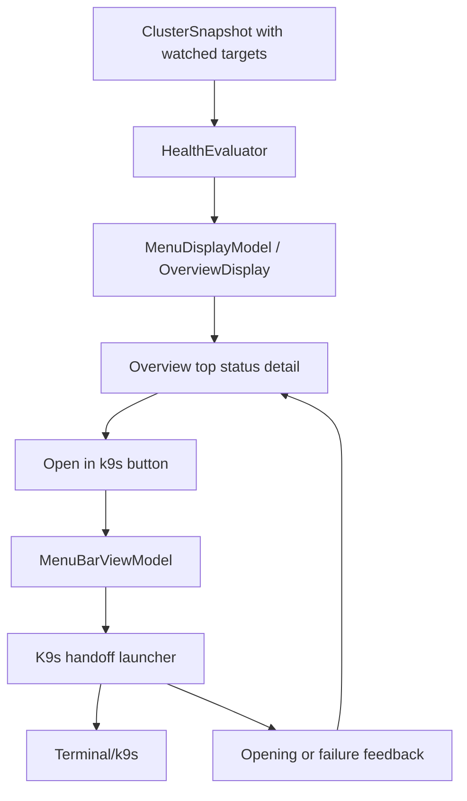

# feat: Add k9s handoff

## Overview

Add a narrow `Open in k9s` handoff from Kubebar's Overview top status detail
when the current status is driven by an abnormal watched target. The handoff
opens the user's local `k9s` for the same app-owned context and namespace, gives
brief launch feedback, and fails with safe user-facing copy when `k9s` cannot
be opened.

Kubebar remains the glanceable status tool. The new action moves the operator
from signal to investigation without embedding a terminal, logs, watch streams,
or a troubleshooting console in the menu.

## Problem Frame

Issue #9 asks whether deeper-debugging handoff is useful without pulling
Kubebar beyond its first-version product boundary. The origin document resolves
that as a watched-target handoff: when Kubebar says an important watched target
is `Watch` or `Bad`, the operator should be able to jump to `k9s` for the same
context and namespace with one deliberate action (see origin:
`docs/brainstorms/2026-04-23-kubebar-k9s-handoff-requirements.md`).

The current Overview no longer shows a `Watching` section. Tracked-object
attention appears through the top status row and pinned warnings, so this plan
places the handoff in a short Overview status detail rather than reintroducing a
watchlist block.

## Requirements Trace

- R1. Provide `Open in k9s` for watched targets whose current state is `Watch`
  or `Bad`.
- R2. Put the action in the Overview top status short detail as a deliberate
  button-style action, not an automatic launch or primary row click.
- R3. Do not show the action for healthy, setup, empty-watchlist, or stale
  display states.
- R4. Keep the first version focused on watched targets, not Recent Warnings,
  node rows, or a global context launcher.
- R5. Only show the action when the app-owned context and target namespace are
  known; otherwise explain why it cannot be opened.
- R6. Open the user's local `k9s` using the app-owned Kubernetes context.
- R7. Land in the watched target namespace. Exact workload or pod positioning
  is optional only if it stays within a shallow handoff boundary.
- R8. Show brief feedback while `k9s` is opening.
- R9. Show a clear safe failure message when `k9s` cannot be opened.
- R10. Never fall back to the terminal's current Kubernetes context.
- R11-R13. Do not add terminal embedding, logs, raw command output, watch
  streams, or multi-cluster switching.
- R14-R15. Keep the menu glanceable and keep the action keyboard and
  accessibility reachable.

## Scope Boundaries

- No embedded terminal.
- No logs view.
- No command transcript display in Kubebar.
- No full troubleshooting surface inside the menu.
- No Recent Warnings handoff in this version.
- No node-level handoff in this version.
- No global context launcher.
- No multi-cluster switching UI.
- No Kubernetes watch-stream behavior.

### Deferred to Separate Tasks

- Exact workload or pod positioning inside `k9s`: may be considered later if
  daily use shows namespace-level handoff is still too broad.
- Copy-command fallback: remains deferred unless direct launching proves too
  brittle across local Mac setups.

## Context & Research

### Relevant Code and Patterns

- `docs/architecture/runtime-invariants.md` requires the menu to stay
  watchlist-first, keep deep troubleshooting out of version 1, avoid raw command
  transcripts, and never make stale data look current.
- `docs/architecture/system-overview.md` defines the current flow:
  `RefreshCoordinator` reads data, `HealthEvaluator` creates
  `MenuDisplayModel`, and the menu renders only that display model.
- `KubebarCore/Models/WatchTarget.swift` already represents namespace and
  workload watched targets. Both carry namespace information that can become a
  handoff target.
- `KubebarCore/Models/MenuDisplayModel.swift` contains `OverviewDisplay`,
  `WatchItemDisplay`, and safe help/accessibility fields. It does not yet carry
  a k9s handoff target.
- `KubebarCore/Services/HealthEvaluator.swift` already decides the top status
  reason and prioritizes abnormal watched targets before lower-priority signals.
- `Kubebar/Views/StatusSummaryView.swift` renders the Overview top status row
  and already owns hover/accessibility for the status summary.
- `Kubebar/MenuBarViewModel.swift` owns UI-bound side effects such as refresh,
  setup, and view state updates. It is the right place to coordinate launch
  feedback.
- `KubebarCore/Services/CommandRunner.swift` provides an injectable process
  boundary and safe PATH handling for local command execution.
- `Kubebar/Views/MenuFooterView.swift` shows the existing icon-button style,
  tooltip, accessibility label, disabled state, and keyboard shortcut patterns.
- `docs/qa/operator-verification.md` is the operator-facing QA checklist for
  visual, keyboard, hover, stale, and warning states.

### Institutional Learnings

- No `docs/solutions/` learnings exist in this repository.
- Prior Overview plans removed the visible `Watching` section. Handoff must not
  reverse that product decision.
- Existing product docs consistently treat `k9s` as the deeper tool and
  Kubebar as the glanceable signal.

### External References

- k9s command docs confirm the CLI can launch in a namespace with `-n`, launch
  a resource view with `-c`, and use a non-default context with `--context`:
  https://k9scli.io/topics/commands/
- Apple `NSWorkspace` documentation confirms macOS apps can launch other apps
  and that `OpenConfiguration` supports launch arguments, but k9s is a terminal
  CLI rather than a normal document-opening app:
  https://developer.apple.com/documentation/AppKit/NSWorkspace

## Key Technical Decisions

- **Carry handoff eligibility in `MenuDisplayModel`:** The view should not infer
  cluster meaning. `HealthEvaluator` already knows why the top status is
  showing, so it should decide when a handoff target exists.
- **Treat namespace-level targeting as the guaranteed behavior:** k9s documents
  context and namespace flags. Workload-level positioning is useful but should
  only be added if implementation proves a stable shallow command shape.
- **Use an injectable launcher boundary:** External launching is a side effect
  like kubectl reads. It should be testable through a protocol and fake runner,
  not embedded directly in SwiftUI views.
- **Prefer argument arrays over shell interpolation:** Context and namespace are
  cluster-owned strings. Launch code must keep them as structured arguments as
  far as the macOS handoff mechanism allows, and any unavoidable shell layer
  needs focused escaping tests.
- **Keep launch feedback UI-local:** Opening, success, and failure feedback
  belong to `MenuBarViewModel` and the Overview detail. They should not alter
  cluster health state.
- **Do not log or display command transcripts:** User-facing failure copy should
  name the intended context and namespace, not stderr, raw command lines, JSON,
  or kubeconfig paths.

## Open Questions

### Resolved During Planning

- **Where does the action live now that Overview has no watched list?** In a
  short detail for the Overview top status when that status is driven by an
  abnormal watched target.
- **Does a namespace watch target qualify?** Yes. The current product supports
  namespace and workload watch targets. Both have a namespace and can satisfy
  the same handoff contract.
- **Should the plan require exact workload/pod positioning?** No. k9s documents
  stable context and namespace launch flags. Workload or pod positioning is
  deferred unless it can be added without turning Kubebar into a deeper
  navigation surface.
- **Does this need external research?** Yes, lightly. The plan touches an
  external CLI and macOS launch behavior. k9s docs confirm context/namespace
  support; Apple docs clarify the available app-launch surface.

### Deferred to Implementation

- **Exact terminal launch mechanism:** Implement the smallest macOS approach
  that visibly opens k9s and can be tested behind an injected launcher. If the
  chosen mechanism requires a shell bridge, add escaping tests for context and
  namespace values.
- **Exact in-progress wording:** Keep it short, such as `Opening k9s...`, and
  ensure it does not shift the top-row layout.
- **Exact detail affordance shape:** Use the existing SwiftUI constraints to
  choose the least crowded top-status detail pattern while preserving keyboard
  access.

## High-Level Technical Design

> *This illustrates the intended approach and is directional guidance for
> review, not implementation specification. The implementing agent should treat
> it as context, not code to reproduce.*

## Implementation Units

- [ ] **Unit 1: Add handoff target to the display model**

**Goal:** Represent whether the current Overview top status can offer a k9s
handoff, including the safe target labels needed by the UI.

**Requirements:** R1-R5, R10, R14-R15

**Dependencies:** None

**Files:**
- Modify: `KubebarCore/Models/MenuDisplayModel.swift`
- Modify: `KubebarCore/Services/HealthEvaluator.swift`
- Test: `KubebarTests/Models/MenuDisplayModelTests.swift`

**Approach:**
- Add a small display value for k9s handoff eligibility, carrying app-owned
  context, namespace, target title, action label, help text, and accessibility
  label.
- Attach the value to `OverviewDisplay` or another top-status display shape, not
  to raw UI state.
- Populate it in `HealthEvaluator` only when the top status is driven by a
  non-stale watched target in `Watch` or `Bad`.
- Treat namespace and workload watch targets as eligible when their namespace is
  known.
- Omit the value for healthy, setup, empty-watchlist, stale, node-driven,
  warning-only, metrics-unavailable-only, and section-unavailable-only states.
- Do not include command strings, executable paths, or raw launch data in the
  display value.

**Execution note:** Add display-model tests before wiring the UI so eligibility
rules are fixed at the product boundary.

**Patterns to follow:**
- `primaryStatusReason` and `statusHelpText` construction in
  `KubebarCore/Services/HealthEvaluator.swift`
- `WarningEventDisplay.helpText` and accessibility-label patterns in
  `KubebarCore/Models/MenuDisplayModel.swift`
- Stale and unavailable handling in `MenuDisplayModelTests`

**Test scenarios:**
- Happy path: bad workload target in namespace `api` and context `prod` ->
  Overview exposes an `Open in k9s` handoff target for `prod/api`.
- Happy path: watch namespace target `api` -> Overview exposes the same
  namespace-level handoff target.
- Edge case: healthy watched target -> no handoff target.
- Edge case: stale display with previous bad watched target -> no handoff
  target.
- Edge case: warning-only state with no abnormal watched target -> no handoff
  target.
- Edge case: node-driven `Bad` state with watched targets otherwise OK -> no
  handoff target.
- Error path: unavailable workload section or setup-required display -> no
  broken handoff target.
- Regression: visible top status text and accessibility status detail remain
  unchanged except for the additional optional handoff value.

**Verification:**
- `MenuDisplayModel` contains enough safe data for the UI to render a handoff
  without interpreting raw cluster facts.
- Tests prove stale and non-watched attention never exposes the action.

- [ ] **Unit 2: Add a testable k9s launch boundary**

**Goal:** Create the service boundary that opens k9s for a context and namespace
without leaking command construction into SwiftUI.

**Requirements:** R6-R10, R11-R13

**Dependencies:** Unit 1

**Files:**
- Create: `KubebarCore/Services/K9sHandoffLauncher.swift`
- Test: `KubebarTests/Services/K9sHandoffLauncherTests.swift`
- Modify: `KubebarCore/Services/CommandRunner.swift`

**Approach:**
- Define a small `K9sHandoffLaunching` protocol that accepts a validated handoff
  target and returns success or a safe failure category.
- Use the existing `CommandRunning` pattern so tests can assert launch requests
  without opening Terminal or k9s.
- Build k9s arguments from structured values: required context and namespace,
  with optional resource view only if implementation validates a stable shallow
  k9s command.
- Search common executable locations through the existing PATH augmentation
  pattern rather than assuming the user's login shell is available.
- If the chosen macOS launch path requires Terminal or AppleScript, keep that
  bridge contained in this service and add escaping tests for special characters
  in context and namespace.
- Map launch failures to safe messages such as `k9s could not be opened for
  prod / api`; do not surface stderr, shell text, or command transcripts.

**Execution note:** Characterize the launch-request builder with tests before
connecting it to the view model.

**Patterns to follow:**
- `CommandRunning`, `CommandRequest`, and `ProcessCommandRunner` in
  `KubebarCore/Services/CommandRunner.swift`
- Failure categorization in `KubebarCore/Services/KubectlClusterReader.swift`
- Existing fake command runners in `KubebarTests/Services/*Tests.swift`

**Test scenarios:**
- Happy path: target context `prod`, namespace `api` -> launcher builds a
  request that includes explicit k9s context and namespace arguments.
- Happy path: executable discovered through augmented PATH -> launcher reports
  success from a zero-exit fake runner.
- Edge case: context and namespace with spaces, quotes, or shell metacharacters
  -> values remain safe and are not interpolated unsafely.
- Error path: k9s executable missing or launch fails -> safe failure category,
  no raw stderr in the user-facing message.
- Error path: terminal bridge returns non-zero -> safe failure category with the
  intended context and namespace.
- Regression: launch request never omits the explicit context flag and never
  relies on terminal current context.

**Verification:**
- Launching is behind an injectable boundary.
- Tests prove explicit context/namespace targeting and safe failure mapping.

- [ ] **Unit 3: Coordinate handoff state in the view model**

**Goal:** Wire the launcher into the menu state so the UI can show opening and
failure feedback without changing cluster health.

**Requirements:** R2, R6-R10, R14-R15

**Dependencies:** Units 1-2

**Files:**
- Create: `KubebarCore/Services/K9sHandoffCoordinator.swift`
- Modify: `Kubebar/MenuBarViewModel.swift`
- Test: `KubebarTests/Services/K9sHandoffCoordinatorTests.swift`

**Approach:**
- Add a small core coordinator for launch state so the state machine can be
  tested without importing the macOS app target.
- Inject the `K9sHandoffLaunching` boundary into the coordinator and then into
  `MenuBarViewModel`.
- Represent idle, opening target, and failed target states with safe display
  text for the Overview detail.
- Add a view-model action that passes the current Overview handoff target to the
  coordinator.
- Clear obsolete launch feedback when refresh changes the displayed target,
  setup opens, or the display becomes stale.
- Keep launch state separate from `ClusterHealthState`; a failed external
  launch must not make the cluster `Watch`, `Bad`, or `Stale`.
- Ensure repeated taps while opening are disabled or ignored.

**Patterns to follow:**
- `isRefreshing` and `refreshGate` state handling in `MenuBarViewModel.swift`
- `applyRefreshResult` and stale/freshness display updates in
  `MenuBarViewModel.swift`
- Existing setup save failure state in `MenuRuntimeState`
- Existing core service tests with fake dependencies in `KubebarTests/Services`

**Test scenarios:**
- Happy path: opening an eligible handoff target sets opening feedback, invokes
  launcher once, then returns to idle on success.
- Edge case: repeated activation while opening -> launcher is not invoked
  twice.
- Edge case: refresh removes or changes the handoff target -> previous failure
  feedback clears.
- Error path: launcher fails -> view model exposes safe failure text with
  intended context and namespace.
- Regression: cluster display state does not change when external launch fails.

**Verification:**
- View model exposes enough state for short UI feedback.
- Launch success and failure do not mutate cluster health or saved config.

- [ ] **Unit 4: Add the Overview top status detail action**

**Goal:** Render the handoff action in a compact Overview top status detail
without crowding the normal one-line status row.

**Requirements:** R1-R5, R8-R9, R14-R15

**Dependencies:** Units 1-3

**Files:**
- Modify: `Kubebar/Views/MenuBarRootView.swift`
- Modify: `Kubebar/Views/OverviewTabView.swift`
- Modify: `Kubebar/Views/StatusSummaryView.swift`
- Test: `KubebarTests/QA/MenuStateFixtureCatalogTests.swift`

**Approach:**
- Keep the visible top status row one line: context, status icon, status label,
  and short reason.
- Add a small detail affordance for eligible abnormal watched-target statuses.
  The expanded detail should show the safe status detail and an icon+text
  `Open in k9s` button.
- Keep the action out of the footer and out of healthy/stale/setup states.
- Use native SwiftUI controls so keyboard navigation reaches the detail and the
  button.
- Use tooltip and accessibility text that names the external action and target
  namespace.
- Show brief opening feedback and safe failure feedback near the action without
  showing command lines or stderr.
- Preserve the existing Overview focus order, adding the status detail/button
  immediately after the top status row when present.

**Patterns to follow:**
- `StatusSummaryView` for top status composition and safe help text.
- `MenuFooterView` for compact icon button style, disabled state, help text, and
  accessibility labels.
- `OverviewTabView` layout spacing and no nested-card constraints.
- `docs/architecture/runtime-invariants.md` keyboard and stale-data rules.

**Test scenarios:**
- Happy path: QA `watch` state metadata expects top status detail with
  `Open in k9s` for the watched namespace.
- Happy path: QA `bad` state metadata expects the action near the top status,
  not in the footer or Events.
- Edge case: healthy fixture metadata does not mention a handoff action.
- Edge case: stale fixtures do not mention or expose a handoff action.
- Error path: failure feedback copy is safe and names context/namespace without
  command output.
- Accessibility: focus order reaches top status, status detail, `Open in k9s`,
  cards, Recent Warnings.

**Verification:**
- Overview stays scan-first and the top row remains one line.
- The action is discoverable only when an abnormal watched target drives the
  status.
- Keyboard and accessibility paths are documented in QA expectations.

- [ ] **Unit 5: Update QA and architecture docs**

**Goal:** Keep product docs and operator verification aligned with the new
handoff behavior and its boundaries.

**Requirements:** R3-R5, R8-R15

**Dependencies:** Units 1-4

**Files:**
- Modify: `docs/architecture/runtime-invariants.md`
- Modify: `docs/architecture/system-overview.md`
- Modify: `docs/qa/operator-verification.md`
- Modify: `KubebarCore/QA/MenuStateFixtureCatalog.swift`
- Test: `KubebarTests/QA/MenuStateFixtureCatalogTests.swift`

**Approach:**
- Add runtime invariants that `Open in k9s` appears only for current abnormal
  watched-target status details with known context and namespace.
- State that stale data, warning-only attention, node-only attention, and setup
  states do not offer the handoff.
- Update system overview to mention the external handoff boundary while
  preserving "Where The UI Stops": no embedded terminal or troubleshooting
  console.
- Update operator verification so Watch and Bad QA states check the top status
  detail action, keyboard reachability, and safe failure behavior.
- Keep human-visible QA evidence explicit; do not mark launch behavior verified
  from model tests alone.

**Patterns to follow:**
- Existing runtime invariant bullets for stale, watchlist, keyboard, and failure
  rules.
- Existing operator verification sections for hover, keyboard, and menu footer.
- Existing QA fixture expected-behavior phrasing.

**Test scenarios:**
- Happy path: QA fixture catalog descriptions for Watch and Bad mention the
  top-status k9s handoff.
- Edge case: stale, healthy, first-use, empty-watchlist, and warning-heavy
  fixture descriptions do not imply the handoff is available.
- Regression: docs still say deep troubleshooting stays out of version 1.
- Regression: docs still forbid raw command transcripts in menu views.

**Verification:**
- Runtime docs describe the new allowed handoff and its exclusions.
- QA docs provide a human-visible checklist for action placement, stale
  suppression, keyboard access, and safe failure messaging.

## System-Wide Impact

- **Interaction graph:** `HealthEvaluator` selects the handoff target for
  `MenuDisplayModel`; `StatusSummaryView` renders the detail; `MenuBarViewModel`
  invokes the launcher; the launcher opens external k9s and reports safe
  feedback.
- **Error propagation:** Launcher failures become UI feedback near the action.
  They do not alter cluster health, saved config, freshness, or watchlist state.
- **State lifecycle risks:** Handoff feedback must clear when the displayed
  status changes, when stale data replaces current data, or when setup opens.
- **API surface parity:** This is a menu UI action only. It does not change
  Kubernetes reads, setup persistence, refresh cadence, or Events/Nodes/Pods tab
  scope.
- **Integration coverage:** Unit tests prove display eligibility and launch
  request construction. QA fixtures and operator verification cover the
  cross-layer visual placement and keyboard path.
- **Unchanged invariants:** `HealthEvaluator` remains the source of severity;
  UI renders `MenuDisplayModel`; stale data does not look current; the menu does
  not expose raw command output; deep troubleshooting remains outside Kubebar.

## Risks & Dependencies

| Risk | Mitigation |
|------|------------|
| Local k9s is not installed or not discoverable | Use a safe failure state that names the intended context and namespace and keeps cluster state unchanged |
| macOS terminal launch behavior differs by user setup | Keep launch behind an injectable service and verify the selected mechanism manually in operator QA |
| Context or namespace values contain shell-sensitive characters | Prefer structured arguments; if a shell bridge is unavoidable, add escaping tests before wiring UI |
| Handoff appears for stale or non-watched status | Put eligibility in `HealthEvaluator` and cover stale, warning-only, node-only, and healthy cases in tests |
| Top status becomes too crowded | Put the action in a short detail affordance, not in the one-line row or footer |
| Exact workload targeting is tempting scope creep | Keep namespace-level targeting as required behavior and defer deeper positioning unless it remains shallow and stable |

## Documentation / Operational Notes

- Update architecture and runtime invariant docs because this is a new external
  handoff capability.
- Update operator verification with a manual launch check for Watch and Bad QA
  states.
- Do not document `k9s` as a Kubebar prerequisite. It remains optional; missing
  `k9s` must be handled as an understandable failure.
- If final launch behavior uses Terminal, document that the external window is
  where deeper investigation happens; Kubebar itself still does not show logs,
  terminal output, or command transcripts.

## Sources & References

- **Origin document:** [docs/brainstorms/2026-04-23-kubebar-k9s-handoff-requirements.md](../brainstorms/2026-04-23-kubebar-k9s-handoff-requirements.md)
- **GitHub issue:** [#9 Explore optional deeper-debugging handoff](https://github.com/nexttylabs/kubebar/issues/9)
- Related architecture: [docs/architecture/system-overview.md](../architecture/system-overview.md)
- Related invariants: [docs/architecture/runtime-invariants.md](../architecture/runtime-invariants.md)
- Existing top status view: `Kubebar/Views/StatusSummaryView.swift`
- Existing display model: `KubebarCore/Models/MenuDisplayModel.swift`
- Existing health mapping: `KubebarCore/Services/HealthEvaluator.swift`
- Existing command boundary: `KubebarCore/Services/CommandRunner.swift`
- k9s command docs: https://k9scli.io/topics/commands/
- Apple NSWorkspace docs: https://developer.apple.com/documentation/AppKit/NSWorkspace
