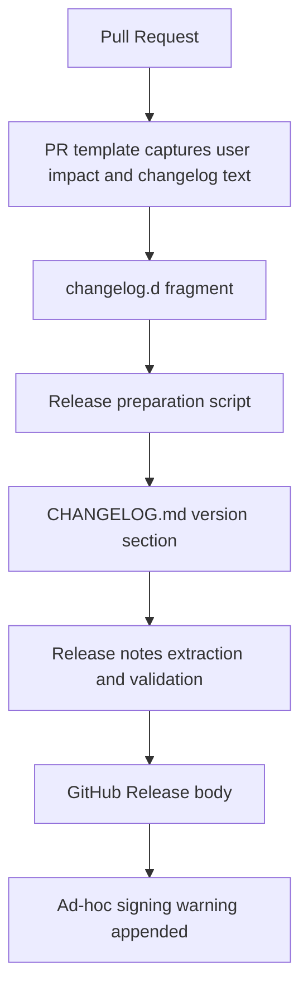

# feat: Add changelog automation

## Overview

Add a lightweight changelog maintenance flow for Kubebar. Each user-facing PR
records release-note-ready text, release preparation folds those notes into the
next `CHANGELOG.md` version section, and GitHub Releases publish only validated
notes for the matching tag.

The plan follows the CodexBar lesson from the origin document: curated
changelog text remains the source of truth, while release automation reuses and
validates that text instead of inventing notes from commits.

## Problem Frame

Kubebar already publishes releases from `v*` tags, but the release workflow can
currently extract an empty or wrong changelog section without failing early. The
repository also relies on contributors remembering to edit `CHANGELOG.md`
directly, which makes release notes easy to miss until release day.

The origin requirements define the first version as GitHub Release note
automation only, with Sparkle, notarization, Homebrew, and Developer ID signing
explicitly deferred (see origin:
`docs/brainstorms/2026-04-26-kubebar-release-changelog-automation-requirements.md`).

## Requirements Trace

- R1. `CHANGELOG.md` remains the single human-edited source for user-facing
  release notes.
- R2. A release for tag `vX.Y.Z` publishes notes from the matching
  `CHANGELOG.md` section only.
- R3. Release notes include Kubebar's ad-hoc signing installation warning until
  formal signing and notarization exist.
- R4. Release publishing fails when the matching changelog section is missing,
  still marked `Unreleased`, or does not match the tag.
- R5. Release publishing fails when generated release notes are empty.
- R6. Current package artifact behavior stays unchanged.
- R7. First version improves GitHub Release notes only.
- R8. Sparkle appcast notes stay deferred.
- R9. Release docs explain that changelog text is curated before release, then
  reused automatically during publishing.

## Scope Boundaries

- No AI-generated changelog text.
- No generated changelog from commits, pull requests, or labels.
- No Sparkle appcast generation.
- No notarization, Homebrew Cask, or Developer ID signing changes.
- No change to `Kubebar.zip` packaging behavior.

### Deferred to Separate Tasks

- Formal auto-update release notes for Sparkle: later, after Kubebar has a
  supported update channel.
- Fully automatic changelog generation from PR metadata: later only if PR
  labels and titles become reliable enough.

## Context & Research

### Relevant Code and Patterns

- `CHANGELOG.md` already uses Keep a Changelog headings such as
  `## [0.1.0] - 2026-04-23`.
- `.github/workflows/release.yml` extracts notes with a `sed` range and then
  appends the ad-hoc signing warning before calling `softprops/action-gh-release`.
- `scripts/build-release.sh` builds, ad-hoc signs, verifies, and zips
  `Kubebar.app`; this plan should not change that artifact behavior.
- `docs/RELEASING.md` says contributors manually move `[Unreleased]` entries
  into a versioned section before tagging.
- `.github/pull_request_template.md` now includes `User Impact` and
  `Changelog` sections for release-note-ready PR text.
- `scripts/swift-quality-gate.sh` is the local quality gate and can host a fast
  shell-level changelog tooling check if the implementation keeps it independent
  from Xcode state.

### Institutional Learnings

- No `docs/solutions/` learnings exist in this repository.
- Existing planning documents favor small explicit scripts and repo-local
  verification over hidden workflow behavior.

### External References

- CodexBar release documentation and scripts referenced by the origin document:
  `docs/RELEASING.md`, `Scripts/release.sh`,
  `Scripts/validate_changelog.sh`, `Scripts/changelog-to-html.sh`, and
  `Scripts/make_appcast.sh` in `steipete/CodexBar`.

## Key Technical Decisions

- **Keep Keep a Changelog headings:** Kubebar already uses
  `## [X.Y.Z] - YYYY-MM-DD`; preserving that format avoids unnecessary churn and
  keeps release extraction compatible with the current file.
- **Use changelog fragments for PR-time capture:** A small `changelog.d/`
  convention reduces release-day manual work while keeping text curated by
  humans.
- **Use dedicated scripts for validation and extraction:** Scripts are easier
  to test locally than inline workflow shell, and the GitHub workflow can call
  the same checked behavior.
- **Run release-note validation before GitHub Release creation:** The workflow
  must fail before publishing if notes are missing, stale, or empty.
- **Keep PR template as the human checkpoint:** The template asks whether a
  user-facing changelog entry exists or is unnecessary, but automation should
  rely on files and scripts rather than unchecked checkbox state.

## Open Questions

### Resolved During Planning

- **Should validation live in a script or the workflow?** Use dedicated scripts
  and call them from the workflow.
- **Should heading format change to CodexBar style?** No. Preserve Kubebar's
  existing Keep a Changelog format.
- **Should the first version generate notes from commits or PRs?** No. Use
  curated fragments and finalized changelog sections.

### Deferred to Implementation

- **Exact fragment filename convention:** Choose a simple documented convention
  while implementing, such as `<short-description>.<type>.md` or
  `<issue-or-pr>.<type>.md`, as long as duplicate names and unknown types fail
  clearly.
- **Exact release date source:** Use today's local date for manual preparation,
  or allow an explicit date argument for deterministic tests.

## High-Level Technical Design

> *This illustrates the intended approach and is directional guidance for
> review, not implementation specification. The implementing agent should treat
> it as context, not code to reproduce.*

## Implementation Units

- [x] **Unit 1: Capture changelog intent in PR template**

**Goal:** Make every PR explicitly state whether it needs a user-facing
changelog entry.

**Requirements:** R1, R9

**Dependencies:** None

**Files:**
- Modify: `.github/pull_request_template.md`

**Approach:**
- Keep the existing template structure.
- Add `User Impact` so reviewers can see whether the change affects users.
- Add a `Changelog` section with a clear choice between adding release-note
  text and explaining why no changelog is needed.
- Keep the changelog text as a concise sentence suitable for `CHANGELOG.md` or
  future fragments.

**Patterns to follow:**
- Existing PR template sections for validation, security impact, blast radius,
  rollback, and review track.

**Test scenarios:**
- Test expectation: none -- GitHub PR template text only, no executable
  behavior.

**Verification:**
- The PR template asks for user impact.
- The PR template asks for changelog handling.
- The template does not require a mechanism that does not exist yet.

- [x] **Unit 2: Define changelog fragment convention**

**Goal:** Give contributors a low-friction place to write release-note-ready
text during PR work.

**Requirements:** R1, R9

**Dependencies:** Unit 1 is useful context but not required.

**Files:**
- Create: `changelog.d/README.md`
- Create: `changelog.d/.gitkeep`
- Modify: `.github/pull_request_template.md`
- Modify: `docs/RELEASING.md`

**Approach:**
- Document accepted fragment categories that map to `CHANGELOG.md` headings,
  such as Added, Changed, Fixed, Removed, Security, and Documentation.
- Keep each fragment to one or more user-facing bullet lines.
- State that internal-only changes may skip fragments when the PR template
  explains why.
- Update the PR template to point user-facing changes toward `changelog.d/`
  once the convention exists.
- Keep `CHANGELOG.md` as the release source of truth: fragments are staging
  input, not the published history.

**Patterns to follow:**
- `CHANGELOG.md` heading names and concise bullet style.
- `docs/RELEASING.md` checklist language.

**Test scenarios:**
- Test expectation: none -- documentation and template convention only.

**Verification:**
- A contributor can read `changelog.d/README.md` and know where to put a
  release-note entry.
- The PR template no longer leaves the changelog destination ambiguous.
- `docs/RELEASING.md` distinguishes PR-time fragments from final release notes.

- [x] **Unit 3: Add changelog preparation tooling**

**Goal:** Merge pending fragments into a finalized version section in
`CHANGELOG.md` without relying on manual copy-and-paste.

**Requirements:** R1, R4, R9

**Dependencies:** Unit 2

**Files:**
- Create: `scripts/prepare-changelog-release.sh`
- Create: `scripts/test-changelog-tools.sh`
- Modify: `CHANGELOG.md`
- Modify: `docs/RELEASING.md`

**Approach:**
- Accept a version argument and optional date argument.
- Read supported fragment files from `changelog.d/`.
- Group fragment content under the matching `CHANGELOG.md` categories.
- Insert `## [X.Y.Z] - YYYY-MM-DD` immediately after `[Unreleased]`.
- Leave the `[Unreleased]` section present for future work.
- Remove or archive merged fragments only after the changelog update succeeds.
- Fail clearly when version is missing, fragments contain an unknown category,
  the target version already exists, or there is no releasable fragment content.

**Execution note:** Add shell-level characterization tests for the current
`CHANGELOG.md` shape before implementing the mutation behavior.

**Patterns to follow:**
- `scripts/swift-quality-gate.sh` for `set -euo pipefail`, repo-root handling,
  and clear failure output.
- Existing Keep a Changelog format in `CHANGELOG.md`.
- CodexBar's `Scripts/validate_changelog.sh` for fail-fast release checks.

**Test scenarios:**
- Happy path: one Added fragment and one Fixed fragment for `0.2.0` -> new
  `## [0.2.0] - <date>` section contains both grouped bullets.
- Happy path: multiple fragments in the same category -> all bullets appear
  once under that category.
- Edge case: no fragments -> script fails without changing `CHANGELOG.md`.
- Edge case: target version already exists -> script fails without duplicate
  version sections.
- Error path: unknown fragment category -> script fails with a clear message and
  leaves files unchanged.
- Error path: malformed or empty fragment -> script fails without publishing an
  empty section.

**Verification:**
- `scripts/test-changelog-tools.sh` covers fragment grouping, empty input,
  duplicate version, and unknown category behavior.
- Running the preparation script creates a valid version section from fragments.
- The script does not change build artifacts or app source.

- [x] **Unit 4: Validate and extract release notes for GitHub Releases**

**Goal:** Make the release workflow publish only the notes for the tag's
matching finalized changelog section.

**Requirements:** R2, R3, R4, R5, R6, R7

**Dependencies:** Unit 3 is preferred because tests can share fixtures and
helpers, but validation can be implemented independently.

**Files:**
- Create: `scripts/extract-release-notes.sh`
- Modify: `.github/workflows/release.yml`
- Modify: `scripts/test-changelog-tools.sh`

**Approach:**
- Accept a version argument.
- Find exactly one `## [X.Y.Z] - YYYY-MM-DD` section in `CHANGELOG.md`.
- Reject `[Unreleased]`, missing sections, duplicate version sections, and
  empty extracted notes.
- Output only the content that belongs in the GitHub Release body.
- Update `.github/workflows/release.yml` to call the script and write its output
  to the GitHub Actions output used by `softprops/action-gh-release`.
- Keep the ad-hoc signing warning in the workflow body after extracted notes.
- Keep `scripts/build-release.sh` artifact behavior unchanged.

**Patterns to follow:**
- Existing `.github/workflows/release.yml` tag-to-version step.
- Existing ad-hoc signing note in `.github/workflows/release.yml`.
- CodexBar's release-note extraction principle from `Scripts/release.sh`.

**Test scenarios:**
- Happy path: `CHANGELOG.md` contains `## [0.2.0] - 2026-04-26` -> script
  outputs only that section's body.
- Edge case: version exists below another version -> script still extracts the
  requested tag version.
- Error path: version missing -> script exits non-zero before GitHub Release
  creation.
- Error path: version section exists but has no bullets -> script exits
  non-zero.
- Error path: duplicate version sections -> script exits non-zero.
- Integration: workflow release notes step uses the script output and still
  appends the ad-hoc signing warning.

**Verification:**
- `scripts/test-changelog-tools.sh` covers extraction and validation failures.
- The workflow no longer contains ad hoc `sed` extraction logic.
- Release publishing fails before `softprops/action-gh-release` when notes are
  invalid.

- [x] **Unit 5: Wire changelog checks into local and CI verification**

**Goal:** Make changelog tooling regressions visible before release day.

**Requirements:** R4, R5, R9

**Dependencies:** Units 3-4

**Files:**
- Modify: `scripts/swift-quality-gate.sh`
- Modify: `.github/workflows/ci.yml`
- Modify: `scripts/test-changelog-tools.sh`

**Approach:**
- Keep changelog tooling tests fast and independent of Xcode.
- Run `scripts/test-changelog-tools.sh` from the local quality gate.
- Ensure CI runs the same local check through the existing quality gate, or add
  a separate lightweight CI step if keeping it outside the Swift gate is clearer
  during implementation.
- Avoid requiring release credentials, GitHub tokens, or macOS signing state for
  changelog tests.

**Patterns to follow:**
- `scripts/swift-quality-gate.sh` already runs repo-local checks such as QA
  artifact generation.
- `.github/workflows/ci.yml` delegates validation to the quality gate.

**Test scenarios:**
- Happy path: quality gate invokes the changelog test script and succeeds when
  fixtures are valid.
- Error path: a broken fixture or extraction case causes the changelog test
  script to fail the quality gate.
- Integration: CI uses the same changelog tooling tests as local verification.

**Verification:**
- The quality gate exercises changelog tooling without needing a release tag.
- CI has a visible failure when changelog tooling tests fail.

- [x] **Unit 6: Update release documentation and PR authoring guidance**

**Goal:** Make the full human workflow clear: write PR changelog text, prepare a
release section, then tag and publish.

**Requirements:** R1, R3, R7, R8, R9

**Dependencies:** Units 2-5

**Files:**
- Modify: `docs/RELEASING.md`
- Modify: `CHANGELOG.md`
- Optional Create: `docs/CONTRIBUTING.md`

**Approach:**
- Update the release checklist so it says release preparation creates the
  versioned changelog section from fragments.
- Explain that GitHub Release notes are extracted automatically from the
  finalized version section.
- Keep the ad-hoc signing warning requirement visible.
- Explicitly mark Sparkle, notarization, Homebrew, and Developer ID signing as
  future distribution work.
- If implementation adds `docs/CONTRIBUTING.md`, include the Codex PR creation
  prompt there instead of burying it in release docs.

**Patterns to follow:**
- Existing `docs/RELEASING.md` direct checklist style.
- Existing PR template sections.
- Origin requirements scope boundaries.

**Test scenarios:**
- Test expectation: none -- documentation-only update.

**Verification:**
- Release docs no longer imply manual copying into GitHub Release notes.
- Release docs clearly preserve ad-hoc signing instructions.
- Contributor docs, if added, include the PR authoring prompt and point to the
  PR template.

## System-Wide Impact

- **Interaction graph:** PR template and changelog fragments feed release
  preparation; finalized `CHANGELOG.md` feeds GitHub Release notes.
- **Error propagation:** Changelog script failures should stop local checks or
  release jobs with clear messages before publication.
- **State lifecycle risks:** Preparation tooling mutates `CHANGELOG.md` and
  fragment files; it must fail before partial removal or duplicate sections.
- **API surface parity:** No app runtime API, UI, CLI, or Kubernetes behavior
  changes.
- **Integration coverage:** Shell tests should cover both local fragment merging
  and release extraction because GitHub Actions depends on those scripts.
- **Unchanged invariants:** `Kubebar.zip` packaging, ad-hoc signing, and
  current app behavior remain unchanged.

## Risks & Dependencies

| Risk | Mitigation |
| --- | --- |
| Fragment convention feels heavier than direct changelog edits | Keep fragment format one sentence per user-facing change and allow explicit "not needed" in PRs |
| Release script removes fragments before updating `CHANGELOG.md` safely | Use temp files or staged validation so failures leave inputs intact |
| Workflow still publishes empty notes after script changes | Make extraction script return non-zero for missing, duplicate, unreleased, or empty sections |
| Changelog tests slow down normal Swift checks | Keep tests shell-only and fixture-based |
| Contributors skip fragments despite template prompts | Keep PR template explicit and add reviewer guidance in docs |

## Documentation / Operational Notes

- Release preparation should happen before creating the `vX.Y.Z` tag.
- `CHANGELOG.md` remains the published release history.
- `changelog.d/` is a staging area and should normally be empty immediately
  after a release preparation commit.
- The GitHub Release body should still include the ad-hoc signing warning until
  Kubebar changes its distribution model.

## Sources & References

- **Origin document:** [2026-04-26-kubebar-release-changelog-automation-requirements.md](../brainstorms/2026-04-26-kubebar-release-changelog-automation-requirements.md)
- Current release workflow: `.github/workflows/release.yml`
- Current changelog: `CHANGELOG.md`
- Current release docs: `docs/RELEASING.md`
- Current PR template: `.github/pull_request_template.md`
- CodexBar references:
  - https://github.com/steipete/CodexBar/blob/main/docs/RELEASING.md
  - https://github.com/steipete/CodexBar/blob/main/Scripts/release.sh
  - https://github.com/steipete/CodexBar/blob/main/Scripts/validate_changelog.sh
  - https://github.com/steipete/CodexBar/blob/main/Scripts/changelog-to-html.sh
  - https://github.com/steipete/CodexBar/blob/main/Scripts/make_appcast.sh
